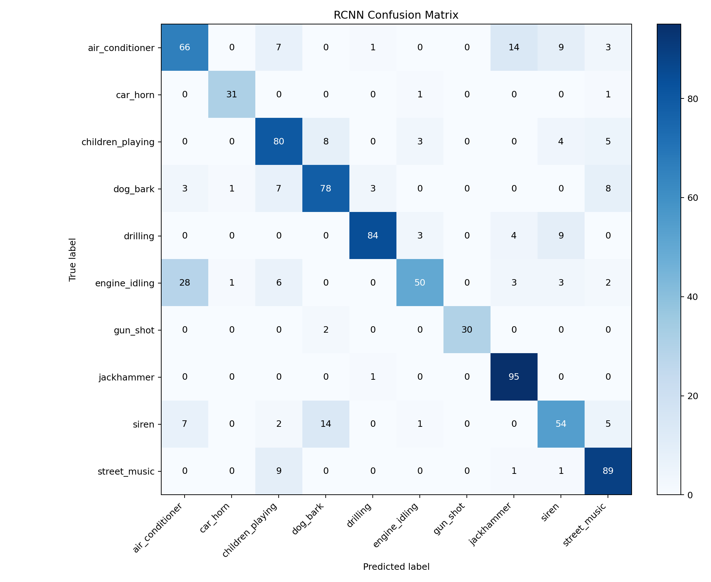

# 다양한 모델을 활용한 도시 환경 소리의 종류 분류 및 성능 평가

Members: 

# I. Proposal (Option A)

# II. Datasets

# III. Methodology

## III-I. 데이터 전처리

### Sample Rate: 22050 Hz
1. 전체 통계
2. 22050 Hz로 판단한 근거.

### Channels: Mono
1. 전체 통계
2. Mono로 판단한 근거(양쪽에서 들리는 소리 차이가 없음)

### Bit Depth: 32-float point
1. 전체 통계
2. float로 판단한 근거(정보 손실이 없다.)

### Duration: 4초, repeat padding
1. 전체 통계
2. repeat padding의 근거

### Noramlization: 
1. MFCC + SVM / RandomForest / XGBoost   
    MFCC나 log-mel 통계 feature를 뽑은 뒤, train fold 기준으로 feature standardization
2. 2D CNN / CRNN용 log-mel spectrogram   
    log-mel spectrogram을 만든 뒤, train set 전체의 mean/std로 정규화

---
## III-II 모델 

### 1. XGboost 
## Model Description

XGBoost는 Gradient Boosting 기반의 앙상블 학습 알고리즘으로, 여러 개의 결정트리(Decision Tree)를 순차적으로 학습하여 예측 성능을 향상시킨다.
과적합 방지 기능과 높은 학습 효율성을 제공하며, 다양한 머신러닝 문제에서 우수한 성능을 보이는 모델이다.
본 프로젝트에서는 다중 클래스 환경음 분류(Multi-class Sound Classification)에 활용하였다.

## Hyperparameters

- Number of Trees (n_estimators): 300
- Max Depth: 5
- Learning Rate: 0.05
- Subsample: 0.8
- Colsample Bytree: 0.8
- Objective: multi:softmax
- Number of Classes: 10
- Evaluation Metric: mlogloss
- Random State: 42

### Features Used

- MFCC (Mel-Frequency Cepstral Coefficients)
- 40개의 MFCC 계수 추출
- 각 계수의 평균(mean)과 표준편차(std) 계산
- 총 Feature 수: 80개
  - 40 MFCC means
  - 40 MFCC standard deviations

### 2. SVM

## Model Description

SVM(Support Vector Machine)은 초평면(hyperplane)을 이용하여 서로 다른 클래스를 분류하는 지도학습 알고리즘이다.
본 프로젝트에서는 비선형 데이터 분류를 위해 RBF(Radial Basis Function) 커널을 사용하였다.
SVM은 고차원 특징 공간에서 클래스 간 경계를 효과적으로 학습할 수 있으며, 비교적 적은 데이터에서도 안정적인 성능을 보이는 장점이 있다.

## Hyperparameters

- Kernel: RBF
- C: 10
- Gamma: scale
- Class Weight: balanced
- Random State: 42

## Features Used

- MFCC (Mel-Frequency Cepstral Coefficients)
- 40개의 MFCC 계수 추출
- 각 계수의 평균(mean) 계산
- 각 계수의 표준편차(std) 계산
- 총 Feature 수: 80개
  - 40 MFCC means
  - 40 MFCC standard deviations

### 3. MLP

### 4. 2D CNN

### 5. RCNN

## Model Description

RCNN(Recurrent Convolutional Neural Network)은 spectrogram의 공간적 패턴과 시간적 흐름을 함께 학습하는 모델이다.  
본 프로젝트에서는 log-mel spectrogram을 CNN으로 먼저 압축한 뒤, Bi-GRU로 시간 축의 앞뒤 문맥을 학습하도록 구성하였다.

| 구성 | 내용 |
|---|---|
| 입력 | log-mel spectrogram `(1, 128, 173)` |
| CNN | ConvBlock 4개, freq-axis MaxPool 3회 |
| RNN | 2-layer Bidirectional GRU |
| Pooling | time-axis mean pooling + max pooling |
| Classifier | LayerNorm + Dropout + Linear |
| 출력 | 10개 class logits |
| 코드 | `models/rcnn/rcnn.py` |
| checkpoint | `models/rcnn/best_rcnn.pt` |

## Hyperparameters

| 항목 | 내용 |
|---|---|
| Sample Rate | 22050 Hz |
| Duration | 4.0 sec |
| Padding | repeat |
| n_mels | 128 |
| n_fft | 1024 |
| hop_length | 512 |
| top_db | 80 |
| Hidden Size | 128 |
| RNN Layers | 2 |
| Dropout | 0.3 |
| Epochs | 60 |
| Batch Size | 32 |
| Learning Rate | 0.001 |
| Weight Decay | 0.0001 |
| Gradient Clipping | 5.0 |
| Early Stopping Patience | 10 |
| Optimizer | AdamW |
| Loss | CrossEntropyLoss + class weight |
| Scheduler | ReduceLROnPlateau |
| Best Model 기준 | validation macro F1 |

## Features Used

- 22050Hz mono audio를 4초 길이로 고정
- 짧은 audio는 repeat padding 적용
- log-mel spectrogram 추출
- train split 기준 mean/std로 정규화
- Train: fold 1-8 / Validation: fold 9 / Test: fold 10

### 6. Pretrained audio model

---

# IV. Evaluation & Analysis

### Train: fold 1-8 / Validation: fold 9 / Test: fold 10 
 

### 평가 항목: 
| 통계값 | 설명 |
|---|---|
| accuracy | 전체 sample 중 모델이 정답을 맞힌 비율 |
| balanced accuracy | class별 recall을 평균낸 값. class imbalance가 있을 때 accuracy보다 공정하게 볼 수 있음 |
| macro precision | class별 precision을 단순 평균한 값. 모든 class를 같은 비중으로 반영 |
| macro recall | class별 recall을 단순 평균한 값. 작은 class의 탐지 성능까지 반영 |
| macro F1 | class별 F1을 단순 평균한 값. class imbalance가 있는 모델 비교에서 핵심 지표로 사용 |
| weighted precision | class별 precision을 sample 수에 따라 가중 평균한 값 |
| weighted recall | class별 recall을 sample 수에 따라 가중 평균한 값 |
| weighted F1 | class별 F1을 sample 수에 따라 가중 평균한 값. 실제 데이터 분포 기준 성능을 반영 |
| class별 precision | 특정 class라고 예측한 sample 중 실제로 그 class인 비율. 오탐이 많은지 확인 |
| class별 recall | 실제 특정 class sample 중 모델이 제대로 맞힌 비율. 미탐이 많은지 확인 |
| class별 F1 | class별 precision과 recall의 조화평균. 각 class의 종합 성능 확인 |
| confusion matrix | 실제 class와 예측 class의 대응표. 어떤 class끼리 헷갈리는지 확인 |

### 1. XGboost 
## Overall Performance

| Metric | Score |
|----------|----------:|
| Accuracy | 0.728793 |
| Balanced Accuracy | 0.734558 |
| Macro Precision | 0.776564 |
| Macro Recall | 0.734558 |
| Macro F1 | 0.746983 |
| Weighted Precision | 0.749381 |
| Weighted Recall | 0.728793 |
| Weighted F1 | 0.730958 |

## Per-Class Performance

| Class | Precision | Recall | F1-score |
|---------|---------:|---------:|---------:|
| air_conditioner | 0.904762 | 0.760000 | 0.826087 |
| car_horn | 1.000000 | 0.727273 | 0.842105 |
| children_playing | 0.540000 | 0.810000 | 0.648000 |
| dog_bark | 0.740741 | 0.800000 | 0.769231 |
| drilling | 0.584746 | 0.690000 | 0.633028 |
| engine_idling | 0.925926 | 0.806452 | 0.862069 |
| gun_shot | 0.903226 | 0.875000 | 0.888889 |
| jackhammer | 0.632911 | 0.520833 | 0.571429 |
| siren | 0.700000 | 0.506024 | 0.587413 |
| street_music | 0.833333 | 0.850000 | 0.841584 |

### Result Analysis

- 가장 높은 F1-score는 **gun_shot (0.888889)**, **engine_idling (0.862069)**, **car_horn (0.842105)** 에서 나타났다.
- **siren (0.587413)**, **jackhammer (0.571429)**, **drilling (0.633028)** 은 상대적으로 낮은 성능을 보였다.
- children_playing은 Recall(0.81)은 높지만 Precision(0.54)이 낮아 다른 클래스가 children_playing으로 오분류되는 경향이 존재하였다.
- engine_idling, gun_shot, car_horn과 같이 특징이 뚜렷한 소리는 높은 분류 성능을 보였다.

## Confusion Matrix

| Actual Class | 주요 오분류 |
|--------------|------------|
| air_conditioner | jackhammer (15건) |
| car_horn | street_music (6건) |
| children_playing | dog_bark (10건) |
| dog_bark | children_playing (11건) |
| drilling | jackhammer (10건), siren (9건) |
| engine_idling | children_playing (5건), jackhammer (3건) |
| gun_shot | dog_bark (4건) |
| jackhammer | drilling (44건) |
| siren | jackhammer (42건), children_playing (34건) |
| street_music | children_playing (13건) |

### Confusion Matrix Analysis

- **drilling ↔ jackhammer** 사이의 혼동이 가장 크게 나타났다.
- **siren → jackhammer (42건)**, **siren → children_playing (34건)** 으로 오분류되는 경우가 많았다.
- **children_playing ↔ dog_bark** 사이에서도 상호 혼동이 발생하였다.
- 반면 **gun_shot** 은 32개 중 28개를 정확히 분류하여 가장 안정적인 성능을 보였다.
- 전반적으로 공사 소음(drilling, jackhammer) 및 도시 환경음(siren, children_playing) 간의 음향적 유사성이 오분류의 주요 원인으로 나타났다.

### 2. SVM
## Overall Performance

| Metric | Score |
|----------|----------:|
| Accuracy | 0.702509 |
| Balanced Accuracy | 0.722153 |
| Macro Precision | 0.732377 |
| Macro Recall | 0.722153 |
| Macro F1 | 0.723635 |
| Weighted Precision | 0.711003 |
| Weighted Recall | 0.702509 |
| Weighted F1 | 0.702494 |

## Per-Class Performance

| Class | Precision | Recall | F1-score |
|---------|---------:|---------:|---------:|
| air_conditioner | 0.790698 | 0.680000 | 0.731183 |
| car_horn | 0.812500 | 0.787879 | 0.800000 |
| children_playing | 0.689655 | 0.800000 | 0.740741 |
| dog_bark | 0.604478 | 0.810000 | 0.692308 |
| drilling | 0.555556 | 0.600000 | 0.576923 |
| engine_idling | 0.888889 | 0.774194 | 0.827586 |
| gun_shot | 0.937500 | 0.937500 | 0.937500 |
| jackhammer | 0.538462 | 0.437500 | 0.482759 |
| siren | 0.629630 | 0.614458 | 0.621951 |
| street_music | 0.876404 | 0.780000 | 0.825397 |

### Result Analysis

- 가장 높은 F1-score는 **gun_shot (0.937500)** 에서 나타났다.
- **engine_idling (0.827586)**, **street_music (0.825397)**, **car_horn (0.800000)** 역시 높은 분류 성능을 보였다.
- **jackhammer (0.482759)**, **drilling (0.576923)** 은 상대적으로 낮은 성능을 보였다.
- dog_bark와 children_playing은 Recall은 높지만 Precision이 상대적으로 낮아 다른 클래스와 혼동되는 경향이 나타났다.
- 공사 소음 계열(drilling, jackhammer)에서 성능 저하가 두드러졌다.

## Confusion Matrix

| Actual Class | 주요 오분류 |
|--------------|------------|
| air_conditioner | gun_shot (17건), drilling (8건) |
| car_horn | street_music (5건) |
| children_playing | dog_bark (12건), siren (7건) |
| dog_bark | children_playing (8건), street_music (5건) |
| drilling | jackhammer (18건), siren (14건) |
| engine_idling | air_conditioner (9건), dog_bark (5건) |
| gun_shot | dog_bark (2건) |
| jackhammer | drilling (45건) |
| siren | jackhammer (51건), dog_bark (24건) |
| street_music | children_playing (17건) |

### Confusion Matrix Analysis

- **drilling ↔ jackhammer** 사이의 혼동이 가장 크게 나타났다.
- **siren → jackhammer (51건)** 으로 오분류되는 경우가 매우 많았다.
- **siren → dog_bark (24건)**, **street_music → children_playing (17건)** 역시 빈번하게 발생하였다.
- **air_conditioner → gun_shot (17건)** 으로 잘못 분류된 사례도 관찰되었다.
- 반면 **gun_shot** 은 32개 중 30개를 정확히 분류하여 가장 우수한 분류 성능을 보였다.
- 전반적으로 음향 특성이 유사한 공사 소음(drilling, jackhammer)과 도시 환경음(siren, dog_bark, children_playing) 사이에서 혼동이 발생하는 경향을 보였다.

### 3. MLP

### 4. 2D CNN

### 5. RCNN

## Overall Performance

| Metric | Score |
|---|---:|
| Test Loss | 1.0044 |
| Accuracy | 0.7706 |
| Balanced Accuracy | 0.7957 |
| Macro Precision | 0.8103 |
| Macro Recall | 0.7957 |
| Macro F1 | 0.7932 |
| Weighted Precision | 0.7877 |
| Weighted Recall | 0.7706 |
| Weighted F1 | 0.7678 |

## Per-Class Performance

| Class | Precision | Recall | F1-score | Support |
|---|---:|---:|---:|---:|
| air_conditioner | 0.7347 | 0.7200 | 0.7273 | 100 |
| car_horn | 0.9688 | 0.9394 | 0.9538 | 33 |
| children_playing | 0.6916 | 0.7400 | 0.7150 | 100 |
| dog_bark | 0.8632 | 0.8200 | 0.8410 | 100 |
| drilling | 0.9839 | 0.6100 | 0.7531 | 100 |
| engine_idling | 0.7826 | 0.5806 | 0.6667 | 93 |
| gun_shot | 0.9697 | 1.0000 | 0.9846 | 32 |
| jackhammer | 0.6761 | 1.0000 | 0.8067 | 96 |
| siren | 0.7037 | 0.6867 | 0.6951 | 83 |
| street_music | 0.7288 | 0.8600 | 0.7890 | 100 |

## Confusion Matrix

| Actual \ Predicted | air_conditioner | car_horn | children_playing | dog_bark | drilling | engine_idling | gun_shot | jackhammer | siren | street_music |
|---|---:|---:|---:|---:|---:|---:|---:|---:|---:|---:|
| air_conditioner | 72 | 0 | 0 | 0 | 1 | 4 | 0 | 14 | 4 | 5 |
| car_horn | 0 | 31 | 0 | 0 | 0 | 0 | 0 | 0 | 0 | 2 |
| children_playing | 0 | 0 | 74 | 7 | 0 | 5 | 0 | 0 | 9 | 5 |
| dog_bark | 1 | 1 | 7 | 82 | 0 | 1 | 1 | 0 | 0 | 7 |
| drilling | 0 | 0 | 0 | 0 | 61 | 5 | 0 | 28 | 6 | 0 |
| engine_idling | 24 | 0 | 7 | 0 | 0 | 54 | 0 | 3 | 3 | 2 |
| gun_shot | 0 | 0 | 0 | 0 | 0 | 0 | 32 | 0 | 0 | 0 |
| jackhammer | 0 | 0 | 0 | 0 | 0 | 0 | 0 | 96 | 0 | 0 |
| siren | 1 | 0 | 8 | 6 | 0 | 0 | 0 | 0 | 57 | 11 |
| street_music | 0 | 0 | 11 | 0 | 0 | 0 | 0 | 1 | 2 | 86 |

## Major Confusions

| 실제 class | 주된 오분류 | 건수 |
|---|---|---:|
| drilling | jackhammer | 28 |
| engine_idling | air_conditioner | 24 |
| air_conditioner | jackhammer | 14 |
| siren | street_music | 11 |
| street_music | children_playing | 11 |

### Result Analysis

- 강점: `gun_shot`, `car_horn`, `dog_bark`
- 약점: `engine_idling`, `siren`, `children_playing`
- 주요 혼동: `drilling → jackhammer`, `engine_idling → air_conditioner`
- 상세 해석 파일: `rcnn_feature_results.md`

### 6. Pretrained audio model

### 7. 최종 비교 분석

# V. Related Work

# VI. Conclusion: Discussion
