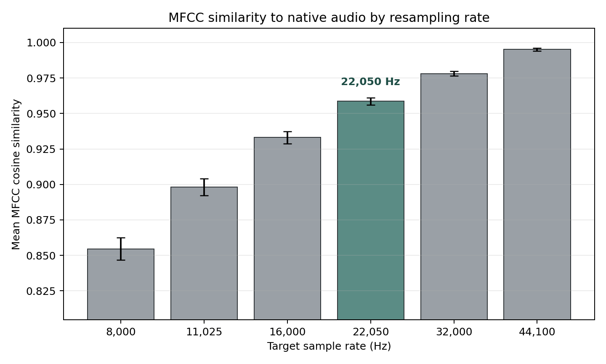
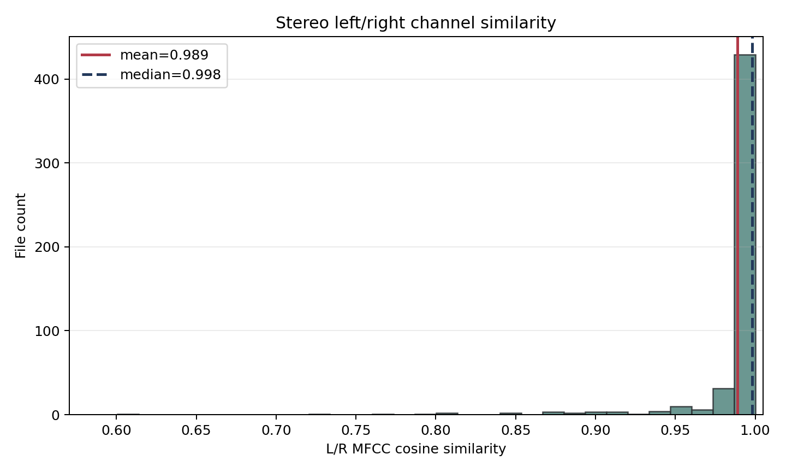
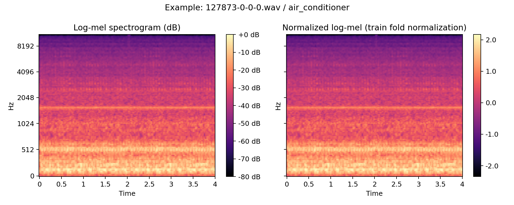
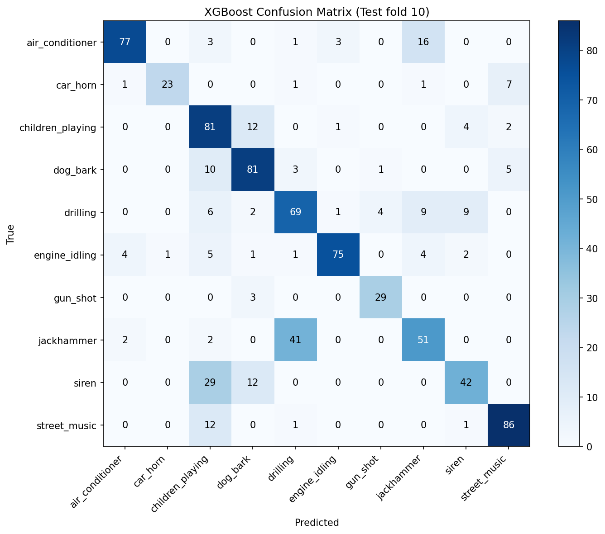
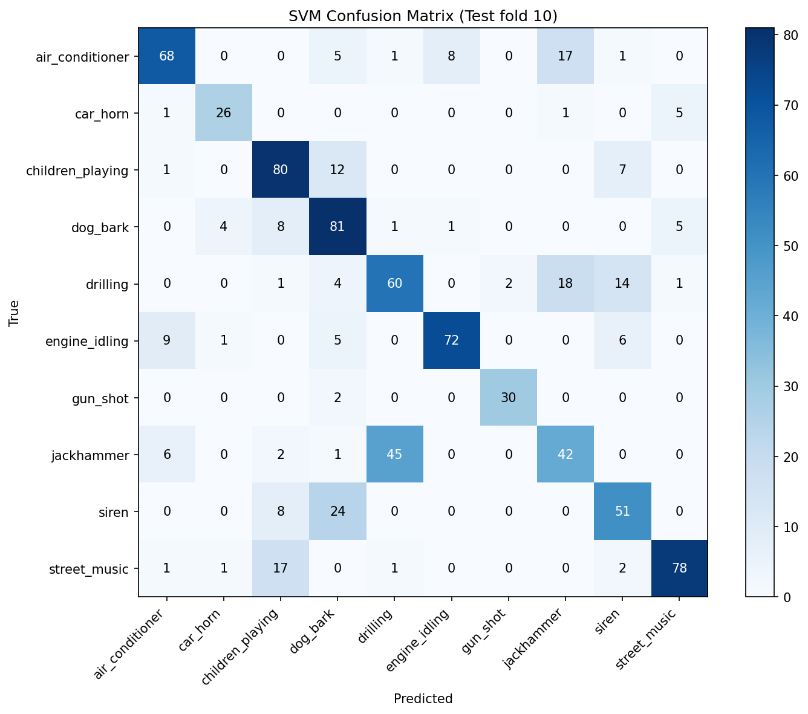
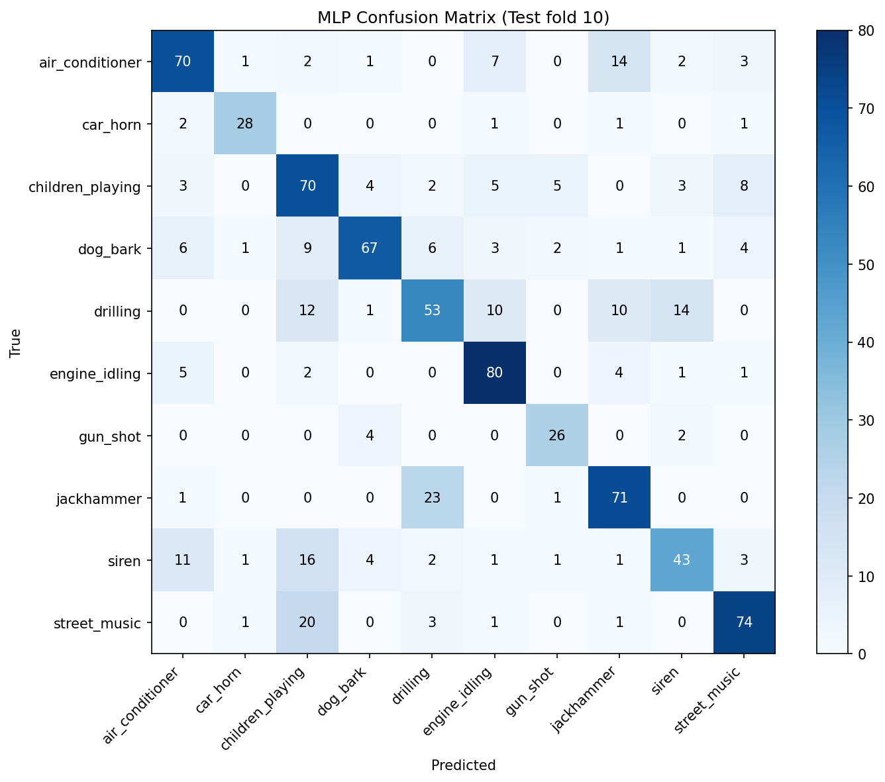
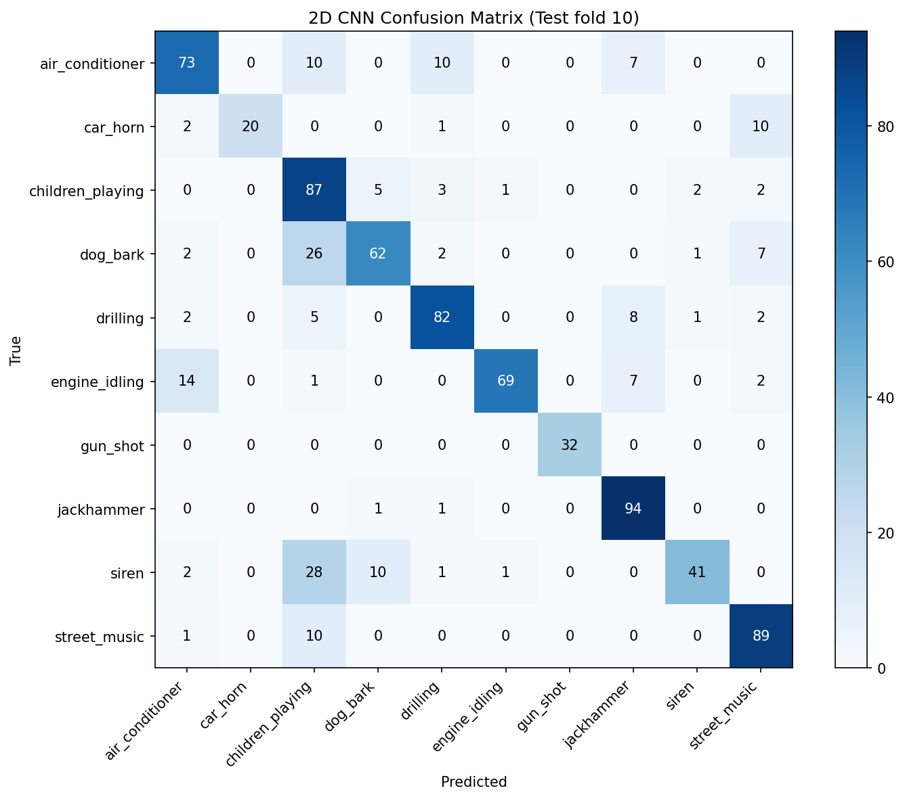
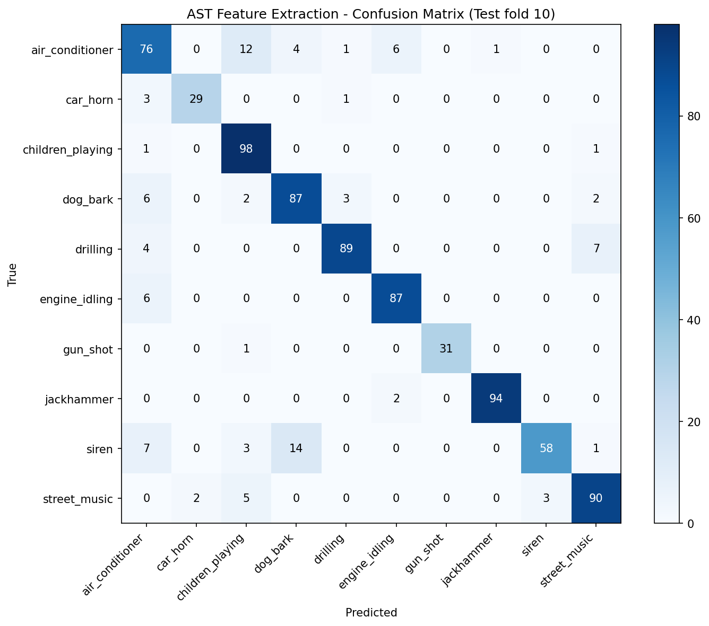

# 다양한 모델을 활용한 도시 환경 소리의 종류 분류 및 성능 평가
유튜브 링크: TODO

## Members: <br>
**2020064320 백연지**
  - 데이터셋 구조 파악 및 전처리 방법론 조사 <br>
  - MLP 구현 <br>
  - 2D CNN 구현 <br>
  - AST를 이용한 파인튜닝 구현

**2021013790 박지우**
  - 데이터셋 구조 파악 및 전처리 방법론 조사<br>
  - RCNN 구현<br>
  - 코드 리팩토링<br>
  - 보고서 정리<br>
  - 유튜브 촬영<br>

**2023021494 성신예**
  - 데이터셋 구조 파악 및 전처리 방법론 조사<br>
  - 2D CNN 구현<br>
  - 보고서 정리<br>

**2024024139 박사라**
  - 데이터셋 구조 파악 및 전처리 방법론 조사<br>
  - SVM 구현<br>
  - XGboost 구현<br>

# I. Proposal

본 프로젝트의 목적은 UrbanSound8K 데이터셋을 활용하여 도시 환경 소리를 10개 class로 분류하고, 서로 다른 모델 구조와 입력 feature가 분류 성능에 어떤 차이를 만드는지 비교하는 것이다. 단순히 가장 높은 accuracy를 얻는 모델을 찾는 것에 그치지 않고, MFCC 기반 feature vector, log-mel spectrogram, 사전학습 오디오 모델 표현이 각각 어떤 장점과 한계를 가지는지 분석한다.

도시 환경음은 사람 목소리나 음악처럼 일정한 패턴을 갖는 소리뿐 아니라, gun_shot, car_horn처럼 짧고 순간적인 소리, drilling, jackhammer처럼 반복적인 기계음, air_conditioner, engine_idling처럼 배경에 깔리는 지속음까지 포함한다. 따라서 하나의 모델만으로 성능을 판단하기보다, 입력 표현 방식과 모델 구조를 바꾸어가며 어떤 class에서 어떤 접근이 유리한지 확인할 필요가 있다.

모델 비교는 다음 관점으로 진행한다.

| 비교 관점 | 모델 | 확인하고 싶은 점 |
|---|---|---|
| 전통 머신러닝 baseline | SVM, XGBoost | 손으로 요약한 음향 feature만으로 어느 정도까지 분류 가능한지 |
| 단순 신경망 baseline | MLP | spectrogram 정보를 1차원으로 압축했을 때의 성능과 한계 |
| 2D 시간-주파수 패턴 학습 | 2D CNN | spectrogram의 지역적 패턴을 직접 학습하는 효과 |
| 시간 흐름 반영 | RCNN | CNN feature에 RNN을 더했을 때 시간적 변화 학습이 도움이 되는지 |
| 사전학습 표현 활용 | AST Feature Extraction, AST Full Fine-tuning | 대규모 오디오 사전학습 모델이 작은 데이터셋에서 얼마나 유리한지 |

최종적으로 이 프로젝트는 모델별 성능 순위를 제시하는 것을 넘어, 입력 feature의 정보량, 시간 구조 보존 여부, 모델 복잡도, 사전학습 활용 여부가 도시 환경음 분류 성능에 어떤 영향을 주는지 비교하는 것을 목표로 한다.

# II. Datasets

### 데이터 정의
UrbanSound8K은 도시 환경에서 발생하는 실제 소음(urban sounds)을 4초 이하로 잘라 라벨링한 데이터셋이다. Freesound.org에 업로드된 필드 레코딩에서 추출되었으며, 총 8,732개의 WAV 파일로 구성된다. 각 파일은 도시 생활에서 흔히 들을 수 있는 소리(공사 소음, 교통 소음, 사람/동물 소리 등)를 포함하며, 배경 소음이 섞여 있어 현실적인 환경음 분류 문제를 잘 반영한다.

### 데이터 구조

UrbanSound8K는 오디오 파일과 메타데이터가 분리된 구조로 제공된다.

```text
UrbanSound8K/
├── audio/
│   ├── fold1/
│   ├── fold2/
│   ├── ...
│   └── fold10/
└── metadata/
    └── UrbanSound8K.csv
```

| 항목 | 내용 |
|---|---|
| 전체 파일 수 | 8,732개 WAV 파일 |
| 클래스 수 | 10개 |
| 문제 유형 | multi-class classification |
| 오디오 위치 | `audio/fold1` ~ `audio/fold10` |
| 메타데이터 | `metadata/UrbanSound8K.csv` |

| classID | class |
|---:|---|
| 0 | air_conditioner |
| 1 | car_horn |
| 2 | children_playing |
| 3 | dog_bark |
| 4 | drilling |
| 5 | engine_idling |
| 6 | gun_shot |
| 7 | jackhammer |
| 8 | siren |
| 9 | street_music |

Fold는 총 10개(`fold1`~`fold10`)로 제공된다. 동일한 원본 레코딩에서 나온 슬라이스가 같은 fold에 들어가도록 설계되어, 서로 다른 split 사이의 데이터 누출을 줄일 수 있다.

### 출처
공식 사이트: https://urbansounddataset.weebly.com/urbansound8k.html <br>
원 논문: Salamon et al., "A Dataset and Taxonomy for Urban Sound Research" (ACM Multimedia 2014) <br>
라이선스: CC BY-NC 3.0 (비상업적 연구 목적 자유 이용)

# III. Methodology

## III-I. 데이터 전처리

### Sample Rate: 22050 Hz

전체 데이터의 Sample Rate(1초에 몇 번 측정해서 저장했는지) 분포를 확인한 결과, 44.1kHz와 48kHz가 대부분이지만 8kHz부터 192kHz까지 다양한 값이 존재한다. 

| Sample Rate (Hz) | Count | Percent (%) |
|---:|---:|---:|
| 8000 | 12 | 0.14 |
| 11024 | 7 | 0.08 |
| 11025 | 39 | 0.45 |
| 16000 | 45 | 0.52 |
| 22050 | 44 | 0.50 |
| 24000 | 82 | 0.94 |
| 32000 | 4 | 0.05 |
| 44100 | 5370 | 61.50 |
| 48000 | 2502 | 28.65 |
| 96000 | 610 | 6.99 |
| 192000 | 17 | 0.19 |

몇 Hz로 resampling할 지 정하기 위해, 아래 그림과 같이 여러 sample rate로 resampling한 뒤 원본 sample rate 기준 MFCC feature와 cosine similarity를 비교하였다. 22050 Hz는 평균 cosine similarity 0.9586으로 0.95 이상의 높은 유사도를 보였고, 8kHz, 11.025kHz, 16kHz보다 원본 MFCC 구조를 더 잘 유지하였다. 32kHz와 44.1kHz도 높은 유사도를 보이지만, 계산량과 저장 효율을 고려해 22.050 Hz로 결정했다.



### Channels: Mono

해당 데이터는 좌우 음향이 따로 있는 데이터(Stereo)와, 좌우 구분 없는 데이터(Mono)가 존재한다.

| Channels | Type | Count | Percent (%) |
|---:|---|---:|---:|
| 1 | Mono | 739 | 8.46 |
| 2 | Stereo | 7993 | 91.54 |

대부분의 파일이 stereo이지만, 도시 환경음 분류에서는 공간 정보(좌우 차이)의 차이가 적을 것으로 예상된다. 
아래 그림과 같이 Stereo 파일을 대상으로 left/right 채널의 MFCC cosine similarity를 계산한 결과, 평균 0.9888, median 0.9980으로 매우 높게 나타났다. 따라서 양쪽 채널 간 음향적 차이가 크지 않으며, 예상이 맞음을 확인했다. 이에 따라 데이터 형식을 mono로 통일한다.



### Bit Depth: 32-bit float

원본 파일들의 bit depth는 다양하지만, 모델 입력 시에는 float32로 변환하여 처리하였다. float32는 서로 다른 bit depth의 파일을 동일한 수치 형식으로 다룰 수 있게 하며, 정규화(normalization)와 PyTorch/TensorFlow 기반 학습 과정에서도 호환성이 좋다.

| Subtype | Bit Depth | Count | Percent (%) |
|---|---|---:|---:|
| PCM_16 | 16-bit PCM | 5758 | 65.94 |
| PCM_24 | 24-bit PCM | 2753 | 31.53 |
| FLOAT | 32-bit float | 169 | 1.94 |
| PCM_U8 | 8-bit PCM | 43 | 0.49 |
| MS_ADPCM | Microsoft ADPCM | 8 | 0.09 |
| IMA_ADPCM | IMA ADPCM | 1 | 0.01 |

### Duration: 4초, repeat padding

모든 파일을 4초로 고정하였다. 짧은 파일은 repeat padding(반복 채우기)을 적용했다. 

### Normalization

MFCC 기반 ML 모델(SVM, XGBoost)은 MFCC feature(40계수 mean + std)를 추출한 후 train fold 기준으로 standardization(mean=0, std=1)을 적용하였다.

Spectrogram 기반 모델(MLP, 2D CNN, RCNN, AST)은 log-mel spectrogram을 생성한 뒤 train set 전체 mean/std로 정규화하였다. MFCC는 소리의 특징을 요약한 1D 벡터이고, log-mel spectrogram은 주파수-시간 구조를 보존하는 2D 이미지 형태이므로, 모델 입력에 맞게 서로 다른 방식으로 정규화하였다.

아래 그림은 log-mel spectrogram 원본과 train fold 통계로 정규화한 예시이다. 정규화를 통해 feature scale을 일정하게 맞추어 모델이 특정 파일의 절대 에너지 크기보다 주파수-시간 패턴을 안정적으로 학습하도록 한다.



---
## III-II 모델

모든 모델은 공통적으로 Train fold 1~8, Validation fold 9, Test fold 10을 사용한다. 최적 모델은 Validation Accuracy 기준으로 선택하고, 선택된 모델을 Test fold 10에서 최종 평가한다.

### 1. XGBoost

#### 모델 설명

XGBoost는 Gradient Boosting 기반의 앙상블 학습 알고리즘으로, 여러 개의 결정트리(Decision Tree)를 순차적으로 학습하여 예측 성능을 향상시킨다. 과적합 방지 기능과 높은 학습 효율성을 제공하며, 다양한 머신러닝 문제에서 우수한 성능을 보이는 모델이다. 본 프로젝트에서는 다중 클래스 환경음 분류(Multi-class Sound Classification)에 활용하였다.

#### 입력 특징

- MFCC(Mel-Frequency Cepstral Coefficients) 40개 계수를 추출한다.
- 각 MFCC 계수의 평균(mean)과 표준편차(std)를 계산하여 총 80차원 feature를 사용한다.


#### 주요 하이퍼파라미터

| 항목 | 값 |
|---|---|
| n_estimators | 100, 300 |
| max_depth | 3, 5 |
| learning_rate | 0.05, 0.1 |
| subsample | 0.8 |
| colsample_bytree | 0.8 |
| objective | `multi:softmax` |
| num_class | 10 |
| eval_metric | `mlogloss` |
| random_state | 42 |

#### 최적 모델 저장 형식

최적 모델은 코드와 같은 디렉터리에 `xgb_checkpoint.json`으로 저장한다. XGBoost 모델은 JSON 형식으로 저장되며, MFCC feature 정규화에 사용한 `StandardScaler`는 `xgb_scaler.pkl`로 별도 저장한다. 따라서 inference 시에는 `xgb_checkpoint.json`과 `xgb_scaler.pkl`을 함께 사용한다.

### 2. SVM

#### 모델 설명

SVM(Support Vector Machine)은 초평면(hyperplane)을 이용하여 서로 다른 클래스를 분류하는 지도학습 알고리즘이다. 본 프로젝트에서는 비선형 데이터 분류를 위해 RBF(Radial Basis Function) 커널을 사용하였다. SVM은 고차원 특징 공간에서 클래스 간 경계를 효과적으로 학습할 수 있으며, 비교적 적은 데이터에서도 안정적인 성능을 보이는 장점이 있다.

#### 입력 특징

- MFCC 40개 계수를 추출한다.
- 각 MFCC 계수의 평균(mean)과 표준편차(std)를 계산하여 총 80차원 feature를 사용한다.

#### 주요 하이퍼파라미터

| 항목 | 값 |
|---|---|
| kernel | RBF |
| C | 1, 10, 100 |
| gamma | `scale`, `auto` |
| class_weight | `balanced` |
| random_state | 42 |

#### 최적 모델 저장 형식

최적 모델은 코드와 같은 디렉터리에 `svm_checkpoint.pkl`로 저장한다. 이 파일은 `joblib`으로 직렬화한 scikit-learn SVM 모델이다. MFCC feature 정규화에 사용한 `StandardScaler`는 `svm_scaler.pkl`로 별도 저장하므로, inference 시에는 모델 파일과 scaler 파일을 함께 사용한다.

### 3. MLP

#### 모델 설명

MLP(Multi-Layer Perceptron)는 fully-connected layer를 여러 층 쌓아 입력 feature로부터 class를 분류하는 가장 기본적인 신경망 모델이다. 본 프로젝트에서는 log-mel spectrogram을 시간축으로 압축한 256차원 feature를 입력으로 받아 10개 환경음 class를 분류하도록 구성하였다.

소리는 본래 `(주파수 × 시간)`의 2차원 정보지만, MLP는 1차원 벡터만 입력으로 받는다. 따라서 log-mel spectrogram의 시간축을 평균(mean)과 표준편차(std)로 요약하여 한 파일을 256개의 숫자로 압축한다. 이 방식은 "각 주파수 대역이 평균적으로 얼마나, 얼마나 들쭉날쭉하게 나타났는가"는 남기지만, "시간에 따라 어떻게 변하고 반복되는가"에 대한 정보는 줄어든다.

#### 입력 특징

- log-mel spectrogram을 추출한다. (`n_mels=128`, `n_fft=2048`, `hop_length=512`)
- 시간축 평균 128차원과 표준편차 128차원을 연결해 총 256차원 feature를 만든다.

#### 모델 구조

| 구성 | 내용 |
|---|---|
| 입력 | log-mel 시간축 요약 `(256,)` = mean 128 + std 128 |
| 흐름 | wav → log-mel `(128, T)` → 시간축 mean/std → `(256,)` |
| Hidden 1 | Linear(256 → 128) + ReLU + Dropout(0.3) |
| Hidden 2 | Linear(128 → 64) + ReLU + Dropout(0.3) |
| Classifier | Linear(64 → 10) |
| 출력 | 10개 class logits |

#### 주요 하이퍼파라미터

| 항목 | 값 |
|---|---|
| Sample Rate | 22050 Hz |
| Duration | 4.0 sec |
| Padding | repeat |
| n_mels | 128 |
| n_fft | 2048 |
| hop_length | 512 |
| Input Dim | 256 |
| Hidden | 128 → 64 |
| Dropout | 0.3 |
| Epochs | 100 |
| Batch Size | 64 |
| Learning Rate | 0.001 |
| Early Stopping Patience | 10 |
| Optimizer | Adam |
| Loss | CrossEntropyLoss |
| Random Seed | 42 |

#### 최적 모델 저장 형식

최적 모델은 코드와 같은 디렉터리에 `mlp_best.pt`로 저장한다. `.pt`는 PyTorch checkpoint 형식이며, `model_state_dict`, 입력 차원, class 수, class 이름, seed, 평가 metric 정보를 함께 담는다.

### 4. 2D CNN

#### 모델 설명

2D CNN(2D Convolutional Neural Network)은 소리를 이미지처럼 다루는 모델이다. log-mel spectrogram은 `(주파수 × 시간)`의 2차원 그림이므로, 이미지 인식에 쓰이는 2차원 합성곱(`Conv2d`)으로 그 안의 패턴을 직접 학습한다.

MLP가 입력 단계에서 시간축을 평균과 표준편차로 압축해 1차원 벡터로 만든 것과 달리, 2D CNN은 spectrogram을 2차원 그대로 입력받는다. 즉 "어떤 주파수에서 소리가 시간에 따라 어떻게 변하는가"라는 2차원 패턴을 모델이 직접 본다. 합성곱은 spectrogram 위를 훑으며 특정 주파수 대역의 에너지 분포, 시간에 따른 반복 무늬 같은 지역적 패턴을 잡아낸다.

#### 입력 특징

- log-mel spectrogram을 추출한다. (`n_mels=128`, `n_fft=2048`, `hop_length=512`)
- 4초 고정 길이로 인해 시간축 프레임 수는 약 173으로 일정해진다.
- 입력은 `(배치, 1채널, 128, 173)` 형태로 CNN에 들어간다.

#### 모델 구조

| 구성 | 내용 |
|---|---|
| 입력 | log-mel spectrogram `(1, 128, 173)` |
| Conv 블록 | 4개 `(32 → 64 → 128 → 128 채널)` |
| 블록 구성 | Conv2d(3×3) + BatchNorm + ReLU + Dropout2d + MaxPool(2×2) |
| Pooling | Global Average Pooling |
| Classifier | Dropout(0.3) + Linear(128 → 10) |
| 출력 | 10개 class logits |


#### 주요 하이퍼파라미터

| 항목 | 값 |
|---|---|
| Sample Rate | 22050 Hz |
| Duration | 4.0 sec |
| Padding | repeat |
| n_mels | 128 |
| n_fft | 2048 |
| hop_length | 512 |
| 입력 형태 | `(1, 128, 173)` |
| Conv 블록 | 4개 |
| Dropout | 0.05, 0.10, 0.15, classifier 0.3 |
| Epochs | 100 |
| Batch Size | 64 |
| Learning Rate | 0.001 |
| Early Stopping Patience | 10 |
| Optimizer | Adam |
| Loss | CrossEntropyLoss |
| Random Seed | 42 |

#### 최적 모델 저장 형식

최적 모델은 코드와 같은 디렉터리에 `2d_cnn_best.pt`로 저장한다. `.pt`는 PyTorch checkpoint 형식이며, `model_state_dict`, class 수, class 이름, seed, best validation accuracy, 평가 metric 정보를 함께 담는다.

### 5. RCNN

#### 모델 설명

RCNN(Recurrent Convolutional Neural Network)은 spectrogram의 공간적 패턴과 시간적 흐름을 함께 학습하는 모델이다. 본 프로젝트에서는 log-mel spectrogram을 CNN으로 먼저 압축한 뒤, Bi-GRU로 시간축의 앞뒤 문맥을 학습하도록 구성하였다.

CNN 부분은 spectrogram에서 지역적인 주파수-시간 패턴을 추출하고, RNN 부분은 CNN이 압축한 시퀀스를 따라 시간적 흐름을 학습한다. 마지막에는 time-axis mean pooling과 max pooling을 함께 사용해 전체 clip을 하나의 표현으로 요약한 뒤 10개 class를 분류한다.

#### 입력 특징

- log-mel spectrogram을 추출한다. (`n_mels=128`, `n_fft=1024`, `hop_length=512`)
- train split 기준 mean/std로 정규화한다.

#### 모델 구조

| 구성 | 내용 |
|---|---|
| 입력 | log-mel spectrogram `(1, 128, 173)` |
| CNN | ConvBlock 4개, freq-axis MaxPool 3회 |
| RNN | 2-layer Bidirectional GRU |
| Pooling | time-axis mean pooling + max pooling |
| Classifier | LayerNorm + Dropout + Linear |
| 출력 | 10개 class logits |

#### 학습 및 검증 설정

| 항목 | 설정 |
|---|---|
| Train | fold 1~8 |
| Validation | fold 9 |
| Test | fold 10 |
| 최적 모델 기준 | validation accuracy |
| Early Stopping 기준 | validation accuracy |

#### 주요 하이퍼파라미터

| 항목 | 값 |
|---|---|
| Sample Rate | 22050 Hz |
| Duration | 4.0 sec |
| Padding | repeat |
| n_mels | 128 |
| n_fft | 1024 |
| hop_length | 512 |
| top_db | 80 |
| Hidden Size | 128 |
| RNN Layers | 2 |
| Dropout | 0.3 |
| Epochs | 60 |
| Batch Size | 32 |
| Learning Rate | 0.001 |
| Weight Decay | 0.0001 |
| Gradient Clipping | 5.0 |
| Early Stopping Patience | 10 |
| Optimizer | AdamW |
| Loss | CrossEntropyLoss + class weight |
| Scheduler | ReduceLROnPlateau |
| Random Seed | 42 |

#### 최적 모델 저장 형식

최적 모델은 코드와 같은 디렉터리에 `best_rcnn.pt`로 저장한다. `.pt`는 PyTorch checkpoint 형식이며, `model_state_dict`, 모델 구조 인자, 전처리 설정, 정규화 통계, class 이름, 선택 기준(`validation_accuracy`) 정보를 함께 담는다.

### 6. 사전학습 오디오 모델(AST)

#### 모델 설명

AST(Audio Spectrogram Transformer)는 소리를 이미지처럼 다루는 사전학습 모델이다. 오디오를 spectrogram(가로축 시간 × 세로축 주파수의 그림)으로 바꾼 뒤, 이미지 인식에서 쓰이는 Transformer 구조로 분류한다. 본 프로젝트에서는 AudioSet으로 사전학습된 `MIT/ast-finetuned-audioset-10-10-0.4593` 모델을 가져와 UrbanSound8K 10개 class에 맞게 재학습하였다.

MLP가 소리의 시간 정보를 평균과 표준편차로 압축하는 것과 달리, AST는 spectrogram을 시간축까지 통째로 입력받는다. 즉 "소리가 시간에 따라 어떻게 변하고 반복되는가"를 모델이 직접 본다.

사전학습 모델을 활용하는 방식은 두 가지로 나누어 비교하였다.

| 방식 | 본체(Transformer) | 분류 헤드(classifier head) | 학습 대상 | 목적 |
|---|---|---|---|---|
| Feature Extraction (FE) | 동결(freeze) | 학습 | head만 | AudioSet 사전학습 표현을 그대로 사용할 때의 성능 확인 |
| Full Fine-tuning (Full FT) | 학습 | 학습 | 전체 모델 | UrbanSound8K에 맞춰 모델 전체를 미세조정했을 때의 성능 확인 |

Feature Extraction은 이미 소리를 잘 듣도록 훈련된 AST 본체는 그대로 두고, "이 소리가 10개 중 무엇인지" 판단하는 마지막 분류 헤드(classifier head)만 새로 학습하는 방식이다. Full Fine-tuning은 AST 본체까지 UrbanSound8K 데이터에 맞춰 함께 조정하는 방식이다.

AudioSet의 527개 라벨을 UrbanSound8K의 10개 라벨에 직접 대응시키는 Zero-shot 방식은 라벨 매핑의 주관성이 크고 모델 비교의 일관성도 떨어지므로 본 분석에서 제외하였다.

#### 입력 특징

- AST는 16kHz mono 입력을 사용한다.
- `ASTFeatureExtractor`가 길이 보정(1024 frame zero-padding)과 AudioSet 통계 기반 정규화를 처리한다.
- 입력 흐름은 `wav → 16kHz mono → ASTFeatureExtractor → spectrogram (1024 frame × 128 mel) → AST → 10개 class`이다.
- 분류 헤드(classifier head)는 사전학습 모델의 527-class 분류층을 10-class 분류층으로 교체한다.

#### 주요 하이퍼파라미터

| 항목 | Feature Extraction | Full Fine-tuning |
|---|---|---|
| Pretrained Model | `MIT/ast-finetuned-audioset-10-10-0.4593` | `MIT/ast-finetuned-audioset-10-10-0.4593` |
| Optimizer | AdamW | AdamW |
| Learning Rate | 1e-3 | 1e-5 |
| Batch Size | 32 | 16 |
| Max Epochs | 50 | 5 |
| Early Stopping | best val 저장 | patience=2 |
| Loss | CrossEntropyLoss | CrossEntropyLoss |
| Random Seed | 42 | 42 |
| Device | CUDA 사용 가능 시 GPU | CUDA 사용 가능 시 GPU |

#### 최적 모델 저장 형식

Feature Extraction 모델은 코드와 같은 디렉터리에 `ast_fe_best.pt`로 저장한다. 이 checkpoint는 AST 본체를 제외한 classifier head의 `head_state_dict`와 사전학습 모델 ID, class 정보, best validation accuracy, 평가 metric을 담는다.

Full Fine-tuning 모델은 코드와 같은 디렉터리에 `ast_full_ft_best.pt`로 저장한다. 이 checkpoint는 전체 AST 모델의 `model_state_dict`와 사전학습 모델 ID, class 정보, best validation accuracy, 평가 metric을 담는다.

---

# IV. Evaluation & Analysis

<br>

### 평가 항목:
| 통계값 | 설명 |
|---|---|
| accuracy | 전체 sample 중 모델이 정답을 맞힌 비율 |
| balanced accuracy | class별 recall을 평균낸 값. class imbalance가 있을 때 accuracy보다 공정하게 볼 수 있음 |
| macro precision | class별 precision을 단순 평균한 값. 모든 class를 같은 비중으로 반영 |
| macro recall | class별 recall을 단순 평균한 값. 작은 class의 탐지 성능까지 반영 |
| macro F1 | class별 F1을 단순 평균한 값. class imbalance가 있는 모델 비교에서 핵심 지표로 사용 |
| weighted precision | class별 precision을 sample 수에 따라 가중 평균한 값 |
| weighted recall | class별 recall을 sample 수에 따라 가중 평균한 값 |
| weighted F1 | class별 F1을 sample 수에 따라 가중 평균한 값. 실제 데이터 분포 기준 성능을 반영 |
| class별 precision | 특정 class라고 예측한 sample 중 실제로 그 class인 비율. 오탐이 많은지 확인 |
| class별 recall | 실제 특정 class sample 중 모델이 제대로 맞힌 비율. 미탐이 많은지 확인 |
| class별 F1 | class별 precision과 recall의 조화평균. 각 class의 종합 성능 확인 |
| confusion matrix | 실제 class와 예측 class의 대응표. 어떤 class끼리 헷갈리는지 확인 |

### 1. XGboost

#### Overall Performance

| Metric | Score |
|---|---:|
| Accuracy | 0.7336 |
| Balanced Accuracy | 0.7387 |
| Macro Precision | 0.7746 |
| Macro Recall | 0.7387 |
| Macro F1 | 0.7479 |
| Weighted Precision | 0.7539 |
| Weighted Recall | 0.7336 |
| Weighted F1 | 0.7354 |

#### Per-Class Performance

| Class | Precision | Recall | F1-score |
|---|---:|---:|---:|
| air_conditioner | 0.9167 | 0.7700 | 0.8370 |
| car_horn | 0.9583 | 0.6970 | 0.8070 |
| children_playing | 0.5473 | 0.8100 | 0.6532 |
| dog_bark | 0.7297 | 0.8100 | 0.7678 |
| drilling | 0.5897 | 0.6900 | 0.6359 |
| engine_idling | 0.9375 | 0.8065 | 0.8671 |
| gun_shot | 0.8529 | 0.9062 | 0.8788 |
| jackhammer | 0.6296 | 0.5312 | 0.5763 |
| siren | 0.7241 | 0.5060 | 0.5957 |
| street_music | 0.8600 | 0.8600 | 0.8600 |

#### Confusion Matrix



### 2. SVM

#### Overall Performance

| Metric | Score |
|---|---:|
| Accuracy | 0.7025 |
| Balanced Accuracy | 0.7222 |
| Macro Precision | 0.7324 |
| Macro Recall | 0.7222 |
| Macro F1 | 0.7236 |
| Weighted Precision | 0.7110 |
| Weighted Recall | 0.7025 |
| Weighted F1 | 0.7025 |

#### Per-Class Performance

| Class | Precision | Recall | F1-score |
|---|---:|---:|---:|
| air_conditioner | 0.7907 | 0.6800 | 0.7312 |
| car_horn | 0.8125 | 0.7879 | 0.8000 |
| children_playing | 0.6897 | 0.8000 | 0.7407 |
| dog_bark | 0.6045 | 0.8100 | 0.6923 |
| drilling | 0.5556 | 0.6000 | 0.5769 |
| engine_idling | 0.8889 | 0.7742 | 0.8276 |
| gun_shot | 0.9375 | 0.9375 | 0.9375 |
| jackhammer | 0.5385 | 0.4375 | 0.4828 |
| siren | 0.6296 | 0.6145 | 0.6220 |
| street_music | 0.8764 | 0.7800 | 0.8254 |

#### Confusion Matrix



### 3. MLP

#### Overall Performance

| Metric | Score |
|---|---:|
| Accuracy | 0.6953 |
| Balanced Accuracy | 0.7119 |
| Macro Precision | 0.7158 |
| Macro Recall | 0.7119 |
| Macro F1 | 0.7102 |
| Weighted Precision | 0.7021 |
| Weighted Recall | 0.6953 |
| Weighted F1 | 0.6947 |

#### Per-Class Performance

| Class | Precision | Recall | F1-score |
|---|---:|---:|---:|
| air_conditioner | 0.7143 | 0.7000 | 0.7071 |
| car_horn | 0.8750 | 0.8485 | 0.8615 |
| children_playing | 0.5344 | 0.7000 | 0.6061 |
| dog_bark | 0.8272 | 0.6700 | 0.7403 |
| drilling | 0.5955 | 0.5300 | 0.5608 |
| engine_idling | 0.7407 | 0.8602 | 0.7960 |
| gun_shot | 0.7429 | 0.8125 | 0.7761 |
| jackhammer | 0.6893 | 0.7396 | 0.7136 |
| siren | 0.6515 | 0.5181 | 0.5772 |
| street_music | 0.7872 | 0.7400 | 0.7629 |

#### Confusion Matrix



### 4. 2D CNN

#### Overall Performance

| Metric | Score |
|---|---:|
| Accuracy | 0.7754 |
| Balanced Accuracy | 0.7751 |
| Macro Precision | 0.8384 |
| Macro Recall | 0.7751 |
| Macro F1 | 0.7876 |
| Weighted Precision | 0.8099 |
| Weighted Recall | 0.7754 |
| Weighted F1 | 0.7751 |

#### Per-Class Performance

| Class | Precision | Recall | F1-score |
|---|---:|---:|---:|
| air_conditioner | 0.7604 | 0.7300 | 0.7449 |
| car_horn | 1.0000 | 0.6061 | 0.7547 |
| children_playing | 0.5210 | 0.8700 | 0.6517 |
| dog_bark | 0.7949 | 0.6200 | 0.6966 |
| drilling | 0.8200 | 0.8200 | 0.8200 |
| engine_idling | 0.9718 | 0.7419 | 0.8415 |
| gun_shot | 1.0000 | 1.0000 | 1.0000 |
| jackhammer | 0.8103 | 0.9792 | 0.8868 |
| siren | 0.9111 | 0.4940 | 0.6406 |
| street_music | 0.7946 | 0.8900 | 0.8396 |

#### Confusion Matrix



### 5. RCNN

#### Overall Performance

| Metric | Score |
|---|---:|
| Accuracy | 0.7849 |
| Balanced Accuracy | 0.8025 |
| Macro Precision | 0.8140 |
| Macro Recall | 0.8025 |
| Macro F1 | 0.8026 |
| Weighted Precision | 0.7913 |
| Weighted Recall | 0.7849 |
| Weighted F1 | 0.7818 |

#### Per-Class Performance

| Class | Precision | Recall | F1-score |
|---|---:|---:|---:|
| air_conditioner | 0.6346 | 0.6600 | 0.6471 |
| car_horn | 0.9394 | 0.9394 | 0.9394 |
| children_playing | 0.7207 | 0.8000 | 0.7583 |
| dog_bark | 0.7647 | 0.7800 | 0.7723 |
| drilling | 0.9438 | 0.8400 | 0.8889 |
| engine_idling | 0.8621 | 0.5376 | 0.6623 |
| gun_shot | 1.0000 | 0.9375 | 0.9677 |
| jackhammer | 0.8120 | 0.9896 | 0.8920 |
| siren | 0.6750 | 0.6506 | 0.6626 |
| street_music | 0.7876 | 0.8900 | 0.8357 |

#### Confusion Matrix


### 6. Pretrained audio model

#### 6-1. Feature Extraction (FE)

##### Overall Performance

| Metric | Score |
|---|---:|
| Accuracy | 0.8829 |
| Balanced Accuracy | 0.8861 |
| Macro Precision | 0.9006 |
| Macro Recall | 0.8861 |
| Macro F1 | 0.8903 |
| Weighted Precision | 0.8881 |
| Weighted Recall | 0.8829 |
| Weighted F1 | 0.8824 |

##### Per-Class Performance

| Class | Precision | Recall | F1-score |
|---|---:|---:|---:|
| air_conditioner | 0.7379 | 0.7600 | 0.7488 |
| car_horn | 0.9355 | 0.8788 | 0.9062 |
| children_playing | 0.8099 | 0.9800 | 0.8869 |
| dog_bark | 0.8286 | 0.8700 | 0.8488 |
| drilling | 0.9468 | 0.8900 | 0.9175 |
| engine_idling | 0.9158 | 0.9355 | 0.9255 |
| gun_shot | 1.0000 | 0.9688 | 0.9841 |
| jackhammer | 0.9895 | 0.9792 | 0.9843 |
| siren | 0.9508 | 0.6988 | 0.8056 |
| street_music | 0.8911 | 0.9000 | 0.8955 |

##### Confusion Matrix



#### 6-2. Full Fine-tuning (Full FT)

##### Overall Performance

| Metric | Score |
|---|---:|
| Accuracy | 0.8901 |
| Balanced Accuracy | 0.8999 |
| Macro Precision | 0.9102 |
| Macro Recall | 0.8999 |
| Macro F1 | 0.8993 |
| Weighted Precision | 0.9001 |
| Weighted Recall | 0.8901 |
| Weighted F1 | 0.8890 |

##### Per-Class Performance

| Class | Precision | Recall | F1-score |
|---|---:|---:|---:|
| air_conditioner | 0.8444 | 0.7600 | 0.8000 |
| car_horn | 0.9143 | 0.9697 | 0.9412 |
| children_playing | 0.8151 | 0.9700 | 0.8858 |
| dog_bark | 0.7500 | 0.9300 | 0.8304 |
| drilling | 0.9767 | 0.8400 | 0.9032 |
| engine_idling | 0.9556 | 0.9247 | 0.9399 |
| gun_shot | 1.0000 | 1.0000 | 1.0000 |
| jackhammer | 0.9600 | 1.0000 | 0.9796 |
| siren | 1.0000 | 0.6747 | 0.8058 |
| street_music | 0.8857 | 0.9300 | 0.9073 |

##### Confusion Matrix


---

# 7. 최종 비교 분석

모든 모델 조합을 일대일로 비교하기보다는, 입력 표현과 모델 구조가 어떻게 발전했는지를 중심으로 결과를 해석하였다. 핵심 비교 축은 `MFCC 기반 고전 ML`, `시간 정보를 압축한 MLP`, `시간-주파수 패턴을 보존한 CNN/RCNN`, `사전학습 표현을 활용한 AST`이다.

| 흐름 | 대표 모델 | 입력 표현 | 시간 정보 반영 | Accuracy | Macro F1 | 해석 |
|---|---|---|---|---:|---:|---|
| 고전 ML | XGBoost | MFCC mean/std | 낮음 | 0.7336 | 0.7479 | 빠르고 안정적인 baseline이나 시간적 패턴 표현에 한계 |
| 고전 ML | SVM | MFCC mean/std | 낮음 | 0.7025 | 0.7236 | 고차원 feature 분류는 가능하지만 복잡한 환경음 분리에는 제한적 |
| 기본 DL | MLP | log-mel 시간축 요약 | 낮음 | 0.6953 | 0.7102 | 신경망이지만 입력 단계에서 시간 정보를 잃어 성능 향상이 제한됨 |
| Spectrogram DL | 2D CNN | log-mel 2D 이미지 | 중간 | 0.7754 | 0.7876 | 주파수-시간 패턴을 직접 보면서 반복음 구분이 개선됨 |
| Spectrogram DL | RCNN | log-mel + CNN + Bi-GRU | 중간 | 0.7849 | 0.8026 | 시간 흐름을 추가로 반영해 CNN보다 소폭 개선 |
| Pretrained DL | AST FE | pretrained AST + head | 높음 | 0.8829 | 0.8903 | 사전학습 표현만으로도 큰 성능 향상 |
| Pretrained DL | AST Full FT | pretrained AST 전체 미세조정 | 높음 | 0.8901 | 0.8993 | 전체 모델 중 가장 높은 정확도와 Macro F1 기록 |

### 1. 고전 ML과 DL의 차이

MFCC 기반 XGBoost와 SVM은 비교적 단순한 feature로도 70%대 accuracy를 보여 baseline으로 충분한 의미가 있었다. 특히 `gun_shot`, `engine_idling`, `street_music`처럼 음색적 특징이 뚜렷한 class에서는 안정적인 성능을 보였다. 그러나 MFCC mean/std는 한 audio clip을 요약 통계로 압축하므로, 소리가 시간에 따라 어떻게 반복되고 변하는지는 충분히 표현하지 못한다.

MLP도 딥러닝 모델이지만 입력을 log-mel spectrogram의 시간축 평균과 표준편차로 압축했기 때문에, 고전 ML 대비 뚜렷한 성능 향상을 보이지 못했다. 이 결과는 성능 차이가 단순히 `ML vs DL`에서만 생기는 것이 아니라, 모델이 어떤 입력 표현을 받는지에 크게 좌우된다는 점을 보여준다.

### 2. 시간 정보 보존의 효과

2D CNN부터는 log-mel spectrogram을 2차원 형태로 입력받기 때문에, 주파수 대역이 시간에 따라 어떻게 나타나는지를 직접 학습할 수 있다. 그 결과 MLP보다 Accuracy와 Macro F1이 모두 상승하였다. 특히 `drilling`, `jackhammer`처럼 반복 타격 패턴이 중요한 class에서 성능 개선이 두드러졌다.

RCNN은 CNN으로 추출한 패턴 위에 Bi-GRU를 적용하여 시간 흐름을 더 명시적으로 반영했다. 성능은 2D CNN보다 소폭 높았지만, 증가폭은 크지 않았다. 이는 UrbanSound8K에서 시간 정보가 중요하긴 하지만, 단순히 RNN을 추가하는 것보다 좋은 spectrogram 표현과 사전학습 표현을 사용하는 것이 더 큰 영향을 줄 수 있음을 의미한다.

### 3. 사전학습 모델의 효과

AST는 가장 높은 성능을 보였다. Feature Extraction만으로도 Accuracy 0.8829, Macro F1 0.8903을 기록했으며, Full Fine-tuning은 Accuracy 0.8901, Macro F1 0.8993으로 전체 모델 중 가장 높았다. 두 방식의 차이가 크지는 않았지만, Full Fine-tuning이 최종 정확도 기준 best model이다.

이 결과는 UrbanSound8K처럼 데이터 수가 아주 크지 않은 환경에서 사전학습 모델의 장점이 크다는 것을 보여준다. AudioSet으로 미리 학습된 AST는 일반적인 오디오 패턴을 이미 학습하고 있기 때문에, 마지막 분류기만 학습해도 강한 성능을 낼 수 있었다.

### 4. 어려웠던 class와 이유

모델들이 공통적으로 어려워한 class는 `siren`, `air_conditioner`, `engine_idling`, 그리고 일부 도시 배경음 계열이다. `siren`은 class 자체가 뚜렷해 보이지만 실제 데이터에서는 배경 소음, 사람 소리, 개 짖는 소리와 함께 섞여 나타나는 경우가 많아 recall이 낮아지는 경향이 있었다. `air_conditioner`와 `engine_idling`은 둘 다 지속적인 저주파 기계음 성격을 가지므로 서로 비슷한 feature로 표현되기 쉽다.

반대로 `gun_shot`, `jackhammer`, `car_horn`은 여러 모델에서 상대적으로 높은 성능을 보였다. 짧고 강한 충격음, 반복 타격음, 뚜렷한 경적음처럼 시간-주파수 패턴이 분명한 class는 모델이 구별할 단서가 많기 때문이다. 다만 `drilling`과 `jackhammer`처럼 둘 다 반복적인 기계 타격음을 포함하는 class는 MFCC 기반 모델에서는 혼동되기 쉬웠고, spectrogram 기반 모델과 AST로 갈수록 구분이 개선되었다.

### 5. 종합 해석

최종적으로 가장 중요한 차이는 모델 이름보다 입력 표현 방식이었다. MFCC 기반 모델은 빠르고 해석하기 쉬운 baseline을 제공했지만 시간적 구조를 충분히 담지 못했다. MLP는 딥러닝 모델이지만 시간축을 요약해 사용했기 때문에 한계가 있었다. 2D CNN과 RCNN은 spectrogram을 통해 시간-주파수 패턴을 보존하면서 성능을 끌어올렸고, AST는 사전학습된 오디오 표현을 활용해 가장 높은 성능을 달성했다.

따라서 본 프로젝트의 결론은 단순히 복잡한 모델이 항상 좋은 것이 아니라, 오디오의 핵심 정보인 시간 변화와 주파수 구조를 얼마나 잘 보존하고 활용하는지가 성능을 결정한다는 것이다.

# V. Related Work

UrbanSound8K은 환경음 분류(Environmental Sound Classification, ESC) 연구에서 널리 사용되는 대표 벤치마크 데이터셋이다. 공식 데이터셋은 8,732개의 4초 이하 urban sound clip과 10개 class를 제공하며, 비교 가능한 평가를 위해 predefined 10-fold 구조 사용을 권장한다. 본 프로젝트는 이 데이터셋을 바탕으로 MFCC 기반 고전 ML부터 spectrogram 기반 딥러닝, pretrained audio model까지 단계적으로 비교하였다.

주요 관련 연구는 다음 흐름으로 정리할 수 있다.

- [Salamon et al. (2014)](https://doi.org/10.1145/2647868.2655045)은 UrbanSound/UrbanSound8K 데이터셋과 taxonomy를 제안하고, MFCC 기반 feature와 SVM, Random Forest 등 전통 ML baseline을 함께 제시하였다. 이는 본 프로젝트의 MFCC 기반 SVM/XGBoost 실험과 직접적으로 연결된다.
- [Piczak (2015)](https://www.karolpiczak.com/papers/Piczak2015-ESC-ConvNet.pdf)은 log-mel spectrogram 기반 CNN을 UrbanSound8K, ESC-10, ESC-50에 적용하여, 수작업 feature 기반 방식에서 spectrogram 기반 CNN으로 넘어가는 초기 흐름을 보여주었다.
- [Salamon & Bello (2017)](https://www.justinsalamon.com/uploads/4/3/9/4/4394963/salamon_cnn-aug-env_ieeespl_2017.pdf)는 UrbanSound8K에서 CNN과 data augmentation을 결합하여 성능 향상을 보였고, CNN이 시간-주파수 패턴을 학습하는 데 적합하다는 점을 강조하였다.
- [Abdoli et al. (2019)](https://arxiv.org/abs/1904.08990)은 raw waveform을 직접 입력으로 받는 1D CNN을 제안하여, handcrafted feature 없이도 오디오의 시간 구조를 end-to-end로 학습할 수 있음을 보였다.
- [Gong et al. (2021)](https://groups.csail.mit.edu/sls/publications/2021/YuanGong_Interspeech-2021.pdf)은 Audio Spectrogram Transformer(AST)를 제안하였다. AST는 UrbanSound8K가 아니라 AudioSet, ESC-50, Speech Commands 등에서 평가되었지만, spectrogram을 patch sequence로 보고 self-attention을 적용하는 pretrained audio transformer 흐름의 대표 사례이다.

본 프로젝트는 위 연구 흐름을 바탕으로 MFCC 기반 고전 ML, log-mel spectrogram 기반 MLP/CNN/RCNN, pretrained AST의 Feature Extraction과 Full Fine-tuning을 비교하였다.

# VI. Conclusion: Discussion

본 프로젝트의 UrbanSound8K 환경음 분류 문제를 통해, 같은 데이터셋을 사용하더라도 어떤 feature를 만들고, 시간 정보를 얼마나 보존하는지에 따라 모델 성능과 오분류 양상이 크게 달라진 것을 알 수 있었다.

주요 결론은 다음과 같다.

- MFCC 기반 SVM/XGBoost는 빠르고 구현이 단순하지만, 한 clip을 mean/std 통계로 요약하기 때문에 시간에 따른 반복 패턴을 충분히 반영하지 못했다.
- MLP는 딥러닝 모델이지만 입력 단계에서 log-mel spectrogram의 시간축을 압축했기 때문에, 고전 ML 대비 뚜렷한 성능 향상을 보이지 못했다.
- 2D CNN과 RCNN은 spectrogram의 시간-주파수 구조를 직접 학습하면서 `drilling`, `jackhammer` 같은 반복 타격음 계열에서 더 좋은 성능을 보였다.
- AST는 AudioSet 기반 사전학습 표현을 활용하여 가장 높은 성능을 기록했다. 정확도 기준 best model은 AST Full Fine-tuning이지만, Feature Extraction도 성능 차이가 작으면서 학습 비용이 Fine-tuning보다 낮았다.
- `siren`, `air_conditioner`, `engine_idling`처럼 배경 소음과 섞이거나 지속적인 기계음 성격을 가지는 class는 여러 모델에서 공통적으로 어려웠다. 이는 모델 구조만의 문제가 아니라 데이터 자체의 음향적 유사성과 녹음 환경의 복잡성에서 비롯된 한계로 볼 수 있다.

이 실험의 의의는 오디오 분류에서 모델의 복잡도보다 입력 표현 방식이 더 본질적인 역할을 한다는 점을 보여준 데 있다. 단순한 MFCC feature는 빠른 프로토타이핑과 baseline 구축에 적합하고, spectrogram 기반 CNN/RCNN은 시간-주파수 패턴 학습에 유리하며, pretrained AST는 적은 데이터에서도 강한 표현력을 제공한다.

향후 작업으로는 data augmentation과 background/foreground 정보를 활용한 학습 확장이 가능하다. 본 프로젝트에서는 모델 간 비교의 일관성을 유지하기 위해 원본 오디오를 동일한 전처리 조건으로 사용하였고, 추가적인 augmentation은 적용하지 않았다. 또한 UrbanSound8K의 메타데이터에는 사람이 구분한 foreground/background 구분이 제공되지만 해당 데이터를 잘 표현하는 전처리 작업을 하기 어려워 이번 프로젝트에는 사용하지 않았다.
