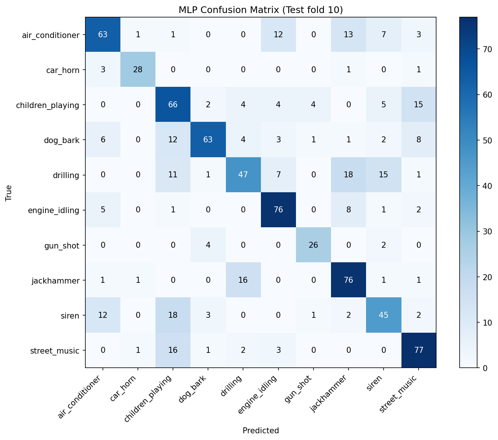
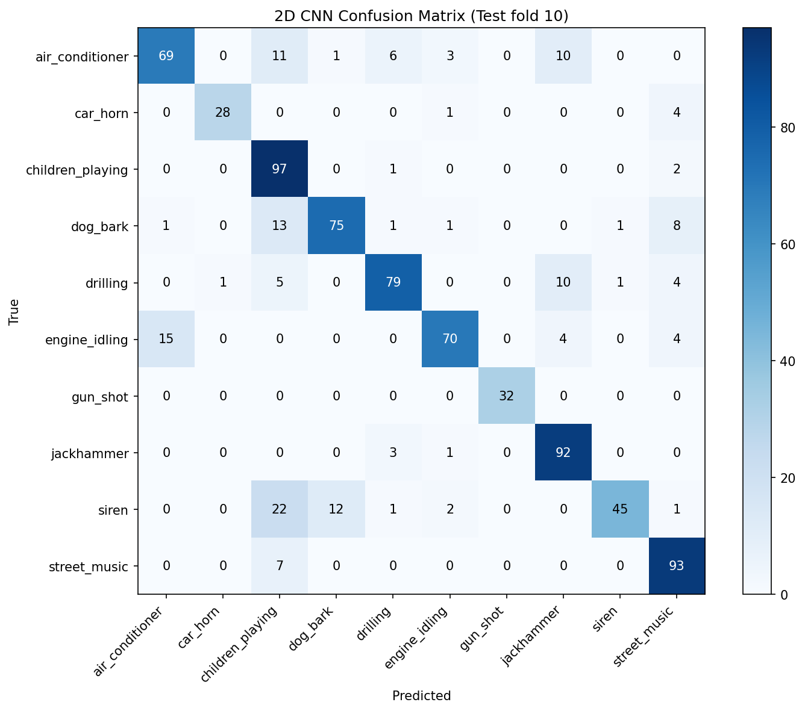
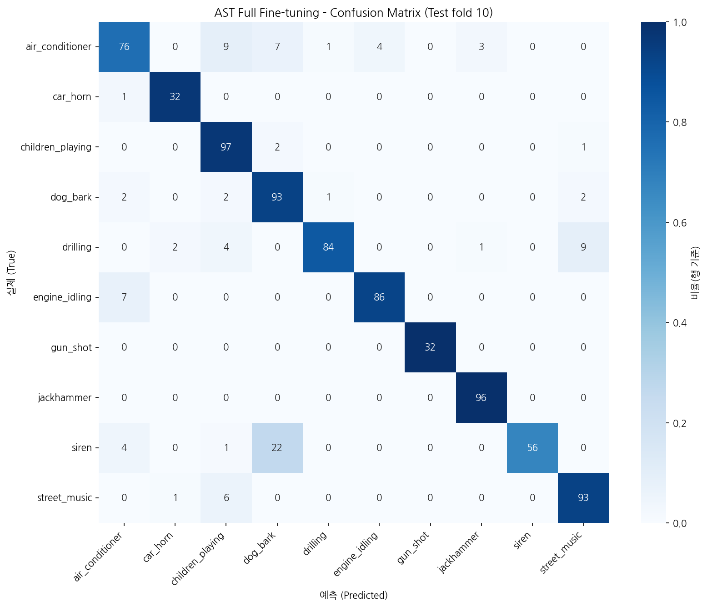

# 다양한 모델을 활용한 도시 환경 소리의 종류 분류 및 성능 평가

Members: 
    2020064320 백연지
    2021013790 박지우
    2023021494 성신예
    2024024139 박사라

# I. Proposal (Option A)
이 프로젝트는 도시 환경 소리를 컴퓨터가 분류할 수 있도록 학습시키는 모델링 프로젝트이다. UrbanSound8K 데이터셋을 활용하여 오디오를 MFCC(Mel-Frequency Cepstral Coefficients)나 Spectrogram(Log-Mel)으로 변환한 후, 전통 머신러닝 모델(Random Forest, SVM, XGBoost, MLP)과 딥러닝 모델(2D CNN, RCNN, Pretrained AST)을 비교한다.
핵심은 단순히 높은 정확도를 달성하는 것이 아니라, 오디오 데이터를 어떤 형태(MFCC: 숫자 feature vs. Spectrogram: 이미지-like)로 표현하느냐에 따라 모델 접근 방식(ML vs. DL)이 어떻게 달라지는지, 그리고 시간 정보 보존 여부가 분류 성능과 오분류 패턴에 미치는 영향을 분석하는 것이다. 이를 통해 “컴퓨터는 소리를 어떻게 이해하고 특징을 추출하여 분류하는가?”라는 질문을 탐구한다.

# II. Datasets

1. 어떤 데이터이고
UrbanSound8K은 도시 환경에서 발생하는 실제 소음(urban sounds)을 4초 이하로 잘라 라벨링한 데이터셋이다. Freesound.org에 업로드된 필드 레코딩에서 추출되었으며, 총 8,732개의 WAV 파일로 구성된다. 각 파일은 도시 생활에서 흔히 들을 수 있는 소리(공사 소음, 교통 소음, 사람/동물 소리 등)를 포함하며, 배경 소음이 섞여 있어 현실적인 환경음 분류 문제를 잘 반영한다.

3. 클래스 개수, 클래스 종류, fold 구조
클래스 개수: 10개 (multi-class classification)
클래스 종류: air_conditioner, car_horn, children_playing, dog_bark, drilling, engine_idling, gun_shot, jackhammer, siren, street_music
Fold 구조: 미리 10개의 fold(fold1~fold10)로 나누어 제공된다. 이는 동일한 원본 레코딩에서 나온 슬라이스가 같은 fold에 들어가지 않도록 설계되어 교차 검증 시 데이터 누출을 방지한다. 일반적으로 fold 1~9(또는 1~8)를 train, 나머지를 validation/test로 사용하며, 10-fold cross validation을 권장한다. 본 프로젝트에서는 Train: fold 1~8, Validation: fold 9, Test: fold 10을 주로 사용하였다.

4. 출처
공식 사이트: https://urbansounddataset.weebly.com/urbansound8k.html
원 논문: Salamon et al., "A Dataset and Taxonomy for Urban Sound Research" (ACM Multimedia 2014)
라이선스: CC BY-NC 3.0 (비상업적 연구 목적 자유 이용)

# III. Methodology
[TODO] - 성신예
## III-I. 데이터 전처리

### Sample Rate: 22050 Hz
전체 데이터의 Sample Rate 분포를 확인한 결과, 대부분 44.1kHz 부근이지만 다양한 값(8kHz ~ 192kHz)이 존재한다. 본 프로젝트에서는 22050 Hz로 resampling하였다. 이는 MFCC/Spectrogram 추출 시 계산 효율성과 Nyquist theorem을 만족하면서도 충분한 주파수 정보를 유지하는 균형점이기 때문이다. 22050 Hz와 원본 간 MFCC 유사도 및 에너지 보존률이 높아 정보 손실이 최소화되었다.

### Channels: Mono
대부분의 파일이 stereo 또는 mono이지만, 도시 환경음 분류에서는 공간 정보(좌우 차이)보다 주파수/시간 패턴이 더 중요하다. 모든 오디오를 mono로 변환(평균 또는 단일 채널 선택)하여 입력 차원을 단순화하고, 모델 일관성을 유지하였다. 양쪽 채널 간 차이가 크지 않은 도시 소음 특성상 mono 변환으로 인한 정보 손실이 미미하다.

### Bit Depth: 32-float point
원본 파일들의 bit depth는 다양(8~32bit)하나, 모델 입력 시 float32로 변환하여 정규화(normalization)한다. float32는 정보 손실 없이 높은 정밀도를 제공하며, 딥러닝 프레임워크(PyTorch/TensorFlow)와의 호환성이 우수하다.

### Duration: 4초, repeat padding
모든 파일을 4초로 고정하였다. 짧은 파일은 repeat padding(반복 채우기)을 적용했다. zero-padding은 순간적인 특징(gun_shot 등)을 왜곡할 수 있으나, repeat padding은 원래 소리의 패턴을 유지하여 모델이 시간적 반복성을更好地 학습할 수 있다.

### Noramlization: 

1.MFCC 기반 ML 모델 (SVM, Random Forest, XGBoost): MFCC feature(40계수 mean + std 등) 추출 후 train fold 기준 standardization (mean=0, std=1).

2.Spectrogram 기반 모델 (MLP, 2D CNN, RCNN, AST): log-mel spectrogram 생성 후 train set 전체 mean/std로 정규화.
MFCC는 소리의 cepstral 특징을 요약한 1D 벡터, log-mel spectrogram은 주파수-시간 2D 이미지(예: n_mels=128)로, 모델 입력에 적합하게 변환된다.

---
## III-II 모델 

### 1. XGboost 

## Model Description

XGBoost는 Gradient Boosting 기반의 앙상블 학습 알고리즘으로, 여러 개의 결정트리(Decision Tree)를 순차적으로 학습하여 예측 성능을 향상시킨다.
과적합 방지 기능과 높은 학습 효율성을 제공하며, 다양한 머신러닝 문제에서 우수한 성능을 보이는 모델이다.
본 프로젝트에서는 다중 클래스 환경음 분류(Multi-class Sound Classification)에 활용하였다.

## Validation Strategy

Fold 1~8을 Train set으로 사용하고 Fold 9를 Validation set으로 사용하였다.
Validation Accuracy를 기준으로 최적 모델을 선택하였으며, 최종 선택된 모델에 대해 Fold 10 Test set으로 성능을 평가하였다.

Best Validation Accuracy: **0.681373**

## Hyperparameters

- Number of Trees (n_estimators): 300
- Max Depth: 5
- Learning Rate: 0.05
- Subsample: 0.8
- Colsample Bytree: 0.8
- Objective: multi:softmax
- Number of Classes: 10
- Evaluation Metric: mlogloss
- Random State: 42

## Features Used

- MFCC (Mel-Frequency Cepstral Coefficients)
- 40개의 MFCC 계수 추출
- 각 계수의 평균(mean)과 표준편차(std) 계산
- 총 Feature 수: 80개
  - 40 MFCC means
  - 40 MFCC standard deviations

### 2. SVM

## Model Description

SVM(Support Vector Machine)은 초평면(hyperplane)을 이용하여 서로 다른 클래스를 분류하는 지도학습 알고리즘이다.
본 프로젝트에서는 비선형 데이터 분류를 위해 RBF(Radial Basis Function) 커널을 사용하였다.
SVM은 고차원 특징 공간에서 클래스 간 경계를 효과적으로 학습할 수 있으며, 비교적 적은 데이터에서도 안정적인 성능을 보이는 장점이 있다.

## Validation Strategy

Fold 1~8을 Train set으로 사용하고 Fold 9를 Validation set으로 사용하였다.
Validation Accuracy를 기준으로 최적 모델을 선택하였으며, 최종 선택된 모델에 대해 Fold 10 Test set으로 성능을 평가하였다.

Best Validation Accuracy: **0.703431**

## Hyperparameters

- Kernel: RBF
- C: 10
- Gamma: scale
- Class Weight: balanced
- Random State: 42

## Features Used

- MFCC (Mel-Frequency Cepstral Coefficients)
- 40개의 MFCC 계수 추출
- 각 계수의 평균(mean) 계산
- 각 계수의 표준편차(std) 계산
- 총 Feature 수: 80개
  - 40 MFCC means
  - 40 MFCC standard deviations

### 3. MLP

## Model Description

MLP(Multi-Layer Perceptron)는 fully-connected layer를 여러 층 쌓아 입력 feature로부터 class를 분류하는 가장 기본적인 신경망 모델이다.
본 프로젝트에서는 log-mel spectrogram을 **시간축으로 압축한 256차원 feature**를 입력으로 받아 10개 환경음 class를 분류하도록 구성하였다.

소리는 본래 `(주파수 × 시간)`의 2차원 정보지만, MLP는 1차원 벡터만 입력으로 받는다. 그래서 log-mel spectrogram의 시간축을 **평균(mean)과 표준편차(std)로 요약**하여 한 파일을 256개의 숫자로 압축한다.
즉 "소리가 시간에 따라 어떻게 변하고 반복되는가"는 버리고, "전체적으로 어떤 주파수 대역이 평균 얼마나, 얼마나 들쭉날쭉하게 나타났는가"만 남긴다. 이 입력 설계가 성능에 어떤 영향을 주는지는 **IV에서 확인한다.**

| 구성 | 내용 |
|---|---|
| 입력 | log-mel 시간축 요약 `(256,)` = mean 128 + std 128 |
| 흐름 | wav → log-mel `(128, T)` → 시간축 mean·std → `(256,)` |
| Hidden 1 | Linear(256 → 128) + ReLU + Dropout(0.3) |
| Hidden 2 | Linear(128 → 64) + ReLU + Dropout(0.3) |
| Classifier | Linear(64 → 10) |
| 출력 | 10개 class logits |
| 코드 | `models/MLP/mlp_model.py` |
| checkpoint | `models/MLP/mlp_best.pt` |

## Design Decisions

환경음 분류에 어떤 접근이 적합한지 확인하기 위해 여러 모델을 비교하는 과정에서, MLP를 가장 기본적인 신경망 baseline으로 다루었다.

MLP를 적용하며 마주한 첫 번째 결정은 **입력을 어떻게 만들 것인가**였다. 소리는 본래 `(주파수 × 시간)`의 2차원 정보지만, MLP는 1차원 벡터만 입력으로 받는다. 따라서 log-mel spectrogram `(128 × T)`를 그대로 넣을 수 없고, 어떤 식으로든 고정 길이 벡터로 만들어야 한다. 본 분석에서는 시간축을 **평균(128) + 표준편차(128)** 로 요약해 256차원으로 압축하는 방식을 택했다. 이는 "각 주파수 대역이 평균적으로 얼마나, 얼마나 들쭉날쭉하게 나타났는가"는 남기되, "시간에 따라 어떻게 변하고 반복되는가"는 버리는 선택이다.

이 압축은 MLP라는 모델을 쓰기로 한 데서 따라오는 자연스러운 귀결이지만, 동시에 **입력 단계에서 시간 정보를 잃는다**는 분명한 특성을 갖는다. 이 특성이 분류 성능에 어떤 영향을 주는지는 IV에서 결과로 확인한다.

## Hyperparameters

| 항목 | 내용 |
|---|---|
| Sample Rate | 22050 Hz |
| Duration | 4.0 sec |
| Padding | repeat |
| n_mels | 128 |
| n_fft | 2048 |
| hop_length | 512 |
| Input Dim | 256 (mean 128 + std 128) |
| Hidden | 128 → 64 |
| Dropout | 0.3 |
| Epochs | 100 |
| Batch Size | 64 |
| Learning Rate | 0.001 |
| Early Stopping Patience | 10 |
| Optimizer | Adam |
| Loss | CrossEntropyLoss |
| Random State | 42 |
| Best Model 기준 | validation accuracy |

## Features Used

- 22050Hz mono audio를 4초 길이로 고정 (짧으면 repeat padding)
- log-mel spectrogram 추출 (n_mels=128, n_fft=2048, hop_length=512)
- 시간축 평균 128차원 + 표준편차 128차원 → 총 256차원
- train(fold 1-8) 기준 mean/std로 정규화 후 validation·test에 동일 적용
- Train: fold 1-8 / Validation: fold 9 / Test: fold 10

### 4. 2D CNN

## Model Description

2D CNN(2D Convolutional Neural Network)은 소리를 **이미지처럼** 다루는 모델이다. log-mel spectrogram은 `(주파수 × 시간)`의 2차원 그림이므로, 이미지 인식에 쓰이는 2차원 합성곱(`Conv2d`)으로 그 안의 패턴을 직접 학습한다.

MLP가 입력 단계에서 시간축을 평균으로 압축해 1차원 벡터로 만든 것과 달리, 2D CNN은 **spectrogram을 2차원 그대로 입력**받는다. 즉 "어떤 주파수에서 소리가 시간에 따라 어떻게 변하는가"라는 2차원 패턴을 모델이 직접 본다. 이 차이가 결과에 어떻게 나타나는지는 IV에서 확인한다.

## Design Decisions

여러 모델을 비교하는 과정에서, MLP가 잃어버린 시간 정보를 보존하는 접근으로 2D CNN을 다루었다. 합성곱은 spectrogram 위를 훑으며 지역적인 패턴(특정 주파수 대역의 에너지 분포, 시간에 따른 반복 무늬 등)을 잡아낸다.

모델은 **ConvBlock(Conv2d → BatchNorm → ReLU → Dropout → MaxPool)을 4개 쌓는** 구조로 설계했다. 블록을 거칠수록 단순한 패턴에서 점차 복잡한 패턴으로 추상화되며, 4개 정도면 환경음 분류에 충분한 표현력을 가지면서도 과하게 무겁지 않다. Conv 블록 뒤에는 Global Average Pooling으로 각 채널을 요약한 뒤, 분류기(Linear)로 10개 class 점수를 낸다. (RNN을 덧붙인 RCNN과 달리, 순수 합성곱만으로 분류한다.)

## Input Flow

```
wav → 22050Hz mono → 4초 고정(repeat pad) → log-mel (128 × 173) → 2D CNN → 10개 class
```

- 오디오를 4초로 고정하므로 시간축 프레임 수(T)가 약 173으로 일정해진다
- 입력은 `(배치, 1채널, 128, 173)` 형태로 CNN에 들어간다
- train(fold 1~8) 기준 평균/표준편차로 정규화하여 validation·test에 동일 적용

## Hyperparameters

| 항목 | 내용 |
|---|---|
| Sample Rate | 22050 Hz |
| Duration | 4.0 sec (repeat pad) |
| n_mels | 128 |
| n_fft | 2048 |
| hop_length | 512 |
| 입력 형태 | (1, 128, 173) |
| Conv 블록 | 4개 (32 → 64 → 128 → 128 채널) |
| 블록 구성 | Conv2d(3×3) + BatchNorm + ReLU + Dropout2d + MaxPool(2×2) |
| Pooling | Global Average Pooling |
| Classifier | Dropout(0.3) + Linear(128 → 10) |
| Optimizer | Adam |
| Learning Rate | 0.001 |
| Batch Size | 64 |
| Max Epochs | 100 |
| Early Stopping Patience | 10 |
| Loss | CrossEntropyLoss |
| Random Seed | 42 |
| Best Model 기준 | validation accuracy |

## Evaluation Setup

| 항목 | 설정 |
|---|---|
| Train | fold 1~8 (7,079개) |
| Validation | fold 9 (816개) |
| Test | fold 10 (837개) |
| 코드 | `models/2D_CNN/2d_cnn_model.py` |
| checkpoint | `models/2D_CNN/2d_cnn_best.pt` |

### 5. RCNN

## Model Description

RCNN(Recurrent Convolutional Neural Network)은 spectrogram의 공간적 패턴과 시간적 흐름을 함께 학습하는 모델이다.  
본 프로젝트에서는 log-mel spectrogram을 CNN으로 먼저 압축한 뒤, Bi-GRU로 시간 축의 앞뒤 문맥을 학습하도록 구성하였다.

| 구성 | 내용 |
|---|---|
| 입력 | log-mel spectrogram `(1, 128, 173)` |
| CNN | ConvBlock 4개, freq-axis MaxPool 3회 |
| RNN | 2-layer Bidirectional GRU |
| Pooling | time-axis mean pooling + max pooling |
| Classifier | LayerNorm + Dropout + Linear |
| 출력 | 10개 class logits |
| 코드 | `models/rcnn/rcnn.py` |
| checkpoint | `models/rcnn/best_rcnn.pt` |

## Hyperparameters

| 항목 | 내용 |
|---|---|
| Sample Rate | 22050 Hz |
| Duration | 4.0 sec |
| Padding | repeat |
| n_mels | 128 |
| n_fft | 1024 |
| hop_length | 512 |
| top_db | 80 |
| Hidden Size | 128 |
| RNN Layers | 2 |
| Dropout | 0.3 |
| Epochs | 60 |
| Batch Size | 32 |
| Learning Rate | 0.001 |
| Weight Decay | 0.0001 |
| Gradient Clipping | 5.0 |
| Early Stopping Patience | 10 |
| Optimizer | AdamW |
| Loss | CrossEntropyLoss + class weight |
| Scheduler | ReduceLROnPlateau |
| Best Model 기준 | validation macro F1 |

## Features Used

- 22050Hz mono audio를 4초 길이로 고정
- 짧은 audio는 repeat padding 적용
- log-mel spectrogram 추출
- train split 기준 mean/std로 정규화
- Train: fold 1-8 / Validation: fold 9 / Test: fold 10

### 6. Pretrained audio model

## Model Description

AST(Audio Spectrogram Transformer)는 소리를 이미지처럼 다루는 사전학습 모델이다. 오디오를 spectrogram(가로축 시간 × 세로축 주파수의 그림)으로 바꾼 뒤, 이미지 인식에서 쓰이는 Transformer 구조로 분류한다.
본 프로젝트에서는 Google이 AudioSet(200만 개 이상의 유튜브 오디오, 527개 라벨)으로 미리 학습해둔 `MIT/ast-finetuned-audioset-10-10-0.4593` 모델을 가져와 UrbanSound8K 10개 class에 맞게 재학습하였다.

MLP가 소리의 시간 정보를 평균으로 압축해 버린 것과 달리, AST는 **spectrogram을 시간축까지 통째로 입력**받는다. 즉 "소리가 시간에 따라 어떻게 변하고 반복되는가"를 모델이 직접 본다. 이 차이가 결과에 어떻게 나타나는지는 **IV에서 확인한다.**

사전학습 모델을 활용하는 방식은 두 가지로 나누어 비교하였다.

| 방식 | 본체(Transformer) | classifier head | 학습 대상 | 목적 |
|---|---|---|---|---|
| **Feature Extraction (FE)** | 동결(freeze) | 학습 | head만 | AudioSet 사전학습 표현을 그대로 쓸 때의 성능 |
| **Full Fine-tuning (Full FT)** | 학습 | 학습 | 전체 | UrbanSound8K에 맞춰 모델 전체를 미세조정 |

> **비유.** Feature Extraction은 이미 소리를 잘 듣도록 훈련된 전문가(AST 본체)는 그대로 두고, "이 소리가 10개 중 무엇인지" 판단하는 마지막 판단부(head)만 새로 가르치는 방식이다. Full Fine-tuning은 전문가의 귀까지 우리 데이터에 맞춰 다시 조율하는 방식이다.

AudioSet의 527개 라벨을 UrbanSound8K의 10개 라벨에 직접 대응시키는 Zero-shot 방식은, 라벨 매핑의 주관성이 크고 MLP와의 일관성도 떨어지므로 본 분석에서 제외하였다.

## Input Flow

```
wav → 16kHz mono → ASTFeatureExtractor → spectrogram (1024 frame × 128 mel) → AST → 10개 class
```

- AST는 16kHz mono 입력을 요구한다 (MLP의 22,050Hz와 다름)
- `ASTFeatureExtractor`가 길이 보정(1024 frame zero-padding)과 AudioSet 통계 기반 정규화를 자동 처리한다
- classifier head는 사전학습 모델의 527-class 분류층을 떼어내고 `LayerNorm(768) → Linear(768 → 10)`으로 교체

## Design Decisions

MLP가 입력 단계에서 시간 정보를 압축한다는 특성을 가졌다면, 그 정보를 보존하는 모델은 어떤 결과를 낼지 확인하기 위해 사전학습 모델 AST를 다루었다. AST는 spectrogram을 시간축까지 통째로 입력받으므로, 시간 정보 보존 여부라는 관점에서 MLP와 대비되는 위치에 있다.

사전학습 모델을 활용하는 방식에는 여러 갈래가 있어, 그중 무엇을 택할지 결정해야 했다.

- **Zero-shot 제외**: AudioSet의 527개 라벨을 UrbanSound8K의 10개 라벨에 직접 대응시키는 방식은, 어떤 라벨을 어떤 class로 볼지 판단하는 과정에 주관이 크게 개입한다. 매핑 기준에 따라 결과가 달라질 수 있어 분석의 일관성을 해치므로 제외했다.
- **Feature Extraction과 Full Fine-tuning을 모두 수행**: 하나의 방식만 택하지 않고 두 방식을 함께 학습해 비교하기로 했다. AST 본체를 동결하고 head만 학습하는 FE는 "AudioSet으로 학습된 표현을 그대로 가져다 쓸 때의 성능"을, 전체를 미세조정하는 Full FT는 "UrbanSound8K에 맞춰 모델 전체를 조정했을 때의 성능"을 보여준다. 데이터 규모가 크지 않은 환경에서 사전학습 표현만으로 충분한지, 아니면 전체 미세조정이 필요한지를 직접 확인하기 위한 비교였다.

두 방식의 비교 결과와, 시간 정보 보존이라는 관점에서 MLP와 어떻게 이어지는지는 IV에서 확인한다.

## Hyperparameters

| 항목 | Feature Extraction | Full Fine-tuning |
|---|---|---|
| 학습 대상 | head (LayerNorm + Linear) | 전체 모델 |
| Optimizer | AdamW | AdamW |
| Learning Rate | 1e-3 | 1e-5 |
| Batch Size | 전체 batch (7,079) | 16 |
| Max Epochs | 50 | 5 |
| Early Stopping | best val 저장 | patience=2 |
| Loss | CrossEntropyLoss | CrossEntropyLoss |
| Random Seed | 42 | 42 |
| Device | T4 GPU (CUDA) | T4 GPU (CUDA) |

## Evaluation Setup

| 항목 | 설정 |
|---|---|
| Train | fold 1–8 (7,079개) |
| Validation | fold 9 (816개) |
| Test | fold 10 (837개) |
| 코드 | `models/AST/ast_model.py` |
| checkpoint (FE) | `models/AST/ast_fe_best.pt` (head만, 약 39KB) |
| checkpoint (Full FT) | 약 329MB로 GitHub 100MB 제한 초과 → 저장소 미포함 |

---

# IV. Evaluation & Analysis

### Train: fold 1-8 / Validation: fold 9 / Test: fold 10 
<br>

### 평가 항목: 
| 통계값 | 설명 |
|---|---|
| accuracy | 전체 sample 중 모델이 정답을 맞힌 비율 |
| balanced accuracy | class별 recall을 평균낸 값. class imbalance가 있을 때 accuracy보다 공정하게 볼 수 있음 |
| macro precision | class별 precision을 단순 평균한 값. 모든 class를 같은 비중으로 반영 |
| macro recall | class별 recall을 단순 평균한 값. 작은 class의 탐지 성능까지 반영 |
| macro F1 | class별 F1을 단순 평균한 값. class imbalance가 있는 모델 비교에서 핵심 지표로 사용 |
| weighted precision | class별 precision을 sample 수에 따라 가중 평균한 값 |
| weighted recall | class별 recall을 sample 수에 따라 가중 평균한 값 |
| weighted F1 | class별 F1을 sample 수에 따라 가중 평균한 값. 실제 데이터 분포 기준 성능을 반영 |
| class별 precision | 특정 class라고 예측한 sample 중 실제로 그 class인 비율. 오탐이 많은지 확인 |
| class별 recall | 실제 특정 class sample 중 모델이 제대로 맞힌 비율. 미탐이 많은지 확인 |
| class별 F1 | class별 precision과 recall의 조화평균. 각 class의 종합 성능 확인 |
| confusion matrix | 실제 class와 예측 class의 대응표. 어떤 class끼리 헷갈리는지 확인 |

### 1. XGboost 

## Overall Performance

| Metric | Score |
|----------|----------:|
| Validation Accuracy | 0.681373 |
| Test Accuracy | 0.728793 |
| Test Balanced Accuracy | 0.734558 |
| Test Macro Precision | 0.776564 |
| Test Macro Recall | 0.734558 |
| Test Macro F1 | 0.746983 |
| Test Weighted Precision | 0.749381 |
| Test Weighted Recall | 0.728793 |
| Test Weighted F1 | 0.730958 |

### Per-Class Performance

| Class | Precision | Recall | F1-score |
|---------|---------:|---------:|---------:|
| air_conditioner | 0.904762 | 0.760000 | 0.826087 |
| car_horn | 1.000000 | 0.727273 | 0.842105 |
| children_playing | 0.540000 | 0.810000 | 0.648000 |
| dog_bark | 0.740741 | 0.800000 | 0.769231 |
| drilling | 0.584746 | 0.690000 | 0.633028 |
| engine_idling | 0.925926 | 0.806452 | 0.862069 |
| gun_shot | 0.903226 | 0.875000 | 0.888889 |
| jackhammer | 0.632911 | 0.520833 | 0.571429 |
| siren | 0.700000 | 0.506024 | 0.587413 |
| street_music | 0.833333 | 0.850000 | 0.841584 |

### Result Analysis

- 가장 높은 F1-score는 gun_shot (0.888889), engine_idling (0.862069), car_horn (0.842105)에서 나타났다.
- siren (0.587413), jackhammer (0.571429), drilling (0.633028)은 상대적으로 낮은 성능을 보였다.
- children_playing은 Recall(0.81)은 높지만 Precision(0.54)이 낮아 다른 클래스가 children_playing으로 오분류되는 경향이 존재하였다.
- engine_idling, gun_shot, car_horn과 같이 특징이 뚜렷한 소리는 높은 분류 성능을 보였다.

### Confusion Matrix

| Actual \ Predicted | air_conditioner | car_horn | children_playing | dog_bark | drilling | engine_idling | gun_shot | jackhammer | siren | street_music |
|-------------------|----------------:|---------:|-----------------:|---------:|---------:|--------------:|---------:|-----------:|------:|-------------:|
| air_conditioner | 76 | 0 | 0 | 3 | 2 | 4 | 0 | 15 | 0 | 0 |
| car_horn | 2 | 24 | 0 | 0 | 0 | 0 | 0 | 1 | 0 | 6 |
| children_playing | 0 | 0 | 81 | 10 | 0 | 2 | 0 | 0 | 4 | 3 |
| dog_bark | 0 | 0 | 11 | 80 | 2 | 0 | 1 | 0 | 1 | 5 |
| drilling | 0 | 0 | 5 | 3 | 69 | 0 | 2 | 10 | 9 | 2 |
| engine_idling | 5 | 0 | 5 | 1 | 0 | 75 | 0 | 3 | 3 | 1 |
| gun_shot | 0 | 0 | 0 | 4 | 0 | 0 | 28 | 0 | 0 | 0 |
| jackhammer | 1 | 0 | 1 | 0 | 44 | 0 | 0 | 50 | 0 | 0 |
| siren | 0 | 0 | 34 | 7 | 0 | 0 | 0 | 0 | 42 | 0 |
| street_music | 0 | 0 | 13 | 0 | 1 | 0 | 0 | 0 | 1 | 85 |

### Confusion Matrix Analysis

- air_conditioner는 대부분 정확히 분류되었으나, 일부가 jackhammer(15건)로 오분류되었다.
- children_playing과 dog_bark 사이에서 상호 혼동이 발생하였다. children_playing은 dog_bark로 10건, dog_bark는 children_playing으로 11건 오분류되었다.
- drilling과 jackhammer 사이의 혼동이 가장 크게 나타났다. drilling은 jackhammer로 10건 오분류되었으며, jackhammer는 drilling으로 44건 오분류되었다.
- siren은 children_playing으로 34건, dog_bark로 7건 오분류되어 도시 환경음 간의 혼동이 관찰되었다.
- street_music는 children_playing으로 13건 오분류되는 경향을 보였다.
- gun_shot은 32개 중 28개를 정확히 분류하여 비교적 안정적인 성능을 나타냈다.
- 전반적으로 공사 소음(drilling, jackhammer)과 도시 환경음(children_playing, dog_bark, siren) 간의 음향적 유사성이 주요 오분류 원인으로 나타났다.


### 2. SVM

## Overall Performance

| Metric | Score |
|----------|----------:|
| Validation Accuracy | 0.703431 |
| Test Accuracy | 0.702509 |
| Test Balanced Accuracy | 0.722153 |
| Test Macro Precision | 0.732377 |
| Test Macro Recall | 0.722153 |
| Test Macro F1 | 0.723635 |
| Test Weighted Precision | 0.711003 |
| Test Weighted Recall | 0.702509 |
| Test Weighted F1 | 0.702494 |

### Per-Class Performance

| Class | Precision | Recall | F1-score |
|---------|---------:|---------:|---------:|
| air_conditioner | 0.790698 | 0.680000 | 0.731183 |
| car_horn | 0.812500 | 0.787879 | 0.800000 |
| children_playing | 0.689655 | 0.800000 | 0.740741 |
| dog_bark | 0.604478 | 0.810000 | 0.692308 |
| drilling | 0.555556 | 0.600000 | 0.576923 |
| engine_idling | 0.888889 | 0.774194 | 0.827586 |
| gun_shot | 0.937500 | 0.937500 | 0.937500 |
| jackhammer | 0.538462 | 0.437500 | 0.482759 |
| siren | 0.629630 | 0.614458 | 0.621951 |
| street_music | 0.876404 | 0.780000 | 0.825397 |

### Result Analysis

- 가장 높은 F1-score는 gun_shot (0.937500)에서 나타났다.
- engine_idling (0.827586), street_music (0.825397), car_horn (0.800000) 역시 높은 분류 성능을 보였다.
- jackhammer (0.482759), drilling (0.576923)은 상대적으로 낮은 성능을 보였다.
- 공사 소음 계열(drilling, jackhammer)에서 성능 저하가 두드러졌다.

### Confusion Matrix

| Actual \ Predicted | air_conditioner | car_horn | children_playing | dog_bark | drilling | engine_idling | gun_shot | jackhammer | siren | street_music |
|-------------------|----------------:|---------:|-----------------:|---------:|---------:|--------------:|---------:|-----------:|------:|-------------:|
| air_conditioner | 68 | 0 | 0 | 5 | 1 | 8 | 0 | 17 | 1 | 0 |
| car_horn | 1 | 26 | 0 | 0 | 0 | 0 | 0 | 1 | 0 | 5 |
| children_playing | 1 | 0 | 80 | 12 | 0 | 0 | 0 | 0 | 7 | 0 |
| dog_bark | 0 | 4 | 8 | 81 | 1 | 1 | 0 | 0 | 0 | 5 |
| drilling | 0 | 0 | 1 | 4 | 60 | 0 | 2 | 18 | 14 | 1 |
| engine_idling | 9 | 1 | 0 | 5 | 0 | 72 | 0 | 0 | 6 | 0 |
| gun_shot | 0 | 0 | 0 | 2 | 0 | 0 | 30 | 0 | 0 | 0 |
| jackhammer | 6 | 0 | 2 | 1 | 45 | 0 | 0 | 42 | 0 | 0 |
| siren | 0 | 0 | 8 | 24 | 0 | 0 | 0 | 0 | 51 | 0 |
| street_music | 1 | 1 | 17 | 0 | 1 | 0 | 0 | 0 | 2 | 78 |

### Confusion Matrix Analysis

- air_conditioner는 jackhammer(17건)와 engine_idling(8건)으로 오분류되는 경우가 많았다.
- children_playing과 dog_bark 사이의 상호 혼동이 발생하였다. children_playing은 dog_bark로 12건, dog_bark는 children_playing으로 8건 오분류되었다.
- drilling과 jackhammer 사이의 혼동이 가장 크게 나타났다. drilling은 jackhammer로 18건 오분류되었으며, jackhammer는 drilling으로 45건 오분류되었다.
- siren은 dog_bark로 24건, children_playing으로 8건 오분류되어 도시 환경음 간의 혼동이 관찰되었다.
- street_music는 children_playing으로 17건 오분류되는 경향을 보였다.
- gun_shot은 32개 중 30개를 정확히 분류하여 가장 높은 분류 성능을 보였다.
- 전반적으로 공사 소음(drilling, jackhammer)과 도시 환경음(children_playing, dog_bark, siren) 간의 음향적 유사성이 주요 오분류 원인으로 나타났다.

### 3. MLP

## Overall Performance

| Metric | Score |
|---|---:|
| Test Loss | 1.0890 |
| Accuracy | 0.6774 |
| Balanced Accuracy | 0.6972 |
| Macro Precision | 0.7078 |
| Macro Recall | 0.6972 |
| Macro F1 | 0.6972 |
| Weighted Precision | 0.6865 |
| Weighted Recall | 0.6774 |
| Weighted F1 | 0.6757 |

## Per-Class Performance

| Class | Precision | Recall | F1-score | Support |
|---|---:|---:|---:|---:|
| air_conditioner | 0.7000 | 0.6300 | 0.6632 | 100 |
| car_horn | 0.9032 | 0.8485 | 0.8750 | 33 |
| children_playing | 0.5280 | 0.6600 | 0.5867 | 100 |
| dog_bark | 0.8514 | 0.6300 | 0.7241 | 100 |
| drilling | 0.6438 | 0.4700 | 0.5434 | 100 |
| engine_idling | 0.7238 | 0.8172 | 0.7677 | 93 |
| gun_shot | 0.8125 | 0.8125 | 0.8125 | 32 |
| jackhammer | 0.6387 | 0.7917 | 0.7070 | 96 |
| siren | 0.5769 | 0.5422 | 0.5590 | 83 |
| street_music | 0.7000 | 0.7700 | 0.7333 | 100 |

## Confusion Matrix



| Actual \ Predicted | air_conditioner | car_horn | children_playing | dog_bark | drilling | engine_idling | gun_shot | jackhammer | siren | street_music |
|---|---:|---:|---:|---:|---:|---:|---:|---:|---:|---:|
| air_conditioner | 63 | 1 | 1 | 0 | 0 | 12 | 0 | 13 | 7 | 3 |
| car_horn | 3 | 28 | 0 | 0 | 0 | 0 | 0 | 1 | 0 | 1 |
| children_playing | 0 | 0 | 66 | 2 | 4 | 4 | 4 | 0 | 5 | 15 |
| dog_bark | 6 | 0 | 12 | 63 | 4 | 3 | 1 | 1 | 2 | 8 |
| drilling | 0 | 0 | 11 | 1 | 47 | 7 | 0 | 18 | 15 | 1 |
| engine_idling | 5 | 0 | 1 | 0 | 0 | 76 | 0 | 8 | 1 | 2 |
| gun_shot | 0 | 0 | 0 | 4 | 0 | 0 | 26 | 0 | 2 | 0 |
| jackhammer | 1 | 1 | 0 | 0 | 16 | 0 | 0 | 76 | 1 | 1 |
| siren | 12 | 0 | 18 | 3 | 0 | 0 | 1 | 2 | 45 | 2 |
| street_music | 0 | 1 | 16 | 1 | 2 | 3 | 0 | 0 | 0 | 77 |

## Major Confusions

| 실제 class | 주된 오분류 | 건수 |
|---|---|---:|
| drilling | jackhammer | 18 |
| siren | children_playing | 18 |
| jackhammer | drilling | 16 |
| street_music | children_playing | 16 |
| drilling | siren | 15 |
| air_conditioner | jackhammer | 13 |

## Result Analysis

- 강점: `car_horn`(F1 0.875), `gun_shot`(0.813), `engine_idling`(0.768)
- 약점: `drilling`(0.543), `siren`(0.559), `children_playing`(0.587)
- 주요 혼동: `drilling ↔ jackhammer`(서로 18·16건), `air_conditioner → jackhammer·engine_idling`

**관찰.** 가장 두드러지는 오분류는 `jackhammer`와 `drilling`이 서로를 헷갈리는 패턴이다(drilling→jackhammer 18, jackhammer→drilling 16). 두 소리 모두 "드르륵·탕탕" 하는 **반복 타격음**으로, 이 반복 리듬이 두 class를 가르는 핵심 단서다. `air_conditioner` 역시 `jackhammer`(13)·`engine_idling`(12) 같은 다른 기계음 쪽으로 흘러가, 기계음 계열이 서로 끌어당기는 경향이 보인다. 한편 `children_playing`은 `siren`·`street_music` 등 잡다한 배경음을 빨아들이는 흡수 class로 작동한다.

**해석.** MLP는 입력 단계에서 log-mel을 시간축 평균·표준편차로 압축한다. 이 과정에서 "소리가 시간에 따라 어떻게 반복되는가"라는 정보가 사라진다. 결국 기계음들은 "비슷한 주파수 대역이 비슷하게 들쭉날쭉한 평균값"으로 뭉뚱그려져, 모델이 서로 구별할 단서를 입력 단계에서 이미 잃는다. 즉 모델 구조가 약해서가 아니라, **데이터의 핵심 특징(시간 변화)을 feature로 만드는 단계에서 버렸기 때문**으로 볼 수 있다.

> MLP의 한계는 모델 구조가 아니라 입력 설계에서 비롯된다. 소리를 시간 정보 없이 평균값으로 압축하면, 반복 패턴이 본질인 기계음(`jackhammer`·`drilling` 등)은 구별할 단서 자체가 사라진다. 그렇다면 시간 흐름을 보존하는 입력을 쓰면 이 혼동이 풀릴 수 있을까 — 이것이 다음 모델로 넘어가는 질문이다.

### 4. 2D CNN

## Overall Performance

| Metric | Score |
|---|---:|
| Test Loss | 0.5937 |
| Accuracy | 0.8124 |
| Balanced Accuracy | 0.8232 |
| Macro Precision | 0.8573 |
| Macro Recall | 0.8232 |
| Macro F1 | 0.8275 |
| Weighted Precision | 0.8350 |
| Weighted Recall | 0.8124 |
| Weighted F1 | 0.8101 |
| Best Val Accuracy | 0.8100 |
| 종료 Epoch | 48 (Early Stopping) |

## Per-Class Performance (F1 내림차순)

| Class | Precision | Recall | F1-score | Support |
|---|---:|---:|---:|---:|
| gun_shot | 1.0000 | 1.0000 | 1.0000 | 32 |
| car_horn | 0.9655 | 0.8485 | 0.9032 | 33 |
| jackhammer | 0.7931 | 0.9583 | 0.8679 | 96 |
| street_music | 0.8017 | 0.9300 | 0.8611 | 100 |
| drilling | 0.8681 | 0.7900 | 0.8272 | 100 |
| engine_idling | 0.8974 | 0.7527 | 0.8187 | 93 |
| dog_bark | 0.8523 | 0.7500 | 0.7979 | 100 |
| children_playing | 0.6258 | 0.9700 | 0.7608 | 100 |
| air_conditioner | 0.8118 | 0.6900 | 0.7459 | 100 |
| siren | 0.9574 | 0.5422 | 0.6923 | 83 |

## Confusion Matrix



## Major Confusions (5건 이상)

| 실제 class | 주된 오분류 | 건수 |
|---|---|---:|
| siren | children_playing | 22 |
| engine_idling | air_conditioner | 15 |
| dog_bark | children_playing | 13 |
| siren | dog_bark | 12 |
| air_conditioner | children_playing | 11 |
| drilling | jackhammer | 10 |
| air_conditioner | jackhammer | 10 |
| dog_bark | street_music | 8 |
| street_music | children_playing | 7 |
| air_conditioner | drilling | 6 |
| drilling | children_playing | 5 |

## Result Analysis

- 강점: `gun_shot`(F1 1.0000), `car_horn`(0.9032), `jackhammer`(0.8679)
- 약점: `siren`(0.6923), `air_conditioner`(0.7459), `children_playing`(0.7608)
- 주요 혼동: `siren → children_playing`(22), `engine_idling → air_conditioner`(15)

**관찰.** Test Accuracy 0.8124, Macro F1 0.8275를 기록했다. `gun_shot`은 완벽 분류(F1 1.0000), 반복 타격음인 `jackhammer`(0.8679)와 `drilling`(0.8272)도 비교적 잘 구별된다. 반면 `siren`은 precision 0.9574로 높지만 recall 0.5422로 낮아, 실제 siren의 약 절반을 `children_playing`(22건)·`dog_bark`(12건)로 놓쳤다. `children_playing`은 recall 0.9700로 거의 다 맞히지만 precision 0.6258에 그쳐, 여러 class가 이쪽으로 흘러드는 흡수 class로 작동했다.

**해석.** 2D CNN은 spectrogram을 시간축까지 보존한 2차원 입력으로 받기 때문에, 합성곱이 "시간에 따른 반복 무늬"를 패턴으로 포착할 수 있다. 그 결과 `jackhammer`·`drilling` 같은 반복 타격음 계열을 비교적 잘 구별한다. 즉 입력에서 시간 정보를 유지하는 것이 이러한 기계음 분류에 유리하게 작용한 것으로 볼 수 있다.

다만 `siren`처럼 다른 소리(`children_playing`·`dog_bark`)와 음향적으로 겹치는 class는 여전히 약했다. 이는 입력 표현 방식과 무관하게 **데이터 자체의 모호성**에서 비롯된 한계로 보인다.

> 2D CNN은 spectrogram을 2차원 그대로 입력받아 시간에 따른 반복 패턴을 학습하며, 이를 통해 반복 타격음 계열(`jackhammer`·`drilling`)을 효과적으로 구별한다. 다만 `siren`처럼 소리 자체가 다른 class와 겹치는 경우는 모델 구조로 해소되지 않으며, 이는 데이터의 본질적 모호성에 해당한다.

### 5. RCNN

## Overall Performance

| Metric | Score |
|---|---:|
| Test Loss | 1.0044 |
| Accuracy | 0.7706 |
| Balanced Accuracy | 0.7957 |
| Macro Precision | 0.8103 |
| Macro Recall | 0.7957 |
| Macro F1 | 0.7932 |
| Weighted Precision | 0.7877 |
| Weighted Recall | 0.7706 |
| Weighted F1 | 0.7678 |

## Per-Class Performance

| Class | Precision | Recall | F1-score | Support |
|---|---:|---:|---:|---:|
| air_conditioner | 0.7347 | 0.7200 | 0.7273 | 100 |
| car_horn | 0.9688 | 0.9394 | 0.9538 | 33 |
| children_playing | 0.6916 | 0.7400 | 0.7150 | 100 |
| dog_bark | 0.8632 | 0.8200 | 0.8410 | 100 |
| drilling | 0.9839 | 0.6100 | 0.7531 | 100 |
| engine_idling | 0.7826 | 0.5806 | 0.6667 | 93 |
| gun_shot | 0.9697 | 1.0000 | 0.9846 | 32 |
| jackhammer | 0.6761 | 1.0000 | 0.8067 | 96 |
| siren | 0.7037 | 0.6867 | 0.6951 | 83 |
| street_music | 0.7288 | 0.8600 | 0.7890 | 100 |

## Confusion Matrix


| Actual \ Predicted | air_conditioner | car_horn | children_playing | dog_bark | drilling | engine_idling | gun_shot | jackhammer | siren | street_music |
|---|---:|---:|---:|---:|---:|---:|---:|---:|---:|---:|
| air_conditioner | 72 | 0 | 0 | 0 | 1 | 4 | 0 | 14 | 4 | 5 |
| car_horn | 0 | 31 | 0 | 0 | 0 | 0 | 0 | 0 | 0 | 2 |
| children_playing | 0 | 0 | 74 | 7 | 0 | 5 | 0 | 0 | 9 | 5 |
| dog_bark | 1 | 1 | 7 | 82 | 0 | 1 | 1 | 0 | 0 | 7 |
| drilling | 0 | 0 | 0 | 0 | 61 | 5 | 0 | 28 | 6 | 0 |
| engine_idling | 24 | 0 | 7 | 0 | 0 | 54 | 0 | 3 | 3 | 2 |
| gun_shot | 0 | 0 | 0 | 0 | 0 | 0 | 32 | 0 | 0 | 0 |
| jackhammer | 0 | 0 | 0 | 0 | 0 | 0 | 0 | 96 | 0 | 0 |
| siren | 1 | 0 | 8 | 6 | 0 | 0 | 0 | 0 | 57 | 11 |
| street_music | 0 | 0 | 11 | 0 | 0 | 0 | 0 | 1 | 2 | 86 |

## Major Confusions

| 실제 class | 주된 오분류 | 건수 |
|---|---|---:|
| drilling | jackhammer | 28 |
| engine_idling | air_conditioner | 24 |
| air_conditioner | jackhammer | 14 |
| siren | street_music | 11 |
| street_music | children_playing | 11 |

### Result Analysis

- 강점: `gun_shot`, `car_horn`, `dog_bark`
- 약점: `engine_idling`, `siren`, `children_playing`
- 주요 혼동: `drilling → jackhammer`, `engine_idling → air_conditioner`
- 상세 해석 파일: `rcnn_feature_results.md`

### 6. Pretrained audio model

AST는 두 가지 방식(Feature Extraction, Full Fine-tuning)으로 학습하여 비교하였다. 흐름은 각 방식의 **결과 → 관찰 → 해석 → 두 방식 비교 → 결론** 순이다.

---

## 6-1. Feature Extraction (FE)

### Overall Performance

| Metric | Score |
|---|---:|
| Accuracy | 0.8829 |
| Balanced Accuracy | 0.8861 |
| Macro Precision | 0.9006 |
| Macro Recall | 0.8861 |
| Macro F1 | 0.8903 |
| Weighted Precision | 0.8881 |
| Weighted Recall | 0.8829 |
| Weighted F1 | 0.8824 |
| Best Val Accuracy | 0.8750 |

### Per-Class Performance (F1 내림차순)

| Class | Precision | Recall | F1-score | Support |
|---|---:|---:|---:|---:|
| jackhammer | 0.9895 | 0.9792 | 0.9843 | 96 |
| gun_shot | 1.0000 | 0.9688 | 0.9841 | 32 |
| engine_idling | 0.9158 | 0.9355 | 0.9255 | 93 |
| drilling | 0.9468 | 0.8900 | 0.9175 | 100 |
| car_horn | 0.9355 | 0.8788 | 0.9062 | 33 |
| street_music | 0.8911 | 0.9000 | 0.8955 | 100 |
| children_playing | 0.8099 | 0.9800 | 0.8869 | 100 |
| dog_bark | 0.8286 | 0.8700 | 0.8488 | 100 |
| siren | 0.9508 | 0.6988 | 0.8056 | 83 |
| air_conditioner | 0.7379 | 0.7600 | 0.7488 | 100 |

### Confusion Matrix


### Major Confusions (5건 이상)

| 실제 class | 주된 오분류 | 건수 |
|---|---|---:|
| siren | dog_bark | 14 |
| air_conditioner | children_playing | 12 |
| drilling | street_music | 7 |
| siren | air_conditioner | 7 |
| air_conditioner | engine_idling | 6 |
| dog_bark | air_conditioner | 6 |
| engine_idling | air_conditioner | 6 |
| street_music | children_playing | 5 |

**관찰.** AST 본체를 동결하고 head만 학습했음에도 Test Accuracy 0.8829, Macro F1 0.8903을 기록했다. `jackhammer`(F1 0.9843)와 `gun_shot`(0.9841)이 최상위이며, 기계음 계열(`jackhammer`·`drilling`·`engine_idling`)이 모두 0.92 이상으로 잘 분리된다. 반면 `siren`은 precision 0.9508로 높지만 recall 0.6988로 낮아, 실제 siren의 약 30%를 다른 class(주로 `dog_bark` 14건)로 놓쳤다. `air_conditioner`는 `children_playing`·`engine_idling` 등으로 분산 오분류되어 가장 낮은 F1(0.7488)을 보였다.

---

## 6-2. Full Fine-tuning (Full FT)

### Overall Performance

| Metric | Score |
|---|---:|
| Accuracy | 0.8901 |
| Balanced Accuracy | 0.8999 |
| Macro Precision | 0.9102 |
| Macro Recall | 0.8999 |
| Macro F1 | 0.8993 |
| Weighted Precision | 0.9001 |
| Weighted Recall | 0.8901 |
| Weighted F1 | 0.8890 |
| Best Val Accuracy | 0.9007 (epoch 3) |
| 종료 Epoch | 5 (Early Stopping, patience=2) |

### Per-Class Performance (F1 내림차순)

| Class | Precision | Recall | F1-score | Support |
|---|---:|---:|---:|---:|
| gun_shot | 1.0000 | 1.0000 | 1.0000 | 32 |
| jackhammer | 0.9600 | 1.0000 | 0.9796 | 96 |
| car_horn | 0.9143 | 0.9697 | 0.9412 | 33 |
| engine_idling | 0.9556 | 0.9247 | 0.9399 | 93 |
| street_music | 0.8857 | 0.9300 | 0.9073 | 100 |
| drilling | 0.9767 | 0.8400 | 0.9032 | 100 |
| children_playing | 0.8151 | 0.9700 | 0.8858 | 100 |
| dog_bark | 0.7500 | 0.9300 | 0.8304 | 100 |
| siren | 1.0000 | 0.6747 | 0.8058 | 83 |
| air_conditioner | 0.8444 | 0.7600 | 0.8000 | 100 |

### Confusion Matrix



### Major Confusions (5건 이상)

| 실제 class | 주된 오분류 | 건수 |
|---|---|---:|
| siren | dog_bark | 22 |
| drilling | street_music | 9 |
| air_conditioner | children_playing | 9 |
| air_conditioner | dog_bark | 7 |
| engine_idling | air_conditioner | 7 |
| street_music | children_playing | 6 |

**관찰.** 전체 모델을 미세조정한 결과 Accuracy 0.8901, Macro F1 0.8993으로 FE보다 소폭 상승했다. `gun_shot`은 완벽 분류(F1 1.0000), `jackhammer`도 recall 1.0000을 달성했다. 다만 `siren → dog_bark` 혼동은 14건에서 **22건으로 오히려 늘었고**, `siren`의 recall은 0.6747로 FE보다 낮아졌다.

**과적합 신호.** 학습 곡선에서 train loss는 epoch 1의 0.28에서 epoch 5의 0.007로 급격히 떨어진 반면, validation loss는 0.47에서 0.70으로 **상승**했다. val accuracy도 epoch 3(0.9007)에서 최고를 찍고 이후 하락했다. train만 잘 맞추고 새 데이터 일반화는 나빠지는 전형적인 과적합 양상이다.

---

## 6-3. 두 방식 비교 및 결론

| 지표 | Feature Extraction | Full Fine-tuning | 차이 |
|---|---:|---:|---:|
| Accuracy | 0.8829 | 0.8901 | +0.0072 |
| Balanced Accuracy | 0.8861 | 0.8999 | +0.0138 |
| Macro F1 | 0.8903 | 0.8993 | +0.0090 |
| Weighted F1 | 0.8824 | 0.8890 | +0.0066 |

**해석.** Full Fine-tuning은 FE 대비 모든 지표에서 +0.7~1.4%p 향상에 그쳤다. 전체 모델을 학습하느라 계산 비용은 훨씬 크지만, 학습 곡선은 과적합을 보였고, `siren → dog_bark` 같은 핵심 혼동은 오히려 악화되었다. 즉 데이터 규모(약 8,700개)가 크지 않은 환경에서는, 본체를 동결한 FE만으로도 사전학습 표현의 이점을 충분히 끌어낼 수 있다.

한편 `siren`이 `dog_bark`로 흘러가는 혼동은 FE·Full FT 양쪽에서 가장 두드러지며, 학습 방식을 바꿔도 사라지지 않았다. 이는 모델의 한계라기보다 **두 소리가 음향적으로 겹치는 데이터 자체의 모호성**으로 볼 수 있다.

> AST는 spectrogram의 시간 정보를 보존하여, 반복 패턴이 핵심인 기계음(`jackhammer`·`drilling` 등)을 정확히 구별한다. 다만 `siren`과 `dog_bark`처럼 소리 자체가 겹치는 class는 모델이나 학습 방식을 바꿔도 풀리지 않는다. 그리고 데이터가 충분치 않을 때는, 모델 전체를 미세조정(Full FT)하기보다 본체를 동결한 Feature Extraction만으로도 충분하다.

## 6-4. 시간 정보 관점에서 본 MLP와 AST

MLP와 AST는 "소리의 시간 정보를 입력에서 어떻게 다루는가"라는 점에서 서로 대비된다. MLP는 시간축을 통계로 압축해 시간 정보를 버리고, AST는 spectrogram을 시간축까지 보존한다. 두 모델을 함께 다루면서, 이 차이가 분류 결과에 어떻게 나타나는지 살펴볼 수 있었다.

MLP에서 두드러진 약점은 반복 타격음인 `jackhammer`와 `drilling`을 서로 구별하지 못한 것이었다(IV-3 참조). 두 소리는 시간에 따른 반복 리듬이 핵심 단서인데, 시간 정보를 평균으로 압축하면 이 단서가 사라진다. 시간 정보를 보존하는 AST에서는 이 혼동이 거의 나타나지 않아(FE·Full FT 모두 상호 오분류 0~1건), 해당 혼동이 모델 구조보다 **입력 설계에서 비롯된 것**으로 볼 수 있다.

다만 입력 방식을 바꾸는 것만으로 모든 오분류가 해소되지는 않았다. `siren`을 다른 class로 놓치는 혼동은 AST에서도 남았는데, 이는 시간 정보 보존 여부와는 무관하게 **소리 자체가 음향적으로 겹치는 데이터의 특성**에 가깝다. 즉 MLP의 약점은 두 종류로 나누어 볼 수 있다. `jackhammer ↔ drilling`처럼 입력 설계(시간 정보 압축)에서 비롯되어 모델을 바꾸면 해소되는 혼동과, `siren`처럼 데이터 자체의 모호성에서 비롯되어 입력 방식과 무관하게 남는 혼동이다.

모델 간 종합 비교는 「7. 최종 비교 분석」에서 다룬다.

### 7. 최종 비교 분석

# V. Related Work
UrbanSound8K은 환경음 분류(Environmental Sound Classification, ESC) 연구의 대표 벤치마크 데이터셋이다. 초기 연구들은 MFCC + Random Forest/SVM 같은 전통 ML 접근을 사용했으나, 최근에는 Spectrogram을 입력으로 하는 CNN 계열 모델이 우수한 성능을 보인다.
주요 관련 연구:

Piczak (2015): Log-Mel Spectrogram + CNN으로 UrbanSound8K에서 높은 정확도 달성.
Abdoli et al. (2019): 1D CNN으로 end-to-end 학습.
Salamon et al. (2014): 데이터셋 제안 논문에서 SVM baseline 제시.
최근: AST(Audio Spectrogram Transformer) 같은 pretrained 모델 활용, dilated convolution, attention mechanism 도입 등으로 85~90%+ accuracy 보고.

본 프로젝트는 MFCC(ML) vs. Spectrogram(DL) 비교, 시간 정보 보존 효과, pretrained 모델의 FE vs. Full FT 분석을 통해 기존 연구를 확장한다.
# VI. Conclusion: Discussion
본 프로젝트를 통해 컴퓨터가 소리를 시간에 따른 숫자 신호(waveform)로 받아들이고, MFCC(요약 숫자 feature)나 Spectrogram(이미지-like 표현)으로 변환하여 패턴을 학습한다는 점을 확인하였다.
주요 발견:

MFCC 기반 ML 모델(Random Forest, SVM 등)은 구현이 간단하고 해석 용이(feature importance)하나, 시간 정보 손실로 반복 패턴(drilling vs. jackhammer) 구분에 한계가 있다.
Spectrogram 기반 CNN/RCNN/AST는 2D 패턴과 시간 흐름을 직접 학습하여 더 높은 성능(Accuracy 80~89%)을 보였으며, 특히 반복 타격음 class에서 우수했다. Pretrained AST의 Feature Extraction 방식은 데이터가 적은 상황에서도 효과적이었다.
공통 오분류(siren ↔ children_playing/dog_bark, drilling ↔ jackhammer)는 데이터 자체의 음향적 유사성(주파수 대역, 배경 소음)에서 기인하며, 모델/표현 방식만으로는 완전 해결이 어렵다.

의의: 오디오 분류에서 데이터 표현 방식이 모델 선택과 성능에 결정적임을 보여주었다. ML은 빠른 프로토타이핑에, DL은 복잡한 패턴 학습에 적합하다.
한계 및 미래 작업: 클래스 불균형, 배경 소음 처리 강화, 실시간 inference 최적화, 더 다양한 pretrained 모델(예: BEATs) 적용 등. 이 프로젝트는 “컴퓨터가 소리를 어떻게 이해하는가”에 대한 교육적·실험적 통찰을 제공하며, 스마트시티 환경 모니터링 등 실제 응용의 기초가 될 수 있다.
