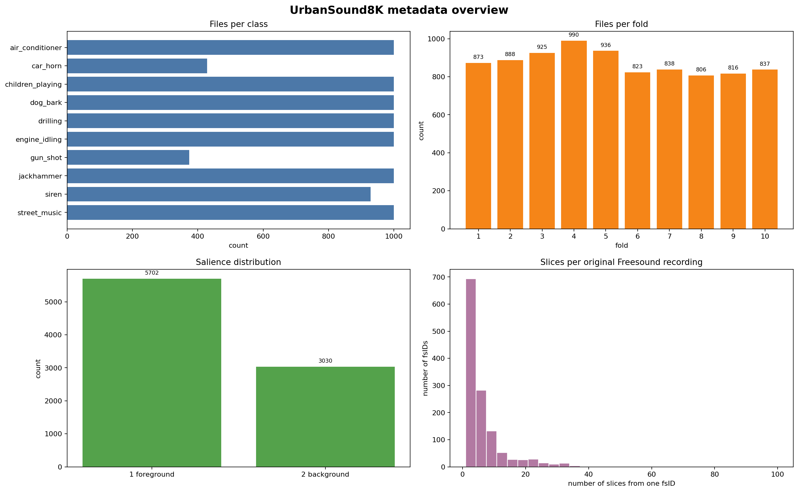
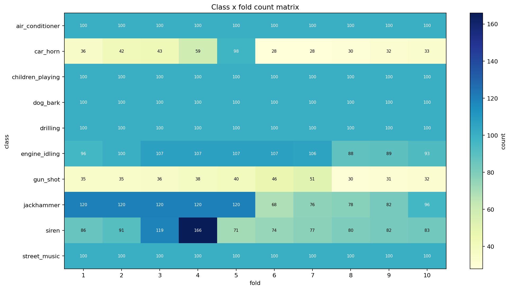
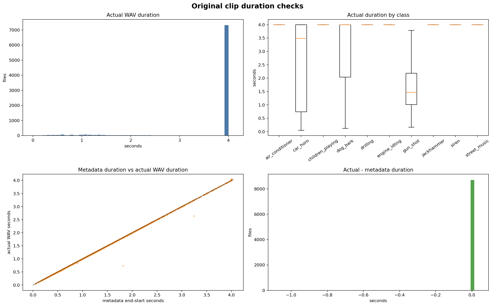
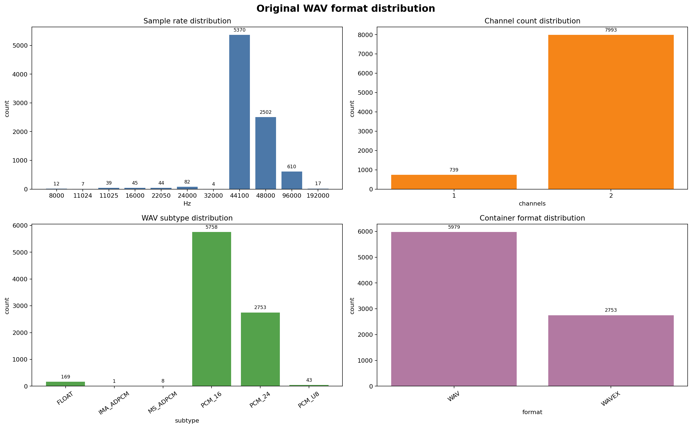
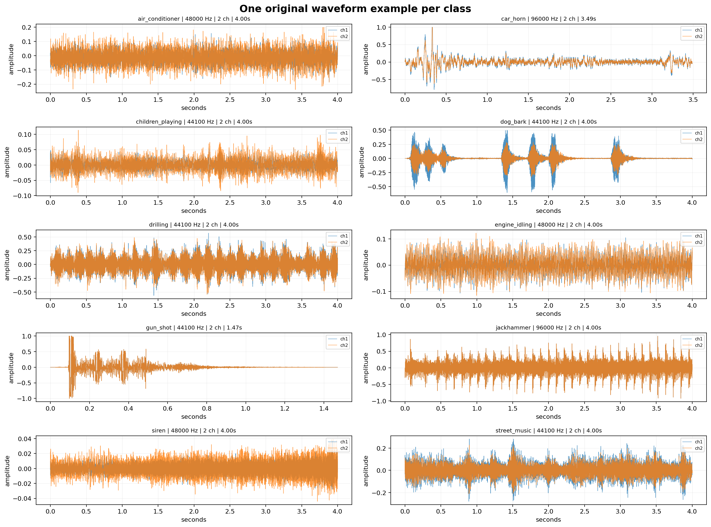

# 1. 목적

이 문서는 UrbanSound8K 데이터셋을 모델 학습에 사용하기 전에 수행한 데이터 구조 분석과
품질 검사를 정리한다. 분석의 목적은 단순히 파일 개수나 그래프를 나열하는 것이 아니라, 각
결과가 전처리 정책과 모델 입력 형식에 어떤 영향을 주는지 판단하는 것이다.

본 분석 단계에서는 원본 WAV 파일을 직접 수정하지 않았다. 즉, 이 단계에서는 resampling,
padding, truncation, normalization을 수행하지 않고, metadata, WAV header, waveform
기반 품질 통계만 수집했다. 실제 학습용 전처리는 이 분석 결과를 바탕으로 별도 단계에서
수행한다.

최종적으로 이 문서에서는 다음 사항을 결정한다.

1. 데이터셋 구조가 정상적인지 확인한다.
2. class 및 fold 분포를 확인한다.
3. sample rate, channel 수, duration이 모델 입력에 적합한지 확인한다.
4. clipping, silence, very quiet file 같은 품질 이슈를 확인한다.
5. random split 사용 가능 여부와 fold 기반 split 필요성을 판단한다.
6. 최소 4~5개의 모델을 비교하기 위한 공통 전처리와 모델별 입력 형식을 결정한다.

따라서 이 문서는 실제 모델 학습 코드 이전에 작성되는 사전 분석 문서이며, 이후 전처리
코드와 모델 비교 실험의 기준이 된다.


# 2. audio_quality

`audio_quality/` 폴더에는 waveform 기반 품질 검사 결과가 저장되어 있다. 이 폴더의 목적은
원본 UrbanSound8K 오디오에 clipping, silence, very quiet sample 같은 품질 이슈가 
얼마나 존재하는지 확인하고, 그 결과를 전처리 정책에 반영하는 것이다.

분석에 사용한 세 가지 파일은 다음과 같다.

| 파일 | 의미 |
|---|---|
| `suspicious_clipping.csv` | clipping이 의심되는 파일 목록 |
| `suspicious_silence.csv` | 대부분의 frame이 무음에 가까운 파일 목록 |
| `very_quiet_files.csv` | 전체 RMS level이 매우 낮은 파일 목록 |

- RMS level:오디오 신호의 평균적인 소리 크기/에너지 수준을 나타내는 값이다. waveform sample들을 제곱해서 평균낸 뒤, 다시 제곱근을 취한 값으로 RMS = sqrt(mean(x^2)) 로 나타내어진다. 

이 세 파일은 모두 waveform을 직접 읽어서 계산한 품질 통계에 기반한다. 따라서
metadata만으로는 알 수 없는 실제 오디오 amplitude 특성을 확인할 수 있다.

## 2.1 `suspicious_clipping.csv`

`suspicious_clipping.csv`는 clipping이 의심되는 오디오 파일 목록이다.
분석 코드에서는 waveform sample의 절댓값이 `0.999` 이상인 sample이 하나라도 존재하면
해당 파일을 clipping 의심 파일로 분류했다. float waveform에서 amplitude가 `-1` 또는 `1` 
근처에 붙으면, 녹음 과정에서 peak가 포화되어 원래 파형 정보가 손상되었을 가능성이 있다.

즉, 이 파일은 다음 질문에 답하기 위한 결과이다.

- 원본 데이터에 amplitude가 과도하게 큰 파일이 있는가?
- 특정 class에서 clipping이 많이 발생하는가?


clipping이 의심되는 파일은 총 **732개**이다. 전체 8,732개 중 약 **8.38%**이다.
class별 clipping 파일 수는 다음과 같다.
| class | clipping 파일 수 | class 전체 수 | class 내부 비율 |
|---|---:|---:|---:|
| `gun_shot` | 247 | 374 | 66.04% |
| `dog_bark` | 140 | 1000 | 14.00% |
| `engine_idling` | 86 | 1000 | 8.60% |
| `jackhammer` | 72 | 1000 | 7.20% |
| `drilling` | 45 | 1000 | 4.50% |
| `car_horn` | 41 | 429 | 9.56% |
| `street_music` | 39 | 1000 | 3.90% |
| `siren` | 29 | 929 | 3.12% |
| `children_playing` | 21 | 1000 | 2.10% |
| `air_conditioner` | 12 | 1000 | 1.20% |

`gun_shot` class에서 clipping 비율이 매우 높다. `gun_shot`은 전체 374개 중 247개가
clipping 의심 파일로 잡혔고, class 내부 비율은 약 66.04%이다.
이는 `gun_shot` 자체가 짧고 강한 impulse sound이기 때문일 가능성이 크다. 

전처리 논의 지점
- amplitude normalization: 오디오 waveform의 크기를 일정한 기준에 맞게 조정하는 작업
    오디오 waveform은 보통 [-0.12, -0.08, 0.03, 0.20, 0.95, 0.99, 0.80, ...] 과 같은 배열로, amplitude는 각 sample의 진폭이다. normalization은 이 진폭 크기를 일정하게 맞추는 작업이다. (어떤 소리는 너무 크게 녹음되어 있고, 어떤 소리는 너무 작게 녹음되어 있을 수 있다.)
    - peak normalization: 파일 안에서 가장 큰 amplitude를 기준으로 전체 waveform을 키우거나 줄이는 방식 
        ```text
        원래 waveform:
        [0.1, -0.2, 0.5]
        peak normalization 후:
        [0.2, -0.4, 1.0]
        ```
    - RMS normalization: RMS level을 기준으로 소리 크기를 맞추는 방식
        큰 파일은 줄이고 작은 파일은 키움으로서 전체적인 평균 소리 크기를 맞추는 방식
    - amplitude augmentation: 학습 데이터를 다양하게 만들기 위해 waveform의 소리 크기를 인위적으로 바꾸는 작업. (ex. random gain augmentation)
        ```text
        원본 waveform:
        [0.1, -0.2, 0.3]
        볼륨 2배 augmentation:
        [0.2, -0.4, 0.6]
        볼륨 0.5배 augmentation:
        [0.05, -0.1, 0.15]
        ```
        학습 중에 볼륨을 조금씩 바꿔주면 모델이 loudness 변화에 더 robust해질 수 있다.

clipping과 augmentation

- peak normalization을 적용했을 때:
gun_shot은 짧고 강한 소리이다. peak가 높은 것이 class 특성일 수 있다. 그러나 peak
normalization을 강제로 적용하면 gun_shot과 조용한 배경음 파일의 최대 amplitude가
비슷해질 수 있다.

- RMS normalization을 적용했을 때:
gun_shot은 대부분 구간은 조용하고, 한 순간만 크게 튀는 소리이다. 그런데 RMS 
normalization으로 평균 에너지를 키우면, 총소리 peak나 배경 noise가 같이 커질 수 있다.

- amplitude augmentation을 적용했을 때
이미 peak가 높은 파일에 볼륨을 더 키우면 augmentation이 새로운 clipping을 만들 수 있다.

가능한 절충안:
```text
원본 waveform-level에서 정규화를 하지 않고, log-mel feature 상태에서 정규화를 고려해볼 수 있다. 이 경우 총소리의 짧고 강한 에너지 burst는 보존될 수 있을 것으로 보인다.
다만 log-mel spectrogram과 feature-level normalization도 원본 waveform의 peak 정보를
그대로 보존하지는 않는다. `gun_shot`처럼 짧고 강한 impulse sound는 waveform에서는 큰
peak로 나타나지만, log-mel spectrogram에서는 짧은 시간 구간의 broadband energy burst로
표현된다.
```

## 2.2 `suspicious_silence.csv`

`suspicious_silence.csv`는 대부분의 frame(0.05초 단위)이 무음에 가까운 오디오 파일 목록이다.
분석 코드에서는 오디오를 짧은 frame 단위로 나눈 뒤, 각 frame의 RMS를 계산했다. 
frame RMS가 `-60 dBFS` 이하이면 silent frame으로 간주했고, 전체 frame 중 silent 
frame의 비율이 `0.95` 이상인 파일을 suspicious silence 파일로 분류했다.

즉, 이 파일은 다음 질문에 답하기 위한 결과이다.

- 거의 무음에 가까운 파일이 존재하는가?
- 특정 class에 조용한 파일이 몰려 있는가?
- 이런 파일이 실제 오류 파일인지, 아니면 background sound나 멀리서 녹음된 sound
event인지 판단해야 하는가?
- silence가 많은 sample을 전처리에서 삭제할지, 유지할지, 별도 분석 대상으로 둘지 논의해야
하는가?

suspicious silence 파일은 총 **20개**이다. 전체 8,732개 중 약 **0.23%**이다.  따라서
UrbanSound8K 전체에 광범위한 silence 문제가 있다고 보기는 어렵다.
class별 분포는 다음과 같다.

| class | suspicious silence 파일 수 | class 전체 수 | class 내부 비율 |
|---|---:|---:|---:|
| `siren` | 15 | 929 | 1.61% |
| `children_playing` | 5 | 1000 | 0.50% |

suspicious silence 파일은 `siren`과 `children_playing`에만 나타났다. 전체 비율은 매우
낮기 때문에 dataset 전체를 훼손할 정도의 문제는 아니다.

`suspicious_silence.csv`의 RMS level은 매우 낮다.

| 통계 | `rms_dbfs` |
|---|---:|
| mean | -67.03 |
| median | -66.64 |
| min | -73.94 |
| max | -63.01 |

또한 silent frame fraction은 다음과 같다.

| 통계 | `silent_frame_fraction` |
|---|---:|
| mean | 0.9906 |
| median | 1.0000 |
| min | 0.9500 |
| max | 1.0000 |

median이 1.0이라는 것은 많은 파일이 거의 전체 구간에서 무음에 가깝다는 뜻이다.
또한 모든 suspicious silence 파일의 실제 duration은 4.0초이다. 따라서 이 문제는 파일
길이가 짧아서 발생한 것이 아니라, 4초 길이 안에 유효한 sound energy가 거의 없기 때문에
발생한 문제로 볼 수 있다.

검토할 수 있는 선택지는 다음과 같다.
| 선택지 | 의미 | 장점 | 단점 |
|---|---|---|---|
| 전체 유지 | suspicious silence 파일도 그대로 사용 | 실제 데이터 분포 보존 | 거의 무음 sample이 학습 noise가 될 수 있음 |
| 전체 삭제 | suspicious silence 파일을 모두 제외 | 명백히 조용한 sample 제거 | background/low-salience sample을 부당하게 제거할 수 있음 |

suspicious silence 파일은 대부분의 구간이 이미 무음에 가깝다. 이런 파일에 강한 time
masking(시간축의 일부 구간을 가려서 모델이 못 보게 만드는 augmentation)이나 random crop
(일정 길이의 구간을 랜덤하게 잘라서 모델 입력으로 사용)을 적용하면 유효한 sound event가
더 사라질 수 있다.
- 최대 4초 clip이라 입력을 4초로 쓰면 random crop이 꼭 필요하지 않음
- 특정 학습 데이터에서 특정 시간을 masking함으로서 시간에 의존하지 않게 할 수 있음

따라서 augmentation을 사용할 경우 다음 사항을 논의해야 한다.

- suspicious silence 파일에도 일반 sample과 같은 augmentation을 적용할 것인가?
- time masking을 사용할 경우 masking 강도를 낮출 것인가?
- random crop을 사용할 경우 event가 거의 없는 구간만 선택되는 문제를 어떻게 막을 것인가?
- gain augmentation으로 조용한 파일을 키우는 것이 도움이 되는가, 아니면 background noise만 키우는가?

## 2.3 `very_quiet_files.csv`

`very_quiet_files.csv`는 전체 RMS level이 매우 낮은 오디오 파일 목록이다.

분석 기준은 `rms_dbfs <= -50.0`이다. RMS는 waveform의 평균 에너지 수준을 나타낸다.
RMS가 낮다는 것은 파일 전체의 소리 크기가 작거나, 목표 sound event가 배경에 약하게
포함되어 있거나, 대부분의 구간이 조용하다는 의미일 수 있다.

즉, 이 파일은 다음 질문에 답하기 위한 결과이다.

- 원본 데이터에 전체적으로 매우 조용한 파일이 있는가?
- very quiet file이 특정 class에 몰려 있는가?
- 조용한 파일이 실제 오류인지, 아니면 멀리서 녹음된 실제 도시 환경음인지 판단해야 하는가?
- 이런 파일을 전처리에서 그대로 둘지, 증폭할지, 삭제할지, 별도 group으로 추적할지 논의해야 하는가?

`very_quiet_files.csv`는 `suspicious_silence.csv`와 다르다.

| 구분 | 의미 |
|---|---|
| `suspicious_silence.csv` | 대부분의 frame이 무음에 가까운 파일 |
| `very_quiet_files.csv` | 전체 평균 에너지, 즉 RMS level이 매우 낮은 파일 |

즉, very quiet 파일이라고 해서 반드시 거의 무음인 것은 아니다. 전체적으로 조용하지만 목표
sound event가 존재할 수 있다.

very quiet 파일은 총 **135개**이다. 전체 8,732개 중 약 **1.55%**이다.

class별 분포는 다음과 같다.

| class | very quiet 파일 수 | class 전체 수 | class 내부 비율 |
|---|---:|---:|---:|
| `siren` | 81 | 929 | 8.72% |
| `children_playing` | 24 | 1000 | 2.40% |
| `air_conditioner` | 10 | 1000 | 1.00% |
| `dog_bark` | 8 | 1000 | 0.80% |
| `car_horn` | 6 | 429 | 1.40% |
| `street_music` | 6 | 1000 | 0.60% |

가장 많이 나타나는 class는 `siren`이다. `siren`은 전체 929개 중 81개가 very quiet
파일이며, class 내부 비율은 약 8.72%이다. 이는 siren 소리가 멀리서 녹음되었거나, 배경
소리로 약하게 포함된 파일이 존재한다는 의미일 수 있다.

very quiet 파일의 RMS 통계는 다음과 같다.

| 통계 | `rms_dbfs` |
|---|---:|
| mean | -56.68 |
| median | -55.13 |
| min | -73.94 |
| max | -50.31 |

silent frame fraction 통계는 다음과 같다.

| 통계 | `silent_frame_fraction` |
|---|---:|
| mean | 0.3386 |
| median | 0.1625 |
| min | 0.0000 |
| max | 1.0000 |

여기서 중요한 점은 median silent frame fraction이 0.1625라는 것이다. 즉, very quiet
파일의 절반 이상은 대부분이 무음인 파일이 아니다. 전체 에너지는 낮지만, 어느 정도
non-silent frame이 존재한다.

`very_quiet_files.csv`와 `suspicious_silence.csv`는 관련은 있지만 같은 의미가 아니다.
분석 결과, suspicious silence 파일 20개는 모두 very quiet file에 포함된다. 즉, 대부분 
무음에 가까운 파일은 당연히 전체 RMS도 낮다.
그러나 very quiet 파일은 총 135개이고, suspicious silence 파일은 20개뿐이다. 

1. very quiet 파일을 유지할 것인가?
    very quiet 파일은 전체의 1.55%로 많지는 않다. 그러나 `siren` class에 상대적으로 많이 포함되어 있다. 이 파일들을 삭제하면 `siren` class의 어려운 sample이 줄어들 수 있다.
2. 조용한 파일을 waveform 단계에서 키울 것인가?
    very quiet 파일은 전체 소리 크기가 작으므로, peak normalization이나 RMS normalization을 적용하면 waveform amplitude가 커질 수 있다.

| 선택지 | 의미 | 장점 | 위험 |
|---|---|---|---|
| 원본 amplitude 유지 | very quiet 파일을 그대로 사용 | 실제 녹음 조건 보존 | 모델이 작은 소리를 놓칠 수 있음 |
| peak normalization | 최대 amplitude 기준으로 키움 | 입력 scale 차이 감소 | background noise도 커질 수 있음 |
| RMS normalization | 평균 에너지 기준으로 키움 | 평균 loudness 차이 감소 | 조용한 noise나 배경음이 과도하게 커질 수 있음 |
| log-mel feature normalization만 사용 | waveform은 그대로 두고 feature 단계에서 정규화 | 원본 amplitude를 덜 왜곡 | absolute loudness 차이는 일부 남음 |

very quiet 파일에 gain augmentation을 적용할 때는 두 가지 가능성을 생각해야 한다.
1. 정답 sound가 작게라도 존재한다면, gain을 키우는 것이 모델 학습에 도움이 될 수 있다.
2. 정답 sound가 거의 없고 background noise만 있다면, gain을 키워도 noise만 커질 수 있다.

# 3. validation

## 3.1 `duration_mismatch.csv`

`validation/` 폴더에는 UrbanSound8K metadata와 실제 WAV 파일이 서로 일관적인지 확인한 
결과가 저장되어 있다. 이 폴더의 목적은 모델 성능 평가용 validation set을 의미하는 것이 
아니라, 데이터셋 자체의 무결성을 검사하는 것이다.

| 파일 | 의미 |
|---|---|
| `duration_mismatch.csv` | metadata duration과 실제 WAV duration이 다른 파일 목록 |
| `extra_wavs.csv` | metadata에는 없지만 audio directory에는 존재하는 WAV 파일 목록 |
| `filename_parse_errors.csv` | 파일명에서 파싱한 `fsID`, `classID`와 metadata가 불일치하는 파일 목록 |
| `fsid_cross_fold_leakage.csv` | 같은 `fsID`가 여러 fold에 걸쳐 나타나는 경우 |
| `missing_wavs.csv` | metadata에는 있지만 실제 audio directory에는 없는 파일 목록 |
| `read_errors.csv` | WAV 파일을 읽는 과정에서 오류가 발생한 파일 목록 |

`duration_mismatch.csv`는 metadata의 `end - start`로 계산한 duration과 실제 WAV
파일에서 읽은 duration이 서로 다른 파일 목록이다. 분석 코드에서는 두 duration의 차이가 `0.01`초보다 큰 경우를 duration mismatch로 분류했다.

즉, 이 파일은 다음 질문에 답하기 위한 결과이다.

- metadata에 기록된 duration과 실제 WAV duration이 일치하는가?
- 모델 입력 길이를 만들 때 metadata duration을 믿어도 되는가?
- 실제 waveform 길이를 기준으로 padding/truncation을 해야 하는가?

duration mismatch 파일은 총 **13개**이다. 전체 8,732개 중 약 **0.15%**이다.

class별 분포는 다음과 같다.

| class | duration mismatch 파일 수 |
|---|---:|
| `children_playing` | 7 |
| `gun_shot` | 3 |
| `drilling` | 2 |
| `dog_bark` | 1 |

전체 파일 수에 비해 mismatch 파일 수는 매우 적다. 따라서 UrbanSound8K 전체에서 duration
metadata가 크게 불안정하다고 보기는 어렵다.

mismatch가 가장 큰 파일은 `107842-4-3-0.wav`이다. 이 파일은 metadata duration이 약 
1.81초이지만, 실제 WAV duration은 0.74초이다. 즉, metadata 기준보다 실제 파일이 약 
1.07초 짧다.

## 3.2 `extra_wavs.csv`
`extra_wavs.csv`는 실제 audio directory에는 존재하지만 metadata CSV에는 없는 WAV 파일 목록이다. 개수는 0개이다.

### 3.3 `filename_parse_errors.csv`
`filename_parse_errors.csv`는 UrbanSound8K 파일명에서 파싱한 `fsID`, `classID`가 metadata의 `fsID`, `classID`와 일치하지 않는 경우를 기록한 파일이다. 개수는 0개이다.

### 3.4 `fsid_cross_fold_leakage.csv`
`fsid_cross_fold_leakage.csv`는 같은 `fsID`가 여러 fold에 걸쳐 나타나는 경우를 기록한 파일이다.
`fsID`는 원본 Freesound recording ID이다. 하나의 원본 녹음에서 여러 개의 slice가 만들어질 수 있으므로, 같은 `fsID`에서 나온 파일들이 train과 test에 동시에 들어가면 source-level leakage가 발생할 수 있다.

즉, 이 파일은 다음 질문에 답하기 위한 결과이다.

- 같은 원본 recording에서 나온 파일들이 여러 fold에 걸쳐 존재하는가?
- random file-level split을 사용했을 때 leakage 위험이 있는가?
- predefined fold split을 그대로 사용할지, 더 엄격한 `fsID` 기준 group split을 사용할지 논의해야 하는가?

고유 `fsID`별 요약은 다음과 같다.

| fsID | 포함 fold | 파일 수 | 관련 class |
|---:|---|---:|---|
| 77751 | 2, 7 | 30 | `drilling`, `jackhammer` |
| 106905 | 1, 8 | 7 | `engine_idling`, `siren` |
| 132016 | 1, 4 | 15 | `jackhammer`, `street_music` |
| 176638 | 1, 4 | 5 | `car_horn`, `engine_idling` |
| 180937 | 1, 9 | 95 | `drilling`, `jackhammer` |

class별 row 수는 다음과 같다.

| class | row 수 |
|---|---:|
| `jackhammer` | 103 |
| `drilling` | 31 |
| `engine_idling` | 6 |
| `street_music` | 6 |
| `siren` | 4 |
| `car_horn` | 2 |

대부분은 `jackhammer`와 `drilling`에 몰려 있다.

공식은 다음을 권장
10-fold cross validation을 사용한다.
매 실험마다 10개 fold 중 1개 fold를 test로 쓰고, 나머지 9개 fold를 train으로 쓴다.
이 과정을 fold 1부터 fold 10까지 반복하고, 최종 성능은 10번 결과의 평균으로 보고한다.

## 3.5 `missing_wavs.csv`

`missing_wavs.csv`는 metadata에는 기록되어 있지만 실제 audio directory에는 존재하지 않는 WAV 파일 목록이다. 개수는 0개이다.

## 3.6 `read_errors.csv`
`read_errors.csv`는 파일은 존재하지만 WAV header 또는 파일 정보를 읽는 과정에서 오류가 발생한 파일 목록이다. 개수는 0개이다.


# 4 이미지 분석

## 4.1 `01_metadata_overview.png`



`01_metadata_overview.png`는 UrbanSound8K metadata의 전체 구조를
요약한 그림이다. 그림은 네 개의 subplot으로 구성되어 있다.

1. class별 파일 수
2. fold별 파일 수
3. salience 분포
4. 하나의 원본 Freesound recording에서 나온 slice 수 분포

### 4.1.1 Files per class

왼쪽 위 그래프는 class별 파일 수를 보여준다. 대부분의 class는 1,000개 sample을 가지지만
`siren`, `car_horn`, `gun_shot`은 상대적으로 sample 수가 적다.

전체 accuracy만 사용하면 sample 수가 많은 class의 성능이 더 크게 반영되고, sample 수가
적은 `car_horn`, `gun_shot`의 성능 저하는 잘 드러나지 않을 수 있다.
따라서 모델 비교에서는 accuracy뿐 아니라 macro F1, class별 precision, class별 recall,
confusion matrix를 함께 확인하는 것이 좋다.

#### 4.1.2 Files per fold

오른쪽 위 그래프는 fold별 파일 수를 보여준다.
fold별 파일 수는 대체로 800~1,000개 사이에 분포한다. fold 크기가 완전히 동일하지는 않다. 

### 4.1.3 Salience distribution

왼쪽 아래 그래프는 `salience` 분포를 보여준다.
foreground sample이 5,702개, background sample이 3,030개이다.
foreground는 정답 class sound가 비교적 뚜렷하게 들리는 sample이고, background는 정답
class sound가 배경에 있거나 다른 sound source와 섞여 상대적으로 덜 두드러지는 sample이다.

`salience = 2`인 sample을 자동으로 삭제하면 데이터의 많은 부분이 삭제될 수 있다.

### 4.1.4 Slices per original Freesound recording

오른쪽 아래 그래프는 하나의 원본 Freesound recording, 즉 하나의 `fsID`에서 몇 개의 slice가 나왔는지 보여준다.
대부분의 `fsID`는 적은 수의 slice만 가진다. 그러나 일부 `fsID`는 많은 slice를 가진다.

## 4.2 `02_class_by_fold_heatmap.png`



`02_class_by_fold_heatmap.png`는 class와 fold의 교차 분포를 heatmap으로 나타낸 그림이다.
이 그림은 fold별 class 분포가 완전히 균등하지 않음을 보여준다. 따라서 단일 predefined
split만 사용하면 test fold 선택에 따라 성능이 달라질 수 있다.

## 4.3 `03_duration_distribution.png`



`03_duration_distribution.png`는 원본 audio clip의 duration 관련 통계를 보여준다.
그림은 네 개의 subplot으로 구성되어 있다.

### 4.3.1 Actual WAV duration

왼쪽 위 그래프는 실제 WAV duration의 histogram이다.
대부분의 파일은 4초 근처에 몰려 있다. UrbanSound8K가 최대 4초 clip으로 구성되어 있기
때문에 자연스러운 결과이다.
그러나 모든 파일이 정확히 4초인 것은 아니다. 4초보다 짧은 파일도 존재한다. 특히 짧은 event
중심 class에서는 4초보다 짧은 clip이 존재할 수 있다.
따라서 모델 입력을 구성할 때 모든 파일이 동일한 길이라고 가정하면 안 된다.

### 4.3.2 Actual duration by class

오른쪽 위 boxplot은 class별 duration 분포를 보여준다.
`air_conditioner`, `children_playing`, `drilling`, `engine_idling`, `jackhammer`,
`siren`, `street_music`은 대부분 4초에 가깝다.
반면 `car_horn`, `dog_bark`, `gun_shot`은 duration 분포가 더 넓다. 특히 `gun_shot`은
짧은 파일이 많고, median duration도 다른 class보다 낮다. 이는 `gun_shot`이 짧은 impulse
sound라는 class 특성과 관련된다.
이 결과는 duration 자체가 class와 상관될 수 있음을 보여준다. 따라서 duration을 직접
feature로 사용하면 모델이 sound pattern이 아니라 clip 길이 편향을 학습할 수 있다.

### 4.3.3 Metadata duration vs actual WAV duration

왼쪽 아래 scatter plot은 metadata의 `end - start`로 계산한 duration과 실제 WAV
duration을 비교한다. 
대부분의 점은 대각선에 매우 가깝게 위치한다. 이는 metadata duration과 실제 WAV
duration이 대체로 일치한다는 뜻이다.
다만 일부 outlier가 존재한다. 즉, metadata duration과 실제 WAV duration이 크게 다른
파일이 일부 있다. 이는 `duration_mismatch.csv`에서 확인한 13개 파일과 관련된다.

### 4.3.4 Actual - metadata duration
오른쪽 아래 histogram은 실제 WAV duration에서 metadata duration을 뺀 값의 분포이다.

## 4.4 `04_audio_format_distribution.png`



`04_audio_format_distribution.png`는 원본 WAV 파일의 format 관련 분포를 보여준다.
그림은 네 개의 subplot으로 구성되어 있다.

1. sample rate 분포
2. channel 수 분포
3. WAV subtype 분포
4. container format 분포

### 4.4.1 Sample rate distribution

왼쪽 위 그래프는 sample rate 분포를 보여준다.
가장 많은 sample rate는 44,100 Hz이며, 5,370개 파일이 해당한다. 그다음은 48,000 Hz로 
2,502개 파일이다. 그 외에도 96,000 Hz, 192,000 Hz, 22,050 Hz, 16,000 Hz 등 여러 sample 
rate가 섞여 있다.
원본 WAV 파일의 sample rate는 통일되어 있지 않다. 모델 입력을 만들기 위해서는 모든 파일을
하나의 target sample rate로 resampling해야 한다.

- sample rate: 오디오를 1초에 몇 번 측정해서 저장했는지
- rssampling 이유: 
    1. 모델은 보통 고정된 크기의 입력을 기대
    2. spectrogram의 시간축과 주파수축 해석이 달라짐

### 4.4.2 Channel count distribution

대부분의 파일은 stereo, 즉 2 channel이다. 그러나 mono 파일도 739개 존재한다.

모델 입력에서 channel 수가 다르면 waveform shape이 달라진다. 따라서 preprocessing
단계에서 모든 audio를 mono로 통일할지, stereo 정보를 유지할지 결정해야 한다.

일반적인 audio classification baseline에서는 mono 변환을 사용하는 경우가 많다. 다만
stereo spatial 정보가 의미 있을 가능성을 고려한다면, stereo 유지 모델도 별도 실험 후보가
될 수 있다.

### 4.4.3 WAV subtype distribution

왼쪽 아래 그래프는 WAV subtype 분포를 보여준다.
대부분은 `PCM_16` 또는 `PCM_24`이다. 그러나 subtype이 완전히 동일하지는 않다.
따라서 파일을 로드한 뒤 waveform dtype을 통일해야 한다. 일반적으로 모델 입력에서는 
`float32` waveform으로 변환한 뒤 feature extraction을 수행한다.

 - WAV 파일 안에 오디오 sample을 어떤 숫자 형식으로 저장했는지?
 1. PCM_16: sample을 16-bit 정수로 저장
 2. PCM_24: 각 sample을 24-bit 정수로 저장
 3. PCM_U8: 8-bit unsigned PCM
 4. FLOAT: sample을 정수가 아니라 floating-point 값으로 저장한 형식

### 4.4.4 Container format distribution

오른쪽 아래 그래프는 container format 분포를 보여준다.
모든 파일이 WAV 계열이지만, container format은 `WAV`와 `WAVEX`로 나뉜다. 따라서 파일
확장자가 같더라도 내부 format은 일부 다를 수 있다.

1. WAV: 오디오 데이터를 저장하는 컨테이너 형식입니다.
2. WAVEX: 기존 WAV 형식을 확장한 버전. 24-bit PCM 파일들이 WAVEX 형식으로 저장된 것
-> 구분 자체를 모델 feature로 사용하지 않는다. 파일을 로드한 뒤 float32 waveform으로 통일하면 해결.


## 4.5 `05_waveform_examples_by_class.png`



`05_waveform_examples_by_class.png`는 class별 대표 waveform 예시를 보여준다. 각
subplot은 하나의 class에 해당하며, title에는 class 이름, sample rate, channel 수,
duration이 표시되어 있다.

이 그림은 전체 class를 대표하는 통계가 아니라, 각 class에서 하나씩 선택된 waveform
예시이다. 따라서 이 그림만으로 class 전체 특성을 일반화하면 안 된다. 다만 class별 sound
event의 대략적인 시간 구조를 직관적으로 확인하는 데 유용하다.


### 4.6 `06_audio_quality_distribution.png`

`06_audio_quality_distribution.png`는 원본 오디오의 품질 관련 통계를 보여준다. 그림은 네 개의 subplot으로 구성되어 있다.

1. RMS level 분포
2. peak level 분포
3. clipping sample fraction 분포
4. silent frame fraction 분포

### 4.6.1 RMS level

왼쪽 위 그래프는 파일별 RMS level 분포를 보여준다. 대부분의 파일은 대략 `-35 dBFS`에서
`-10 dBFS` 사이에 분포하며, 중심은 대략 `-25 dBFS` 근처로 보인다.

그러나 왼쪽 꼬리에는 `-50 dBFS` 이하의 매우 조용한 파일도 존재한다. 이 파일들은
`very_quiet_files.csv`로 따로 저장된 파일들과 관련된다.

즉, UrbanSound8K에는 전체적으로 큰 파일과 작은 파일이 섞여 있다. 이는 녹음 거리, 녹음
장비, 마이크 gain, sound event의 실제 크기 차이 때문일 수 있다.

### 4.6.2 Peak level

오른쪽 위 그래프는 파일별 peak level 분포를 보여준다.

peak level이 0 dBFS 근처에 몰린 파일이 많다. 0 dBFS는 digital audio에서 표현 가능한
최대 amplitude에 해당한다. 따라서 peak가 0 dBFS 근처에 많다는 것은 amplitude가 매우 큰
파일이 많고, 일부 파일에서는 clipping 가능성이 있음을 의미한다.

이 결과는 `suspicious_clipping.csv`에서 clipping 의심 파일이 732개 발견된 것과 연결된다.

### 4.6.3 Clipping sample fraction

왼쪽 아래 그래프는 파일별 clipping sample fraction 분포를 보여준다.

대부분의 파일은 clipping fraction이 0 또는 0에 매우 가깝다. 즉, 전체 dataset의 대부분은
clipping sample이 거의 없다.

그러나 오른쪽 꼬리에 일부 파일이 존재하며, clipping fraction이 최대 약 0.15 수준까지
나타난다. 이는 일부 파일에서는 전체 sample 중 상당 비율이 clipping threshold에 걸렸음을
의미한다.

따라서 clipping 문제는 전체 dataset에 광범위하게 퍼져 있다기보다, 일부 파일과 일부
class에서 두드러지는 문제로 볼 수 있다.

### 4.6.4 Silent frame fraction

오른쪽 아래 그래프는 파일별 silent frame fraction 분포를 보여준다.

대부분의 파일은 silent frame fraction이 0 근처에 몰려 있다. 즉, 대다수 파일은 대부분의
시간 구간에서 어느 정도 sound energy를 가진다.

하지만 일부 파일은 silent frame fraction이 높게 나타난다. 특히 silent frame fraction이
0.95 이상인 파일들은 `suspicious_silence.csv`에 포함된다.

따라서 대부분의 파일은 silence 문제가 없지만, 일부 파일은 거의 무음에 가까운 구간이
대부분을 차지한다.

# 5. 종합: 모델 선택, 전처리 전략, 평가 지표

앞선 분석을 종합하면 UrbanSound8K는 다음 특징을 가진다.

1. class imbalance가 존재한다. 특히 `car_horn`, `gun_shot`은 다른 class보다 sample 수가 적다.
2. predefined fold가 존재하므로 random file-level split은 피해야 한다.
3. sample rate, channel 수, WAV subtype, container format이 통일되어 있지 않다.
4. 대부분의 파일은 4초 근처이지만, 일부 파일은 더 짧거나 metadata duration과 실제 duration이 다르다.
5. clipping, suspicious silence, very quiet file이 일부 존재한다.
6. class별 waveform 형태가 다르다. `gun_shot`, `car_horn`은 짧은 impulse sound이고, `air_conditioner`, `engine_idling`, `drilling`, `jackhammer`는 지속적 noise 성격이 강하다.

## 5.1 공통 split 정책

UrbanSound8K는 이미 `fold1`부터 `fold10`까지 predefined fold로 나뉘어 있다. 따라서 전체 파일을 다시 random shuffle하여 train/test split을 만들지 않는다.

기본 선택지는 두 가지이다.

| 선택지 | 방식 | 장점 | 단점 |
|---|---|---|---|
| 선택지 A | 10-fold cross validation | 공식 protocol에 가깝고 안정적 | 모델 수가 많으면 학습 시간이 큼 |
| 선택지 B | predefined single split | 빠르게 여러 모델 비교 가능 | fold 선택에 따라 결과가 흔들릴 수 있음 |

### 선택지 A: 10-fold cross validation

각 실험에서 10개 fold 중 1개 fold를 test set으로 사용하고, 나머지 9개 fold를 train set으로 사용한다. 이 과정을 fold 1부터 fold 10까지 반복한 뒤 평균 성능을 최종 성능으로 보고한다.

| 실험 | train fold | test fold |
|---:|---|---|
| 1 | fold2~fold10 | fold1 |
| 2 | fold1, fold3~fold10 | fold2 |
| 3 | fold1~fold2, fold4~fold10 | fold3 |
| ... | ... | ... |
| 10 | fold1~fold9 | fold10 |

딥러닝 모델에서 validation set이 필요하면, test fold를 제외한 fold 중 하나를 validation fold로 사용한다.

## 5.2 공통 전처리 후보

모든 모델에 공통으로 적용할 수 있는 기본 전처리 후보는 다음과 같다.

| 단계 | 내용 | 이유 |
|---|---|---|
| file list | metadata CSV 기준으로 파일 목록 구성 | metadata에 label과 fold 정보가 있음 |
| missing/read error 처리 | missing file, read error file 제외 | 학습 중 오류 방지 |
| split | predefined fold 사용 | random split에 의한 source-level leakage 방지 |
| audio load | 실제 WAV 파일을 로드 | metadata duration만 신뢰하지 않기 위해 |
| duration 처리 | 4.0초 fixed length 후보 | 모델 입력 shape 통일 |
| short clip 처리 | zero-padding 후보 | 짧은 clip을 4초 입력으로 맞춤 |
| long clip 처리 | truncate 또는 center crop 후보 | 4초보다 긴 파일 처리 |
| sample rate | target sample rate로 resampling | sample 수와 spectrogram 해석 통일 |
| channel | mono 변환 후보 | channel 수 통일 |
| dtype | `float32` waveform 변환 | subtype 차이 제거 |
| normalization | train set 기준 통계 사용 | test 정보 누수 방지 |
| augmentation | train set에만 적용 | validation/test 평가 안정성 유지 |

## 5.3 normalization 전략 선택지

| 선택지 | 설명 | 장점 | 위험 |
|---|---|---|---|
| waveform normalization 없음 | 원본 amplitude 유지 후 feature 추출 | class 고유 loudness 보존 | 녹음 볼륨 차이에 민감할 수 있음 |
| peak normalization | 최대 amplitude 기준으로 waveform scale 조정 | 입력 peak scale 통일 | `gun_shot` 같은 impulse 특성 약화 가능 |
| RMS normalization | 평균 에너지 기준으로 waveform scale 조정 | 평균 loudness 통일 | very quiet 파일의 noise 증폭 가능 |
| log-mel train-set normalization | log-mel feature를 train 평균/표준편차로 정규화 | 모델 입력 scale 안정화 | absolute peak 정보 일부 약화 |
| per-file normalization | 각 파일별 평균/표준편차로 정규화 | 파일별 scale 차이 강하게 제거 | class 간 loudness 차이까지 제거 가능 |

현재 가장 무난한 후보는 waveform-level normalization을 기본으로 확정하지 않고, log-mel
feature를 만든 뒤 train set 기준 mean/std normalization을 적용하는 방식이다. 단, 이
방식도 `gun_shot`의 absolute peak 정보를 완전히 보존하지는 않는다.

## 5.4 augmentation 전략 선택지

augmentation은 train set에만 적용한다. validation/test set에는 적용하지 않는다.

| augmentation | 목적 | 주의점 |
|---|---|---|
| random gain | loudness 변화에 robust하게 만듦 | clipping 파일에 positive gain 적용 시 추가 clipping 가능 |
| time shift | sound event 위치 변화에 robust하게 만듦 | padding 처리 방식 필요 |
| time masking | 특정 시간 구간 의존 감소 | 짧은 event나 suspicious silence에서 정답 구간을 가릴 수 있음 |
| frequency masking | 특정 주파수 대역 의존 감소 | 과도하면 class 특징 손상 가능 |
| random crop | event 위치 다양화 | UrbanSound8K는 최대 4초라 기본 필요성 낮음 |

## 5.5 학습 및 평가 지표

### 학습 중 기록할 지표

| 지표 | 목적 |
|---|---|
| train loss | 학습이 진행되는지 확인 |
| validation loss | overfitting 여부 확인 |
| validation accuracy | 전체적인 validation 성능 확인 |
| validation macro F1 | class imbalance를 고려한 성능 확인 |
| learning curve | train/validation gap 확인 |

### 최종 test 지표

| 지표 | 의미 |
|---|---|
| accuracy | 전체 sample 중 맞힌 비율 |
| macro F1 | class별 F1을 동일 가중 평균 |
| weighted F1 | class sample 수를 반영한 F1 |
| per-class precision | class별 예측 정밀도 |
| per-class recall | class별 탐지율 |
| per-class F1 | class별 precision/recall 균형 |
| confusion matrix | 어떤 class끼리 혼동되는지 확인 |

# 6. 모델 input 형식 및 모델별 전처리 전략

모델은 크게 두 계열로 나눈다.

| 계열 | 모델 | 입력 형태 |
|---|---|---|
| 전통적 machine learning | SVM, Random Forest/XGBoost | MFCC 또는 log-mel 통계 feature |
| deep learning | MLP, 2D CNN, CRNN | log-mel spectrogram 기반 feature |
| 선택 실험 | pretrained audio model | 모델별 요구 input |

## 6.1 Model 1: MFCC + SVM

MFCC + SVM은 전통적인 audio classification baseline이다. Deep learning 모델을 사용하기
전에, handcrafted feature와 classical classifier만으로 어느 정도 성능이 나오는지
확인하는 기준점으로 사용한다.

이 모델은 waveform을 직접 입력하지 않는다. WAV 파일에서 MFCC를 추출한 뒤, 시간축에 대해
통계량으로 요약한 1차원 feature vector를 사용한다.

| 항목 | 형태 |
|---|---|
| 원본 입력 | WAV waveform |
| 중간 feature | MFCC |
| 최종 모델 입력 | MFCC 통계 vector |
| classifier | SVM |
| 출력 | 10개 class 중 하나 |

사용 가능한 feature는 다음과 같다.

| feature | 의미 |
|---|---|
| MFCC mean | 각 MFCC coefficient의 평균 |
| MFCC std | 각 MFCC coefficient의 표준편차 |
| MFCC min | 각 MFCC coefficient의 최솟값 |
| MFCC max | 각 MFCC coefficient의 최댓값 |
| delta MFCC mean/std | MFCC의 시간 변화량 요약 |
| delta-delta MFCC mean/std | MFCC의 2차 시간 변화량 요약 |

논의할 만한 선택지는 아래와 같다.

| 선택지 | 후보 |
|---|---|
| MFCC coefficient 수 | 13, 20, 40 |
| delta feature | 사용 / 미사용 |
| SVM kernel | linear / RBF |
| class imbalance 처리 | class weight 사용 / 미사용 |
| feature scaling | StandardScaler 사용 |

## 6.2 Model 2: MFCC/log-mel 통계 feature + Random Forest 또는 XGBoost

이 모델은 tree-based baseline이다. MFCC 또는 log-mel spectrogram을 통계 feature로 
요약한 뒤, Random Forest 또는 XGBoost에 입력한다.

SVM과 달리 feature importance를 확인할 수 있으므로, 어떤 feature가 class 구분에 많이 
사용되었는지 분석할 수 있다.

입력 feature는 두 가지 후보가 있다.

| 선택지 | 입력 |
|---|---|
| 선택지 A | MFCC 통계 feature |
| 선택지 B | log-mel spectrogram의 mel-bin별 통계 feature |

log-mel 통계 feature를 사용할 경우, 각 mel frequency bin에 대해 시간축 방향으로 통계를 계산한다.

| 통계량 | 의미 |
|---|---|
| mean | 평균 에너지 |
| std | 에너지 변동성 |
| min | 최저 에너지 |
| max | 최고 에너지 |
| median | 중앙값 |
| percentile | 분위수 기반 요약 |

논의할 선택지는 아래와 같다.

| 선택지 | 후보 |
|---|---|
| feature 종류 | MFCC 통계 / log-mel 통계 |
| 모델 | Random Forest / XGBoost |
| class imbalance 처리 | class weight / sample weight / 미사용 |
| feature scaling | tree model에서는 필수는 아니지만 비교 일관성을 위해 적용 가능 |
| hyperparameter | tree 수, max depth, learning rate 등 |

## 6.3 Model 3: Flattened log-mel spectrogram + MLP

MLP는 neural network baseline이다. log-mel spectrogram을 사용하지만, CNN처럼 2D local
pattern을 직접 학습하지 않는다.

이 모델은 log-mel feature를 사용했을 때, convolution 구조가 실제로 성능 향상에 필요한지
비교하기 위한 기준 모델이다.

log-mel spectrogram을 2D 형태로 만든 뒤, 이를 1D vector로 펼쳐 MLP에 입력한다.

| 단계 | shape 예시 |
|---|---|
| waveform | `[samples]` |
| log-mel spectrogram | `[n_mels, time_frames]` |
| flatten 후 | `[n_mels × time_frames]` |
| MLP 입력 | 1D vector |


## 6.4 Model 4: Log-mel spectrogram + 2D CNN

2D CNN은 본 프로젝트의 주력 후보 모델이다. log-mel spectrogram을 이미지처럼 보고,
시간-주파수 영역의 local pattern을 convolution으로 학습한다.

UrbanSound8K는 짧은 도시 환경음 분류 dataset이므로, log-mel spectrogram + 2D CNN
구조가 가장 기본적인 deep learning baseline으로 적합하다.

입력은 log-mel spectrogram이다.

| 단계 | shape 예시 |
|---|---|
| waveform | `[samples]` |
| log-mel spectrogram | `[n_mels, time_frames]` |
| CNN 입력 | `[1, n_mels, time_frames]` |
| 출력 | 10-class softmax |

## 6.5 Model 5: Log-mel spectrogram + CRNN 또는 CNN-BiGRU

CRNN은 CNN과 RNN 계열 모델을 결합한 구조이다. CNN은 spectrogram의 local pattern을 추출하고, GRU 또는 LSTM은 시간축의 순서를 처리한다.

이 모델은 시간적 변화가 중요한 class에서 2D CNN보다 나은 성능을 보이는지 확인하기 위한 비교 모델이다.

입력은 log-mel spectrogram이다. CNN으로 local feature를 추출한 뒤, 시간축 방향 sequence로 변환하여 GRU 또는 LSTM에 넣는다.

| 단계 | shape 예시 |
|---|---|
| log-mel spectrogram | `[1, n_mels, time_frames]` |
| CNN feature map | `[channels, reduced_mels, reduced_time]` |
| sequence 변환 | `[reduced_time, feature_dim]` |
| GRU/LSTM 입력 | time sequence |
| 출력 | 10-class softmax |

## 6.6 Model 6: Pretrained audio model

Pretrained audio model은 대규모 오디오 데이터셋으로 미리 학습된 모델을 UrbanSound8K에 
fine-tuning하는 방식이다. 직접 학습한 SVM, tree model, MLP, CNN, CRNN과 비교하여 
transfer learning이 성능을 얼마나 개선하는지 확인하기 위한 optional upper baseline으로 
사용할 수 있다.

### 6.6.1 후보 모델

| 모델 | 특징 |
|---|---|
| YAMNet | lightweight pretrained audio classifier |
| PANNs | AudioSet 기반 CNN 계열 pretrained model |
| AST | Audio Spectrogram Transformer 계열 모델 |

Pretrained model은 각 모델이 요구하는 입력 형식을 따라야 한다. 따라서 공통 전처리와 다를 수 있다.

| 항목 | 처리 |
|---|---|
| sample rate | pretrained model의 요구사항에 맞춤 |
| input length | 모델 specification에 맞춤 |
| feature | waveform 또는 log-mel 등 모델별 입력 사용 |
| normalization | pretrained model이 사용한 normalization 방식 따름 |
| augmentation | fine-tuning 실험에서만 적용 여부 결정 |

