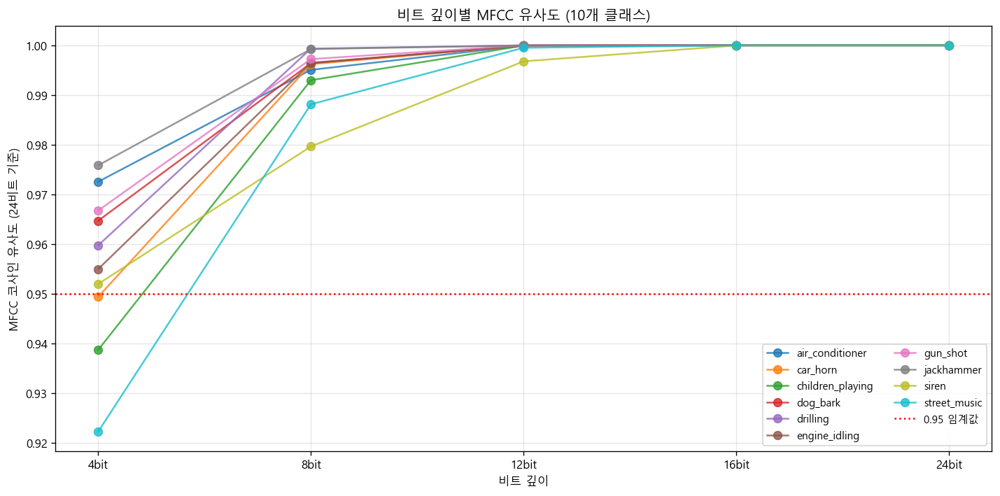
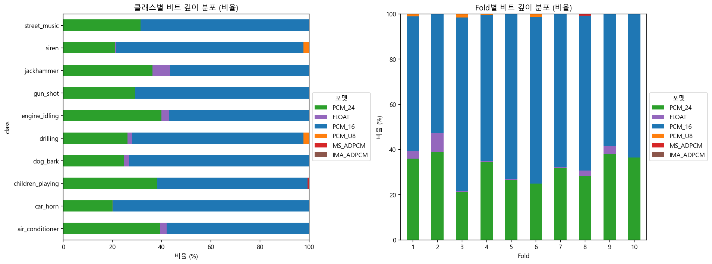

# Bit Depth

## 분석 목표

UrbanSound8K 데이터셋의 wav 파일을 머신러닝 모델 입력으로 쓰기 위해 **모든 파일이 같은 형식(dtype, 값 범위)으로 통일**되어야 한다. 원본 데이터에 여러 비트 깊이 포맷이 섞여 있기 때문이다.

이 문서는 **"비트 깊이를 어떤 방식으로 통일할 것인가"** 를 결정하고, 그 결정의 안전성을 객관적 수치와 실제 분류 결과 모두로 검증하는 과정을 정리한다.

---

## 1. 원본 데이터의 비트 깊이 분포

### 1-1. FACT — 데이터셋이 어떤 비트 깊이 포맷을 가지는가

UrbanSound8K 8,732개 파일은 여러 비트 깊이 포맷이 혼재되어 있다.

### 1-2. 분석 기법

`scripts/01_inspect.py`에서 soundfile 라이브러리로 모든 파일의 subtype을 점검.

```python
import soundfile as sf
info = sf.info(wav_path)
subtype = info.subtype  # 예: PCM_16, PCM_24
```

### 1-3. 결과 (8,732개 파일 점검)

| 포맷 | 파일 수 | 비율 | 설명 |
|---|---:|---:|---|
| PCM_16 | 5,758 | 65.94% | 16비트 정수 (CD 표준) |
| PCM_24 | 2,753 | 31.53% | 24비트 정수 (고음질) |
| FLOAT | 169 | 1.94% | 32비트 부동소수점 |
| PCM_U8 | 43 | 0.49% | 8비트 unsigned (저음질) |
| MS_ADPCM | 8 | 0.09% | 압축 포맷 (구형 Windows) |
| IMA_ADPCM | 1 | 0.01% | 압축 포맷 (구형 멀티미디어) |
| **합계** | **8,732** | **100%** | |

### 1-4. 결과 해석

- 6종류의 비트 깊이 포맷이 혼재
- PCM_16과 PCM_24가 전체의 97.47% (고품질 포맷이 절대 다수)
- 저품질 포맷(PCM_U8 + ADPCM 2종)은 0.59% (52개)
- 머신러닝 모델은 동일한 형식의 입력을 요구하므로 통일 필수

### 1-5. 전처리 단계에서 얻은 정보

- 통일 방식을 결정해야 함
- 저품질 포맷 파일이 소수 존재함을 인지

---

## 2. librosa.load의 자동 변환 검증

### 2-1. FACT — librosa.load는 모든 비트 깊이를 float32로 강제 변환한다

librosa.load는 입력 파일의 비트 깊이와 무관하게 **항상 float32, 범위 [-1.0, 1.0]** 로 변환한다. 사용자가 비트 깊이를 지정할 수 있는 옵션은 없다.

이 자동 변환을 신뢰하고 사용할 것인지 결정하기 위해, 실제로 어떻게 변환되는지 검증한다.

### 2-2. 분석 기법

`scripts/analyze_bit_depth_basic.py`에서 6개 포맷별로 각각 1개씩 샘플 파일을 선정하여:
- 원본 그대로 읽기 (soundfile, dtype 유지)
- librosa.load로 읽기 (자동 float32 변환)
- 두 결과의 dtype, 값 범위, unique 값 개수 비교

### 2-3. 결과

| 포맷 | librosa dtype | librosa 값 범위 | 원본 unique 값 | librosa unique 값 | 정보 보존 |
|---|---|---|---:|---:|:---:|
| PCM_16 | float32 | [-0.967, 1.000] | 8,769 | 8,769 | ✅ |
| PCM_24 | float32 | [-0.729, 0.856] | 183,845 | 183,845 | ✅ |
| FLOAT | float32 | [-0.027, 0.025] | 149,390 | 149,390 | ✅ |
| PCM_U8 | float32 | [-0.438, 0.398] | 108 | 108 | ✅ |
| MS_ADPCM | float32 | [-0.596, 0.599] | 20,061 | 20,061 | ✅ |
| IMA_ADPCM | float32 | [-1.000, 1.000] | 29,672 | 29,672 | ✅ |

### 2-4. 결과 해석

**(1) dtype 통일 확인**

6개 포맷 모두 float32로 자동 통일됨. 사용자가 별도 코드를 작성하지 않아도 모델이 받을 형식이 일치한다.

**(2) 값 범위 통일 확인**

모든 파일이 [-1.0, 1.0] 범위 안에 들어옴. 일부 포맷(IMA_ADPCM)은 거의 1.0에 가깝지만 범위를 넘지 않음.

**(3) 정보 손실 없음**

원본 unique 값 개수와 librosa 변환 후 unique 값 개수가 모든 포맷에서 정확히 일치. **변환 과정에서 정보가 한 비트도 손실되지 않았다.**

**(4) 포맷별 음량 차이**

값 범위가 포맷마다 다르다 — 예: PCM_16은 [-0.97, 1.00], FLOAT은 [-0.027, 0.025]. 이는 비트 깊이 자체의 문제가 아니라 **녹음 음량의 차이**이며, peak normalization으로 별도 해결되는 영역이다.

### 2-5. 전처리 단계에서 얻은 정보

- librosa.load의 자동 변환은 dtype, 값 범위, 정보 보존 측면에서 안전함이 확인됨
- 비트 깊이 통일에 별도 코드 작성 불필요
- 음량 차이는 별도 정규화로 처리 (이 분석의 범위 밖)

---

## 3. 비트 깊이 차이가 MFCC에 미치는 영향

### 3-1. FACT — 원본 비트 깊이 차이가 모델 입력(MFCC)에 영향을 주는가

librosa의 자동 변환이 안전함은 확인했으나(2장), 원본 파일의 비트 깊이가 8비트인 것과 24비트인 것 사이에는 본질적 정보량 차이가 있다. 이 차이가 MFCC에 의미 있는 영향을 주는지 검증한다.

### 3-2. 분석 기법

`scripts/analyze_bit_depth_mfcc.py`에서:
- PCM_24 파일 50개 선정 (클래스별 5개씩)
- 각 파일을 의도적으로 4비트, 8비트, 12비트, 16비트, 24비트로 양자화
- 24비트(기준)와의 MFCC 코사인 유사도 측정
- 임계값: 0.95

```python
# 양자화 함수
def quantize_to_bits(y, bits):
    n_levels = 2 ** bits
    y_clipped = np.clip(y, -1.0, 1.0)
    return np.round(y_clipped * (n_levels/2 - 1)) / (n_levels/2 - 1)
```

### 3-3. 결과

#### 클래스별 MFCC 유사도 (24비트 기준)

| 클래스 | 4bit | 8bit | 12bit | 16bit | 24bit |
|---|---:|---:|---:|---:|---:|
| air_conditioner | 0.9726 | 0.9951 | 1.0000 | 1.0000 | 1.0000 |
| car_horn | 0.9494 | 0.9962 | 1.0000 | 1.0000 | 1.0000 |
| children_playing | 0.9387 | 0.9930 | 1.0000 | 1.0000 | 1.0000 |
| dog_bark | 0.9647 | 0.9964 | 1.0000 | 1.0000 | 1.0000 |
| drilling | 0.9597 | 0.9993 | 1.0000 | 1.0000 | 1.0000 |
| engine_idling | 0.9550 | 0.9965 | 1.0000 | 1.0000 | 1.0000 |
| gun_shot | 0.9668 | 0.9972 | 1.0000 | 1.0000 | 1.0000 |
| jackhammer | 0.9759 | 0.9992 | 1.0000 | 1.0000 | 1.0000 |
| siren | 0.9520 | 0.9797 | 0.9968 | 1.0000 | 1.0000 |
| street_music | 0.9223 | 0.9881 | 0.9995 | 1.0000 | 1.0000 |
| **평균** | **0.9557** | **0.9941** | **0.9996** | **1.0000** | **1.0000** |

#### 임계값(0.95) 통과 클래스 수

| 비트 깊이 | 통과 클래스 |
|---|:---:|
| 24bit | 10/10 |
| 16bit | 10/10 |
| 12bit | 10/10 |
| 8bit | 10/10 |
| 4bit | 7/10 |

### 3-4. 시각화



### 3-5. 결과 해석

**(1) 16비트와 24비트는 사실상 동일**

평균 손실 0.000002 (소수점 6자리). 모델 입장에서 16비트와 24비트는 구분 불가능한 수준이다.

**(2) 8비트도 모든 클래스 임계값 통과**

평균 유사도 0.9941로 안전 통과. 가장 영향 받은 siren도 0.9797로 임계값(0.95) 위.

**(3) 4비트에서 처음 미달 클래스 발생**

4비트 평균 0.9557로 가까스로 통과. 미달 클래스 3개:
- car_horn: 0.9494 (순음 신호)
- children_playing: 0.9387 (다양한 음역)
- street_music: 0.9223 (음악, 광대역)

다만 UrbanSound8K에는 4비트 파일이 없으므로 실제 데이터에는 영향 없음.

**(4) 클래스별 민감도 패턴**

| 민감도 | 클래스 | 신호 특성 |
|---|---|---|
| 가장 민감 | siren, street_music | 순음/음악 (정밀한 진폭 필요) |
| 가장 둔감 | drilling, jackhammer | 광대역 노이즈 (양자화 잡음과 섞임) |

이 패턴은 신호 특성과 일치한다 — 순음 신호는 정확한 진폭 표현이 중요하므로 양자화에 민감하다.

### 3-6. 전처리 단계에서 얻은 정보

- 실제 데이터셋에서 가장 낮은 비트 깊이인 8비트도 안전 범위 내 (MFCC 유사도 0.9941)
- librosa 자동 변환 + 원본 비트 깊이 차이 모두 모델에 의미 있는 영향 없음
- 8비트 파일 43개를 별도 처리(제외 등)할 필요 없음

---

## 4. 저품질 파일의 클래스별·Fold별 분포 확인

### 4-1. FACT — 저품질 파일이 데이터셋에 균등 분포하는가, 편중되어 있는가

비트 깊이 자동 처리가 안전함은 확인했으나(2, 3장), 저품질 파일(8비트, ADPCM)이 특정 클래스나 fold에 편중되어 있다면 학습에 영향을 줄 수 있다. 분포를 정량적으로 확인한다.

### 4-2. 분석 기법

`scripts/analyze_bit_depth_distribution.py`에서:
- 기존 `outputs/audio_file_summary.csv` 활용 (1단계에서 점검한 8732개 정보)
- 클래스 × 비트 깊이 교차표
- Fold × 비트 깊이 교차표
- 저품질 파일의 클래스/fold 편중 검증

### 4-3. 결과

#### 클래스별 저품질 파일 분포

| 클래스 | 저품질 파일 수 | 전체 파일 수 | 비율 |
|---|---:|---:|---:|
| drilling | 23 | 1,000 | 2.30% |
| siren | 21 | 929 | 2.26% |
| children_playing | 7 | 1,000 | 0.70% |
| jackhammer | 1 | 1,000 | 0.10% |
| air_conditioner | 0 | 1,000 | 0.00% |
| car_horn | 0 | 429 | 0.00% |
| dog_bark | 0 | 1,000 | 0.00% |
| engine_idling | 0 | 1,000 | 0.00% |
| gun_shot | 0 | 374 | 0.00% |
| street_music | 0 | 1,000 | 0.00% |

#### Fold별 저품질 파일 분포

| Fold | 저품질 파일 수 | 전체 파일 수 | 비율 |
|---|---:|---:|---:|
| fold3 | 15 | 925 | 1.62% |
| fold6 | 12 | 823 | 1.46% |
| fold1 | 10 | 873 | 1.15% |
| fold8 | 7 | 806 | 0.87% |
| fold4 | 7 | 990 | 0.71% |
| fold5 | 1 | 936 | 0.11% |
| fold2 | 0 | 888 | 0.00% |
| fold7 | 0 | 838 | 0.00% |
| fold9 | 0 | 816 | 0.00% |
| fold10 | 0 | 837 | 0.00% |

### 4-4. 시각화



### 4-5. 결과 해석

**(1) 저품질 파일은 균등 분포가 아니다**

전체 평균 0.6%지만 실제로는 두 클래스에 집중되어 있다:
- drilling, siren 두 클래스가 저품질 파일의 84.6% (44/52개) 차지
- 6개 클래스는 저품질 파일이 전혀 없음 (0개)

**(2) Fold 분포도 불균등**

- fold2, fold7, fold9, fold10: 저품질 파일 0개
- fold3: 1.62% (가장 많음)
- Cross-validation 시 fold 선택에 따라 학습 결과 변동 가능성 존재

**(3) drilling은 두 분석 모두에서 식별된 클래스**

drilling은 본 비트 깊이 분석과 별개의 SR 분석 모두에서 주목 대상으로 식별되었다:
- SR 22050Hz에서 MFCC 유사도 0.925 (임계값 미달)
- 비트 깊이 저품질 비율 2.30% (10개 클래스 중 최고)

이 두 가지가 실제 분류에 영향을 주는지는 별도 검증이 필요하다.

### 4-6. 전처리 단계에서 얻은 정보

- 저품질 파일은 drilling, siren에 편중되어 있음
- Fold 간 품질 차이 존재
- drilling은 두 분석에서 모두 식별된 클래스로, 실제 분류에 영향을 주는지 사전 검증 필요

---

## 5. 사전 점검 — 식별된 위험이 실제 분류에 영향을 주는가

### 5-1. FACT — MFCC 유사도가 높음이 실제 분류 정확도를 보장하지 않는다

1~4장의 분석은 모두 MFCC 유사도 측면에서의 안전성과 데이터 분포 측면에서의 편중을 확인했다. 그러나 분석에서 얻은 결론을 그대로 받아들이기 전에, 다음을 검증할 필요가 있다:

- **3장의 안전성 결론**: "8비트도 0.994로 안전" → 실제 분류에서도 정말 영향 없는가?
- **4장의 편중 발견**: "drilling, siren에 저품질 편중" → 실제 분류에서 정말 문제가 되는가?

전처리 결정을 확정하기 전에, 현재 추출한 feature로 간이 분류 실험을 진행하여 위 두 가지 결론을 실제 분류 정확도로 검증한다.

### 5-2. 분석 기법

`scripts/preview_drilling_risk.py`에서:
- 현재 추출된 ml_features.csv 사용 (8,732개, 54개 feature)
- RandomForest Classifier (n_estimators=100)
- 5-fold Cross-Validation (StratifiedKFold)
- 두 가지 시나리오 비교:
  - **옵션 1**: 현재 상태 그대로 학습 (저품질 파일 포함)
  - **옵션 3**: 저품질 파일 52개 제외 후 학습

이 실험은 본 모델 학습이 아니라, **전처리 결정의 안전성을 검증하기 위한 빠른 시뮬레이션**이다.

### 5-3. 결과

#### 옵션별 정확도 비교

| 옵션 | drilling 정확도 | 전체 정확도 |
|---|---:|---:|
| 옵션 1: 현재 상태 (저품질 포함) | 0.8730 | 0.8745 |
| 옵션 3: 저품질 파일 제외 | 0.8782 | 0.8750 |
| 차이 (옵션 3 - 옵션 1) | +0.0052 | +0.0005 |

#### 클래스별 정확도 순위 (옵션 1 기준)

| 순위 | 클래스 | 정확도 |
|:---:|---|---:|
| 1 | gun_shot | 0.944 |
| 2 | engine_idling | 0.943 |
| 3 | jackhammer | 0.935 |
| 4 | air_conditioner | 0.915 |
| 5 | siren | 0.905 |
| 6 | **drilling** | **0.873** |
| 7 | dog_bark | 0.817 |
| 8 | street_music | 0.815 |
| 9 | children_playing | 0.810 |
| 10 | car_horn | 0.779 |

### 5-4. 결과 해석

**(1) 4장에서 식별된 drilling 편중은 실제 분류에 영향 없음**

drilling 정확도 0.873은 전체 평균(0.874)과 거의 동일하며, 10개 클래스 중 6위(중간 순위)이다. drilling보다 정확도가 낮은 클래스가 4개 있다(dog_bark, street_music, children_playing, car_horn). 

즉, drilling이 "두 분석에서 모두 식별된 클래스"였지만 **실제 분류에서는 평균 수준의 성능을 보임**.

**(2) 3장의 안전성 결론이 실제 분류로도 확증됨**

옵션 3으로 저품질 파일 52개를 제외해도 drilling 정확도는 0.873 → 0.878로 0.5%p 개선에 그침. 전체 정확도 개선도 0.05%p에 불과.

이는 **3장의 결론(8비트도 MFCC 유사도 0.994로 안전)을 실제 분류 측면에서도 확증**한다. librosa 자동 변환과 8비트 파일 포함이 실제 분류에 거의 영향을 주지 않는다.

**(3) 본 분석 범위 밖의 발견: car_horn**

사전 점검 중 car_horn의 정확도가 0.779로 가장 낮음을 확인했다. 이는 비트 깊이와 무관한 이슈이지만 별도 관심이 필요한 클래스로 기록한다.

### 5-5. 전처리 단계에서 얻은 정보

- drilling의 편중은 이론적 우려였으며, 실제 분류에서는 평균 수준
- 저품질 파일 52개 제외는 효과 미미 → 별도 조치 불필요
- librosa 자동 처리 결정이 실제 분류 결과로도 정당화됨
- car_horn이 별도 관심 클래스로 식별됨 (비트 깊이와 무관한 이슈)

---

## 6. 결론

### 6-1. 비트 깊이 통일 방식 결정

**librosa.load의 자동 float32 변환에 위임한다.**

```python
y, sr = librosa.load(path, sr=22050, mono=True)
# librosa가 자동으로 모든 비트 깊이를 float32, [-1.0, 1.0]로 변환
```

### 6-2. 결정 근거 (분석 단계별 종합)

| 분석 | 검증 내용 | 결과 |
|---|---|---|
| 1단계 | 원본 비트 깊이 분포 파악 | 6종 혼재, 통일 필요 |
| 2단계 | librosa 자동 변환 안전성 | dtype/범위/정보 모두 안전 |
| 3단계 | 비트 깊이 차이의 MFCC 영향 | 8비트도 0.994로 안전 |
| 4단계 | 저품질 파일 분포 | drilling, siren 편중 |
| 5단계 | 실제 분류 성능 검증 | drilling 평균 수준, 저품질 제외 효과 미미 |

이론적 검증(1~4장)과 실제 분류 검증(5장) 모두에서 위임 결정이 정당화됨.

### 6-3. 별도 코드 작성하지 않은 이유

비트 깊이 통일을 위한 별도 변환 코드를 작성하지 않는다. 이유:

1. librosa.load가 이미 안전하게 통일함 (2장 검증)
2. 원본 비트 깊이 차이가 MFCC에 미치는 영향 미미 (3장 검증, 평균 0.994)
3. 저품질 파일 제외도 효과 없음 (5장 검증, +0.5%p에 불과)
4. 추가 코드는 복잡성만 증가시키고 효익 없음

### 6-4. 인지하고 가야 할 사항

**(1) 저품질 파일의 클래스 편중**

drilling과 siren은 저품질 파일 비율이 다른 클래스보다 높음(약 2.3%). 비트 깊이 자체의 영향은 미미하나, 이 정보를 인지하고 진행한다.

**(2) Fold 간 품질 편차**

저품질 파일이 fold3, fold6에 집중되어 있음. Cross-validation 결과 비교 시 fold별 차이가 비트 깊이 때문인지 다른 요인인지 구분 필요.

**(3) car_horn의 낮은 정확도 (별도 이슈)**

사전 점검에서 car_horn 정확도가 0.779로 가장 낮음을 발견. 이는 비트 깊이와 무관한 이슈이지만, 향후 별도 검토 필요.

### 6-5. 향후 모델 학습 단계에서 확인할 항목

- drilling 클래스의 본 모델에서의 정확도가 사전 점검(0.873)과 유사한지
- Fold별 cross-validation 결과의 변동성 (특히 fold3, fold6 vs fold2, fold10)
- car_horn 클래스의 정확도 (별도 분석 필요)

---

## 7. 분석 환경

| 항목 | 값 |
|---|---|
| 사용 라이브러리 | librosa, soundfile, numpy, pandas, matplotlib, scikit-learn |
| 분석 스크립트 | scripts/01_inspect.py, scripts/analyze_bit_depth_basic.py, scripts/analyze_bit_depth_mfcc.py, scripts/analyze_bit_depth_distribution.py, scripts/preview_drilling_risk.py |
| 결과 데이터 | outputs/bit_depth_format_analysis.csv, outputs/bit_depth_mfcc_detail.csv, outputs/bit_depth_mfcc_summary.csv, outputs/bit_depth_by_class.csv, outputs/bit_depth_by_fold.csv, outputs/drilling_risk_preview.csv |
| 시각화 | outputs/bit_depth_mfcc_comparison.png, outputs/bit_depth_distribution.png |
| 재현 가능성 | random_state=42 |
