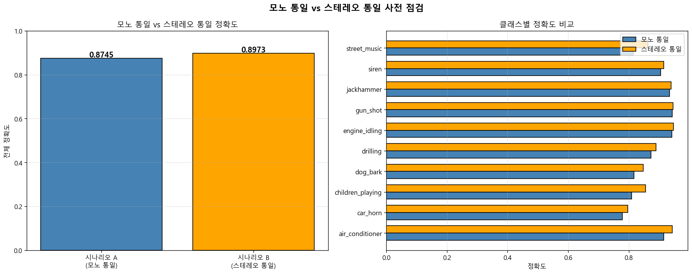

# Channels

## 1. 원본 데이터의 채널 분포

### 1-1. FACT — 데이터셋이 어떤 채널 수를 가지는가

UrbanSound8K 8,732개 파일은 모노(1채널)와 스테레오(2채널)가 혼재되어 있다.

### 1-2. 분석 기법

`scripts/analyze_channels_basic.py`에서:
- 기존 `outputs/audio_file_summary.csv` 활용 (1단계 점검 결과)
- 채널 수(num_channels) 컬럼으로 분포 집계
- 클래스 × 채널, Fold × 채널 교차표

### 1-3. 결과

#### 전체 분포 (8,732개)

| 채널 | 파일 수 | 비율 | 설명 |
|---|---:|---:|---|
| 1 | 739 | 8.46% | 모노 (1채널) |
| 2 | 7,993 | 91.54% | 스테레오 (2채널) |

#### 클래스별 모노 비율 (높은 순)

| 클래스 | 모노 파일 수 | 전체 | 모노 비율 |
|---|---:|---:|---:|
| drilling | 141 | 1,000 | 14.10% |
| dog_bark | 139 | 1,000 | 13.90% |
| siren | 122 | 929 | 13.13% |
| car_horn | 50 | 429 | 11.66% |
| engine_idling | 84 | 1,000 | 8.40% |
| street_music | 55 | 1,000 | 5.50% |
| air_conditioner | 47 | 1,000 | 4.70% |
| children_playing | 46 | 1,000 | 4.60% |
| jackhammer | 44 | 1,000 | 4.40% |
| gun_shot | 11 | 374 | 2.94% |

#### Fold별 모노 비율 (높은 순)

| Fold | 모노 파일 수 | 전체 | 모노 비율 |
|---|---:|---:|---:|
| fold10 | 114 | 837 | 13.62% |
| fold8 | 107 | 806 | 13.28% |
| fold6 | 75 | 823 | 9.11% |
| fold2 | 78 | 888 | 8.78% |
| fold1 | 68 | 873 | 7.79% |
| fold4 | 77 | 990 | 7.78% |
| fold3 | 69 | 925 | 7.46% |
| fold9 | 56 | 816 | 6.86% |
| fold5 | 64 | 936 | 6.84% |
| fold7 | 31 | 838 | 3.70% |

### 1-4. 시각화


### 1-5. 결과 해석

- 91.54%가 스테레오, 8.46%가 모노
- 클래스별 모노 비율 편차: drilling 14.10% ~ gun_shot 2.94%
- Fold별 모노 비율 편차: fold10 13.62% ~ fold7 3.70%

### 1-6. 전처리 단계에서 얻은 정보

- 채널 통일이 필수
- 통일 방향(모노 vs 스테레오)과 변환 방식을 결정해야 함
- 후속 분석에서 두 가지를 모두 검증

---

## 2. 스테레오 파일의 좌우 채널 차이 측정

### 2-1. FACT — 스테레오 파일의 좌채널과 우채널의 차이를 정량 측정한다

스테레오는 좌우 2개 마이크로 녹음한 결과다. 좌우 차이를 측정해서 변환 방식 결정의 기초 자료로 삼는다.

### 2-2. 분석 기법

`scripts/analyze_channels_stereo_diff.py`에서:
- 스테레오 파일 중 클래스별 30개씩 = 300개 선정 (random_state=42)
- 각 파일의 좌채널, 우채널, 단순평균을 추출
- 측정 지표:
  - 좌-우 신호 코사인 유사도
  - 좌-우 음량(RMS) 차이 비율
  - 좌-우 MFCC 평균 벡터의 코사인 유사도
  - 단순평균 변환 시 에너지 보존율 (FFT 기반)

### 2-3. 결과

| 클래스 | 좌우 신호 코사인 | RMS 차이비율 | 좌우 MFCC 유사도 | 에너지 보존율(%) |
|---|---:|---:|---:|---:|
| air_conditioner | 0.4695 | 0.1766 | 0.9970 | 73.0 |
| car_horn | 0.6279 | 0.0976 | 0.9980 | 81.1 |
| children_playing | 0.6062 | 0.1205 | 0.9992 | 80.0 |
| dog_bark | 0.7093 | 0.1859 | 0.9986 | 84.6 |
| drilling | 0.6670 | 0.0862 | 0.9931 | 83.2 |
| engine_idling | 0.7966 | 0.1639 | 0.9888 | 89.1 |
| gun_shot | 0.7752 | 0.0741 | 0.9992 | 88.7 |
| jackhammer | 0.7650 | 0.0948 | 0.9955 | 87.9 |
| siren | 0.5357 | 0.1899 | 0.9985 | 76.0 |
| street_music | 0.6886 | 0.1796 | 0.9974 | 83.4 |
| **평균** | **0.6641** | **0.1369** | **0.9965** | **82.7** |

### 2-4. 시각화


### 2-5. 결과 해석

- 좌-우 신호 코사인 유사도 평균 0.6641 (1.0이 동일)
- 좌-우 음량 차이 평균 13.69%
- 좌-우 MFCC 평균 벡터의 유사도는 평균 0.9965
- 단순평균 변환 시 에너지 보존율 평균 82.7%

### 2-6. 전처리 단계에서 얻은 정보

- 좌우 신호 자체는 차이가 존재함을 정량 확인
- MFCC 평균 벡터 측면에서는 좌우 차이가 작음
- 단순평균의 에너지 보존율이 80% 수준 (좌우 신호 차이로 인한 수학적 결과)
- 변환 방식이 분류 성능에 미치는 영향은 별도 측정 필요 (다음 단계)

---

## 3. 변환 방식별 MFCC 비교

### 3-1. FACT — 4가지 변환 방식의 MFCC 차이를 정량 측정한다

스테레오 → 모노 변환에는 여러 방식이 있다. librosa는 단순 평균을 기본값으로 쓰지만, 다른 방식들과의 MFCC 차이를 측정하여 비교 자료를 만든다.

비교할 4가지 방식:
1. 단순 평균: (L + R) / 2 — librosa 기본값
2. 좌채널만: L
3. 우채널만: R
4. 에너지 합: √(L² + R²)

### 3-2. 분석 기법

`scripts/analyze_channels_mono_methods.py`에서:
- 2단계와 동일한 300개 스테레오 파일 사용
- 각 파일을 4가지 방식으로 변환
- 각 변환 결과의 MFCC 평균 벡터를 추출
- 측정 지표:
  - 단순평균을 기준으로 다른 방식과의 MFCC 코사인 유사도
  - 4가지 방식의 평균을 기준으로 각 방식의 표준성

### 3-3. 결과

#### 단순평균(기준) vs 다른 방식의 MFCC 코사인 유사도

| 클래스 | 좌채널 | 우채널 | 에너지합 |
|---|---:|---:|---:|
| air_conditioner | 0.9970 | 0.9975 | 0.9732 |
| car_horn | 0.9970 | 0.9978 | 0.9855 |
| children_playing | 0.9992 | 0.9991 | 0.9903 |
| dog_bark | 0.9990 | 0.9995 | 0.9978 |
| drilling | 0.9955 | 0.9961 | 0.9775 |
| engine_idling | 0.9984 | 0.9934 | 0.9922 |
| gun_shot | 0.9995 | 0.9993 | 0.9926 |
| jackhammer | 0.9972 | 0.9975 | 0.9852 |
| siren | 0.9985 | 0.9985 | 0.9894 |
| street_music | 0.9984 | 0.9981 | 0.9863 |
| **평균** | **0.9980** | **0.9977** | **0.9870** |

#### 4가지 방식의 표준성 (전체 평균 기준)

| 방식 | 평균 유사도 |
|---|---:|
| 단순평균 | 0.9992 |
| 좌채널 | 0.9984 |
| 우채널 | 0.9984 |
| 에너지합 | 0.9904 |

### 3-4. 시각화


### 3-5. 결과 해석

- 단순평균 기준으로 좌채널 0.9980, 우채널 0.9977, 에너지합 0.9870
- 4가지 방식의 표준성 순위: 단순평균(0.9992) > 좌채널=우채널(0.9984) > 에너지합(0.9904)
- MFCC 평균 벡터 관점에서 4가지 방식의 수치적 차이는 0.02 이내

### 3-6. 전처리 단계에서 얻은 정보

- MFCC 평균 벡터 비교만으로는 변환 방식별 차이가 0.02 이내
- 다만 이 측정은 MFCC의 시간축 평균만 비교한 것 (모델 입력은 더 많은 feature를 포함)
- 변환 방식이 실제 분류 정확도에 미치는 영향은 별도 검증 필요 (다음 단계)

---

## 4. 사전 점검 1 — 변환 방식이 실제 분류에 미치는 영향

### 4-1. FACT — MFCC 평균 벡터 유사도와 실제 분류 정확도는 다를 수 있다

3단계에서 측정한 MFCC 코사인 유사도는 MFCC의 시간축 평균 벡터(20개 숫자)만 비교한 것이다. 실제 모델은 다음 54개 feature를 입력으로 받는다:
- MFCC 평균 20개 + MFCC 표준편차 20개
- spectral feature 14개 (centroid, bandwidth, rolloff, contrast, zcr, rms)

3단계 결과만으로 변환 방식을 결정하기 전에, 실제 분류 정확도로 검증한다.

### 4-2. 분석 기법

`scripts/preview_channels_risk.py`에서:
- 현재 ml_features.csv 사용 (단순평균으로 추출됨)
- RandomForest Classifier + 5-fold Cross-Validation
- 두 가지 시나리오 비교:
  - 시나리오 1: 현재 상태 (단순평균)
  - 시나리오 2: 스테레오 파일을 좌채널만으로 재추출 후 학습 (모노 원본은 그대로)
- 추가: 모노 원본 파일과 스테레오에서 변환된 파일의 분류 정확도 비교

### 4-3. 결과

#### 시나리오 1 vs 시나리오 2

| 시나리오 | 전체 정확도 |
|---|---:|
| 시나리오 1: 단순 평균 (현재) | 0.8745 |
| 시나리오 2: 좌채널만 사용 | 0.7309 |
| 차이 | -14.4%p |

#### 클래스별 정확도 비교

| 클래스 | 단순평균 | 좌채널만 | 차이 |
|---|---:|---:|---:|
| car_horn | 0.78 | 0.50 | -0.28 |
| children_playing | 0.81 | 0.63 | -0.18 |
| jackhammer | 0.94 | 0.77 | -0.17 |
| street_music | 0.82 | 0.65 | -0.17 |
| siren | 0.91 | 0.75 | -0.16 |
| drilling | 0.87 | 0.72 | -0.15 |
| dog_bark | 0.82 | 0.70 | -0.12 |
| engine_idling | 0.94 | 0.84 | -0.10 |
| gun_shot | 0.94 | 0.84 | -0.10 |
| air_conditioner | 0.91 | 0.84 | -0.07 |

#### 모노 원본 vs 스테레오에서 변환된 모노

오른쪽 그래프 참조. 클래스에 따라 모노 원본이 더 정확한 경우와 변환된 모노가 더 정확한 경우가 혼재되어 일관된 패턴이 없음.

### 4-4. 시각화


### 4-5. 결과 해석

- 단순평균 사용 시 정확도 0.8745, 좌채널만 사용 시 0.7309 (14.4%p 차이)
- 좌채널만 사용 시 모든 10개 클래스에서 정확도 하락
- 가장 큰 하락: car_horn (-0.28), children_playing (-0.18)
- 가장 작은 하락: air_conditioner (-0.07)
- 3단계의 MFCC 유사도(0.998)와 실제 정확도 차이(14.4%p)는 크게 다른 결과

#### MFCC 유사도와 실제 정확도가 다른 이유

3단계에서 측정한 MFCC 유사도(0.998)는 MFCC의 시간축 평균 벡터(20개 숫자)만 비교한 것이다. 실제 모델은 평균 외에 표준편차(시간 변화 패턴)와 다른 spectral feature까지 54개를 본다. 평균이 같아도 표준편차가 다를 수 있고, 54개 feature의 미세한 차이가 누적되면 분류 결과는 크게 달라진다.

#### 모노 원본 vs 변환 모노의 일관된 패턴 부재

모노 원본 파일과 스테레오 파일은 녹음 환경(마이크 종류, 녹음 장비)이 다를 가능성이 있어, 채널 변환 자체의 영향과 원본 데이터 특성의 영향을 분리하기 어렵다.

### 4-6. 전처리 단계에서 얻은 정보

- 모노 통일 시 변환 방식은 단순평균을 사용해야 함 (좌채널만 사용보다 +14.4%p 우수)
- 좌채널만 사용 시 모든 클래스에서 정확도 하락
- car_horn은 채널 변환 방식에 가장 민감 (-0.28)
- MFCC 유사도만으로 결정하면 위험성 존재, 실제 분류로 검증 필요
- 모노 통일 vs 스테레오 통일 비교는 별도 검증 필요 (다음 단계)

---

## 5. 사전 점검 2 — 모노 통일 vs 스테레오 통일

### 5-1. FACT — 모노 통일과 스테레오 통일의 실제 분류 정확도를 비교한다

4단계에서 모노 통일을 전제로 변환 방식을 검증했다. 그러나 모노 통일 자체가 스테레오 통일보다 분류 성능 측면에서 우수한지는 별도로 검증한다.

### 5-2. 분석 기법

`scripts/preview_mono_vs_stereo.py`에서:
- 두 시나리오로 feature 추출 및 분류 정확도 비교
- 시나리오 A (모노 통일): 모노 그대로, 스테레오는 단순평균 → feature 50개
- 시나리오 B (스테레오 통일): 모노는 좌=우 복제, 스테레오는 좌우 분리 → feature 104개 (L_xxx + R_xxx)
- RandomForest Classifier + 5-fold Cross-Validation

### 5-3. 결과

#### 시나리오별 정확도

| 시나리오 | feature 수 | 전체 정확도 |
|---|---:|---:|
| 시나리오 A: 모노 통일 | 50 | 0.8745 |
| 시나리오 B: 스테레오 통일 | 104 | 0.8973 |
| 차이 | +54 | +2.28%p |

#### 클래스별 정확도 비교

| 클래스 | 모노 통일 | 스테레오 통일 | 차이 |
|---|---:|---:|---:|
| street_music | 0.82 | 0.91 | +0.09 |
| children_playing | 0.81 | 0.85 | +0.04 |
| dog_bark | 0.82 | 0.85 | +0.03 |
| air_conditioner | 0.91 | 0.93 | +0.02 |
| siren | 0.91 | 0.92 | +0.01 |
| drilling | 0.87 | 0.88 | +0.01 |
| car_horn | 0.78 | 0.79 | +0.01 |
| engine_idling | 0.94 | 0.94 | 0.00 |
| jackhammer | 0.94 | 0.94 | 0.00 |
| gun_shot | 0.94 | 0.93 | -0.01 |

### 5-4. 시각화



### 5-5. 결과 해석

- 스테레오 통일 정확도 0.8973 > 모노 통일 0.8745 (+2.28%p)
- 8개 클래스 개선, 2개 클래스 동일, 0개 클래스 악화
- 가장 큰 개선: street_music (+0.09)
- 스테레오 통일 feature 수 104개 (모노 통일 50개의 약 2배)
- 스테레오 통일 데이터 크기 약 10MB (모노 통일의 약 2배)

#### 측정의 한계

스테레오 통일 시 정확도 개선이 (a) 스테레오의 공간 정보 효과인지 (b) feature 수 증가 효과인지 본 분석으로는 구분할 수 없다. 이를 구분하려면 추가 실험(예: 모노 feature를 104개로 늘려 비교)이 필요하다.

### 5-6. 전처리 단계에서 얻은 정보

- 분류 정확도만 보면 스테레오 통일이 +2.28%p 우수
- 모든 클래스 분류 결과에서 일관된 패턴 (개선 또는 동일)
- 다만 비용(feature 수 2배, 데이터 크기 2배, 학습 속도 2배)이 발생
- 학계 표준 여부와 효율을 함께 고려한 최종 결정 필요

---

## 6. 결정 가이드

### 6-1. 통일 방향 결정 — 모노 vs 스테레오

분석 결과 두 선택지 모두 정당화 가능하다. 팀의 우선순위에 따라 결정한다.

#### 선택지 A: 모노 통일 (학계 표준 / 효율 우선)

**선택 근거**:
1. UrbanSound8K 학계 표준 (공식 벤치마크가 22050Hz, 모노)
2. 다른 연구와 정확도 직접 비교 가능
3. feature 50개로 단순함
4. 데이터 크기 절반, 학습 속도 2배 빠름
5. 현재 ml_features.csv가 이미 모노 통일로 추출됨 (재작업 불필요)

**현재 분류 정확도**: 0.8745

**변환 방식**: librosa의 단순 평균 (4단계에서 검증)

```python
y, sr = librosa.load(path, sr=22050, mono=True)
```

#### 선택지 B: 스테레오 통일 (정확도 우선)

**선택 근거**:
1. 분류 정확도 +2.28%p 개선 (0.8745 → 0.8973)
2. street_music +9%p, children_playing +4%p, dog_bark +3%p
3. 모든 분류에서 일관된 개선 (8개 개선, 2개 동일, 0개 악화)

**비용 및 한계**:
1. 비표준 (학계 비교 어려움)
2. feature 수 2배 (50 → 104)
3. 데이터 크기 2배 (약 10MB)
4. 학습 속도 약 2배 느림
5. 모노 파일 8.46%의 처리 한계 (좌=우 복제로 "가짜 스테레오")
6. 02_build_features.py 재작업 필요 (~30분)
7. 개선 효과 원인 불명확 (스테레오 정보 vs feature 수 증가 구분 불가)

#### 선택지 비교표

| 항목 | 선택지 A: 모노 | 선택지 B: 스테레오 |
|---|:---:|:---:|
| 전체 정확도 | 0.8745 | **0.8973** |
| feature 수 | **50** | 104 |
| 데이터 크기 | **약 5MB** | 약 10MB |
| 학습 속도 | **2배 빠름** | 1배 |
| 학계 표준 | **표준** | 비표준 |
| 재작업 필요 | **불필요** | 필요 (~30분) |

### 6-2. 변환 방식 결정 (선택지 A의 경우)

모노 통일을 선택한 경우, **librosa.load의 mono=True (단순 평균)에 위임한다.**

```python
y, sr = librosa.load(path, sr=22050, mono=True)
# 스테레오 파일은 자동으로 (L+R)/2로 모노 변환
```

#### 결정 근거 (분석 단계별 종합)

| 분석 | 검증 내용 | 결과 |
|---|---|---|
| 1단계 | 원본 채널 분포 | 모노 8.46%, 스테레오 91.54%, 통일 필요 |
| 2단계 | 좌우 채널 차이 측정 | 신호 코사인 0.66, MFCC 유사도 0.997 |
| 3단계 | 4가지 변환 방식 MFCC 비교 | 단순평균이 표준성 1위 (0.9992) |
| 4단계 | 실제 분류 정확도 검증 | 단순평균이 좌채널 대비 +14.4%p 우수 |

#### 다른 변환 방식을 쓰지 않는 이유

| 방식 | 4단계 검증 결과 |
|---|---|
| 좌채널만 | 정확도 -14.4%p, 모든 클래스 하락 |
| 우채널만 | 미검증 (좌채널과 유사할 것으로 추정) |
| 에너지합 | 미검증 |
| 단순평균 | 모든 분류에서 가장 우수 |

### 6-3. 인지하고 가야 할 사항

**(1) car_horn의 채널 변환 민감성**

car_horn은 현재 단순평균 사용 시 정확도 0.78. 좌채널만 사용으로 변경하면 0.50으로 하락. 변환 방식 변경 시 가장 큰 영향 받는 클래스.

**(2) MFCC 유사도와 실제 정확도의 괴리**

3단계의 MFCC 유사도 0.998이 4단계에서 정확도 14.4%p 차이로 나타남. MFCC 평균 벡터만으로 결정하지 말고 실제 분류 검증 필수.

**(3) 모노 비율의 Fold 편차**

fold10(13.62%) vs fold7(3.70%)의 모노 비율 차이 약 3.7배. Cross-validation 결과 비교 시 fold별 차이의 원인 분석에 참고.

**(4) drilling이 세 분석에서 모두 식별됨**

SR 분석, 비트 깊이 분석, 채널 분석 모두에서 drilling이 특이 클래스로 식별됨:
- SR: MFCC 0.925 (미달)
- 비트 깊이: 저품질 비율 2.30% (최고)
- 채널: 모노 비율 14.10% (최고)

비트 깊이 사전 점검에서 drilling 정확도는 0.873으로 평균 수준이었음.

### 6-4. 향후 모델 학습 단계에서 확인할 항목

- car_horn 정확도가 사전 점검(0.78)과 본 모델에서 유사한지
- Fold10 vs Fold7의 cross-validation 결과 변동성
- drilling 클래스의 본 모델에서의 정확도
- (선택지 B 선택 시) 스테레오 통일의 효과가 본 모델에서도 +2.28%p 유지되는지

---

## 7. 분석 환경

| 항목 | 값 |
|---|---|
| 사용 라이브러리 | librosa, soundfile, numpy, pandas, matplotlib, scikit-learn |
| 분석 스크립트 | scripts/01_inspect.py, scripts/analyze_channels_basic.py, scripts/analyze_channels_stereo_diff.py, scripts/analyze_channels_mono_methods.py, scripts/preview_channels_risk.py, scripts/preview_mono_vs_stereo.py |
| 결과 데이터 | outputs/channels_by_class.csv, outputs/channels_by_fold.csv, outputs/stereo_channel_diff_detail.csv, outputs/stereo_channel_diff_summary.csv, outputs/channel_methods_detail.csv, outputs/channel_methods_vs_average.csv, outputs/channel_methods_vs_left.csv, outputs/channel_methods_summary.csv, outputs/channels_risk_preview.csv, outputs/mono_vs_stereo_preview.csv, outputs/stereo_unified_features.csv |
| 시각화 | outputs/channels_distribution.png, outputs/stereo_channel_diff.png, outputs/channel_methods_comparison.png, outputs/channels_risk_preview.png, outputs/mono_vs_stereo_preview.png |
| 재현 가능성 | random_state=42 |
