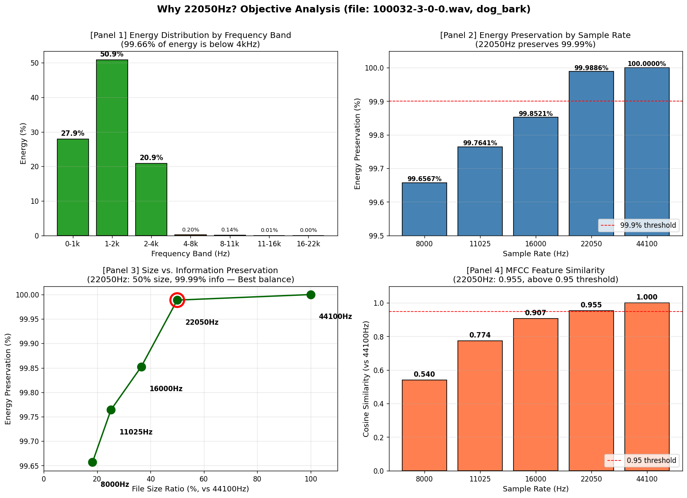
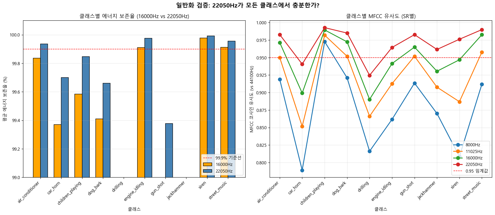
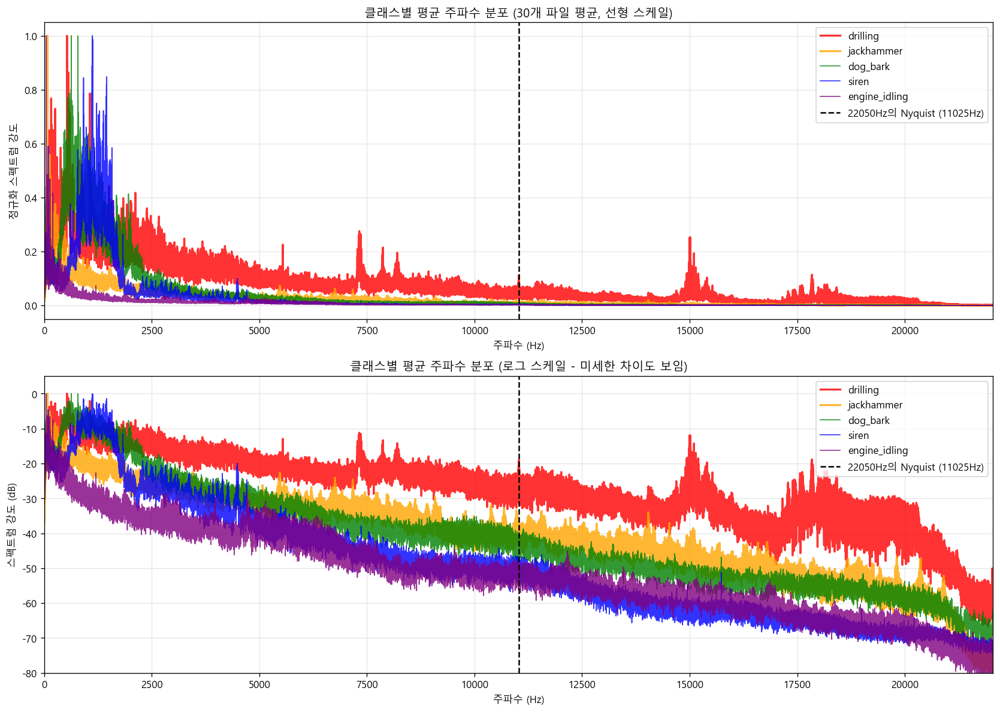
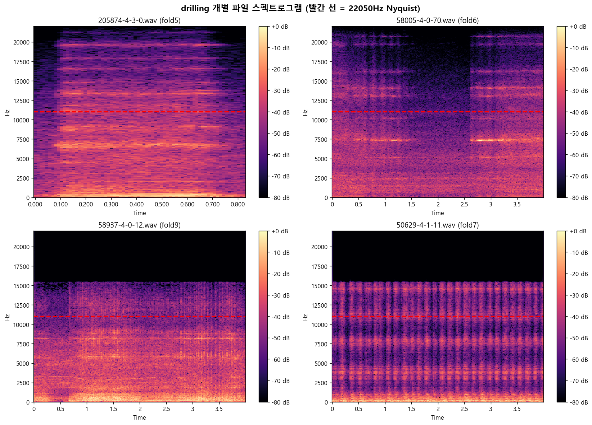

# Sample rate

## 0. 분석 목적

UrbanSound8K 데이터셋의 모든 wav 파일을 하나의 sample rate로 통일해야 한다.
어떤 sample rate가 적절한지 데이터 기반으로 결정한다.

---

## 1. 원본 데이터의 Sample Rate 분포

### 결과 (8,732개 파일 점검)

| Sample Rate | 파일 수 | 비율 |
|---:|---:|---:|
| 44,100 Hz | 5,370 | 61.50% |
| 48,000 Hz | 2,502 | 28.65% |
| 96,000 Hz | 610 | 6.99% |
| 24,000 Hz | 82 | 0.94% |
| 16,000 Hz | 45 | 0.52% |
| 22,050 Hz | 44 | 0.50% |
| 11,025 Hz | 39 | 0.45% |
| 192,000 Hz | 17 | 0.19% |
| 8,000 Hz | 12 | 0.14% |
| 11,024 Hz | 7 | 0.08% |
| 32,000 Hz | 4 | 0.05% |
| **합계** | **8,732** | **100%** |

### 해석

원본 데이터에 **11종류의 sample rate가 혼재**되어 있다.
- 가장 많은 44,100Hz도 전체의 61.5%에 불과
- 8,000Hz~192,000Hz까지 24배 이상 차이
- 11,024Hz 같은 비표준 값도 존재

머신러닝 모델은 동일한 형식의 입력을 요구하므로, **하나의 sample rate로 통일이 필수적이다**.

---

## 2. 1차 분석 — 전체 데이터 기준 적정 SR 탐색

### 2-1. 실험 설계

| 항목 | 내용 |
|---|---|
| 비교 SR 후보 | 8000, 11025, 16000, 22050, 44100 Hz |
| 표본 | 10개 클래스 × 10개 = 100개 파일 |
| 기준 | 44100Hz (원본 최고 품질) |
| 평가 지표 1 | 에너지 보존율 (FFT 기반) |
| 평가 지표 2 | MFCC 코사인 유사도 |

### 2-2. 결과 — 클래스별 에너지 보존율 (%)

| 클래스 | 8000Hz | 11025Hz | 16000Hz | 22050Hz | 44100Hz |
|---|---:|---:|---:|---:|---:|
| air_conditioner | 96.48 | 97.00 | 99.84 | 99.93 | 100.00 |
| car_horn | 97.70 | 98.95 | 99.37 | 99.70 | 100.00 |
| children_playing | 97.48 | 99.03 | 99.58 | 99.85 | 100.00 |
| dog_bark | 98.55 | 98.93 | 99.41 | 99.66 | 100.00 |
| drilling | 78.22 | 81.86 | 88.86 | 97.32 | 100.00 |
| engine_idling | 99.63 | 99.81 | 99.91 | 99.98 | 100.00 |
| gun_shot | 92.41 | 95.01 | 97.93 | 99.38 | 100.00 |
| jackhammer | 80.86 | 85.78 | 94.16 | 96.38 | 100.00 |
| siren | 99.64 | 99.90 | 99.98 | 99.99 | 100.00 |
| street_music | 99.69 | 99.84 | 99.91 | 99.96 | 100.00 |
| **평균** | **94.07** | **95.61** | **97.90** | **99.21** | **100.00** |

### 2-3. 결과 — 클래스별 MFCC 유사도 (44100Hz 대비)

| 클래스 | 8000Hz | 11025Hz | 16000Hz | 22050Hz | 44100Hz |
|---|---:|---:|---:|---:|---:|
| air_conditioner | 0.919 | 0.950 | 0.972 | 0.983 | 1.000 |
| car_horn | 0.789 | 0.852 | 0.899 | 0.941 | 1.000 |
| children_playing | 0.973 | 0.982 | 0.990 | 0.993 | 1.000 |
| dog_bark | 0.921 | 0.952 | 0.972 | 0.985 | 1.000 |
| drilling | 0.816 | 0.866 | 0.890 | 0.925 | 1.000 |
| engine_idling | 0.862 | 0.913 | 0.942 | 0.965 | 1.000 |
| gun_shot | 0.914 | 0.952 | 0.965 | 0.983 | 1.000 |
| jackhammer | 0.870 | 0.908 | 0.930 | 0.962 | 1.000 |
| siren | 0.809 | 0.887 | 0.947 | 0.976 | 1.000 |
| street_music | 0.912 | 0.958 | 0.983 | 0.990 | 1.000 |
| **평균** | **0.880** | **0.922** | **0.949** | **0.970** | **1.000** |

### 2-4. 시각화

단일 파일(dog_bark) 기준 4개 패널 분석:
- Panel 1: 주파수 대역별 에너지 분포
- Panel 2: SR별 에너지 보존율
- Panel 3: 파일 크기 vs 정보 보존
- Panel 4: MFCC 유사도

10개 클래스 전체에 대한 SR별 정량 비교 그래프.

### 2-5. 결과 해석

**(1) 에너지 보존율 관점**

- 8000Hz: 평균 94.07% — drilling(78%), jackhammer(81%)에서 큰 손실
- 11025Hz: 평균 95.61% — 임계값(95%) 가까스로 통과
- 16000Hz: 평균 97.90% — 통과
- **22050Hz: 평균 99.21% — 안정적 통과**
- 44100Hz: 100% (기준)

**(2) MFCC 유사도 관점**

- 8000Hz: 0.880 — 임계값(0.95) 크게 미달
- 11025Hz: 0.922 — 미달
- 16000Hz: 0.949 — **0.001 차이로 미달**
- **22050Hz: 0.970 — 통과 (안전 마진 0.020 확보)**
- 44100Hz: 1.000 (기준)

**(3) 데이터 효율 관점**

| SR | 파일 크기 (44100Hz 대비) | 학습 속도 |
|---|---:|---:|
| 8,000 | 18% | 5.5배 빠름 |
| 22,050 | **50%** | **2배 빠름** |
| 44,100 | 100% | 기준 |

**(4) 최종 결정**

`target_sample_rate = 22050 Hz`

근거:
1. MFCC 유사도 0.95 임계값을 통과하는 **최저 SR**
2. 데이터 크기가 44100Hz의 절반 — 학습 효율 2배
3. UrbanSound8K 학계 표준값
4. 평균 0.970의 안전 마진 확보

---

## 3. 2차 분석 — drilling 클래스 심층 검증

### 3-1. 분석 동기

1차 분석에서 drilling 클래스가 22050Hz에서 다른 클래스보다 낮은 수치를 보였다:
- 에너지 보존율: 97.32% (다른 클래스 평균 99.7%)
- MFCC 유사도: 0.925 (0.95 임계값 미달)

**drilling이 정말 다른 클래스와 다른 특성을 가지는지** 30개 파일로 심층 분석한다.

### 3-2. 결과 — 5개 클래스 주파수 대역별 에너지 비율 (%)

| 클래스 | 0-1k | 1-2k | 2-4k | 4-8k | 8-11k | 11-16k | 16-22k | 22050Hz 보존 |
|---|---:|---:|---:|---:|---:|---:|---:|---:|
| drilling | 36.11 | 19.92 | 22.43 | 13.81 | 4.42 | **2.49** | **0.81** | **96.69** |
| jackhammer | 63.04 | 17.03 | 10.83 | 7.11 | 1.32 | 0.61 | 0.06 | 99.32 |
| dog_bark | 55.89 | 36.71 | 6.18 | 1.06 | 0.12 | 0.03 | 0.01 | 99.96 |
| siren | 32.66 | 64.71 | 2.08 | 0.52 | 0.03 | 0.01 | 0.00 | 99.99 |
| engine_idling | 84.12 | 7.42 | 4.76 | 3.29 | 0.23 | 0.16 | 0.02 | 99.82 |

### 3-3. 결과 — 클래스 간 주파수 분포 유사도

| 비교 | 코사인 유사도 |
|---|---:|
| drilling vs jackhammer | **0.8848** |
| drilling vs dog_bark | 0.8017 |
| drilling vs engine_idling | 0.7231 |
| drilling vs siren | 0.6639 |

### 3-4. 결과 — drilling 핵심 수치

| 항목 | 값 |
|---|---:|
| 11025Hz 이상 에너지 (22050Hz로 줄이면 손실되는 양) | 3.31% |
| 22050Hz로 보존되는 에너지 | 96.69% |
| 다른 4개 클래스의 22050Hz 보존율 평균 | 99.77% |
| drilling과 다른 클래스의 차이 | -3.08%p |

### 3-5. 시각화

30개 파일 평균 주파수 분포 그래프 (선형 + 로그 스케일).
빨간 선(drilling)이 다른 클래스 대비 고주파 영역까지 분포함을 보여줌.

drilling 4개 개별 파일의 스펙트로그램.
빨간 점선(11025Hz, 22050Hz의 Nyquist)을 기준으로 위쪽 영역에 신호가 존재함을 확인.

### 3-6. 결과 해석

**(1) drilling은 광대역(broadband) 신호**

대부분 클래스가 0-2kHz에 에너지 70~95%가 집중되는 반면:
- engine_idling: 0-1kHz에 84.12% 집중
- siren: 1-2kHz에 64.71% 집중
- dog_bark: 0-2kHz에 92.60% 집중

drilling은 에너지가 전 주파수 대역에 골고루 분포 (광대역 신호의 특성).

**(2) 22050Hz에서 손실되는 정보의 양**

drilling: 11kHz 이상에 **3.31%** 에너지 존재
다른 클래스: 11kHz 이상에 0.04% ~ 0.67% 에너지 존재

→ drilling이 다른 클래스보다 **5배 ~ 80배 많은 정보를 11kHz 이상에 보유**

**(3) drilling vs jackhammer 혼동 가능성**

두 클래스의 주파수 분포 유사도는 **0.8848** (다른 비교 대비 가장 높음).
둘 다 기계 공구이며 광대역 신호 특성을 공유.

→ 모델이 drilling과 jackhammer를 헷갈릴 가능성 존재.
→ 22050Hz로 줄이면 두 클래스의 변별 정보(고주파)가 일부 손실됨.

---

## 4. 최종 결론

### 4-1. SR 결정

**`target_sample_rate = 22050 Hz` 유지**

### 4-2. 근거 요약

| 항목 | 22050Hz의 평가 |
|---|---|
| 평균 에너지 보존율 | 99.21% (안전) |
| 평균 MFCC 유사도 | 0.970 (임계값 통과) |
| 임계값 통과 클래스 수 | 10개 중 9개 |
| 데이터 효율 | 44100Hz 대비 50% |
| 학계 표준 | UrbanSound8K 공식 표준 |

### 4-3. 한계 및 모니터링 사항

심층 분석에서 발견된 한계:

1. **drilling 클래스의 정보 손실 3.31% 존재**
   - 11kHz 이상의 고주파 정보가 사라짐
   - 다른 클래스 대비 5~80배 많은 손실

2. **drilling과 jackhammer 혼동 가능성**
   - 두 클래스의 주파수 분포 유사도 0.8848
   - 22050Hz로 줄이면 변별 정보 일부 손실

3. **car_horn의 MFCC 민감성**
   - 22050Hz에서 MFCC 유사도 0.941로 임계값 미달
   - 순음(특정 주파수 중심) 신호 특성 때문

### 4-4. 향후 검증 과제

모델 학습 후 다음 항목 모니터링:
- drilling 클래스의 분류 정확도가 다른 클래스 대비 얼마나 낮은지
- drilling vs jackhammer 혼동 행렬 확인
- car_horn 클래스의 정확도 별도 측정
